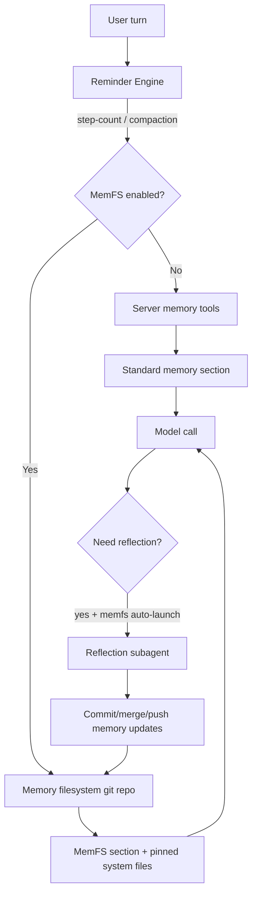
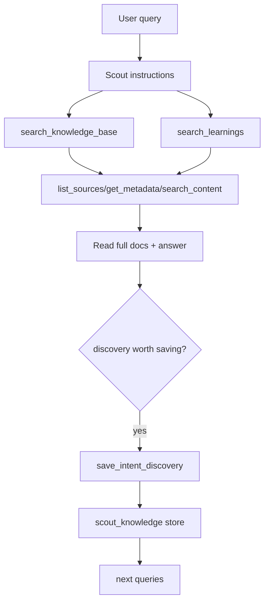
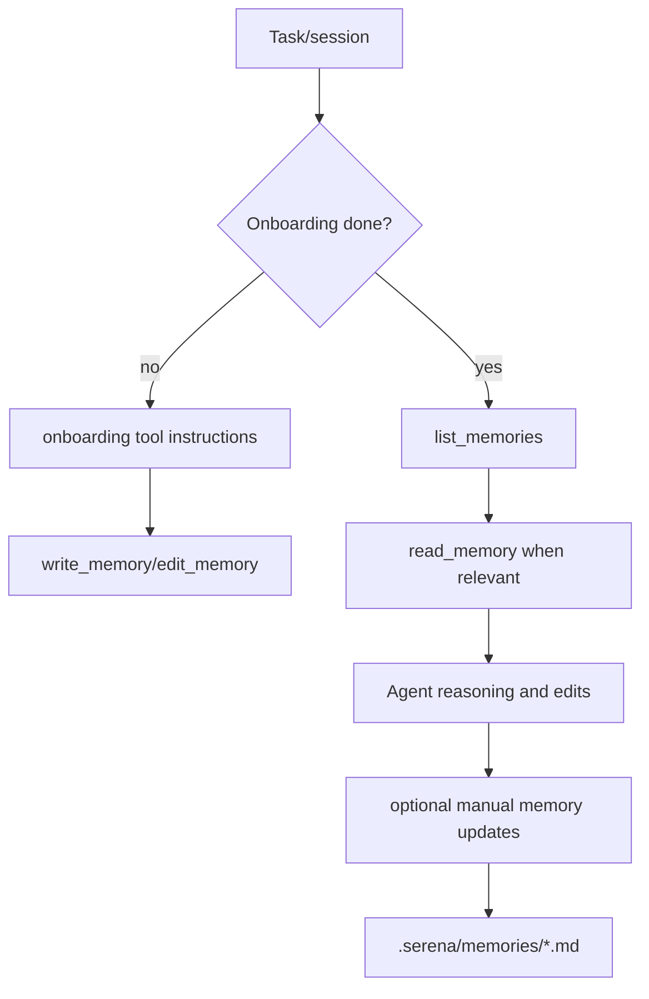
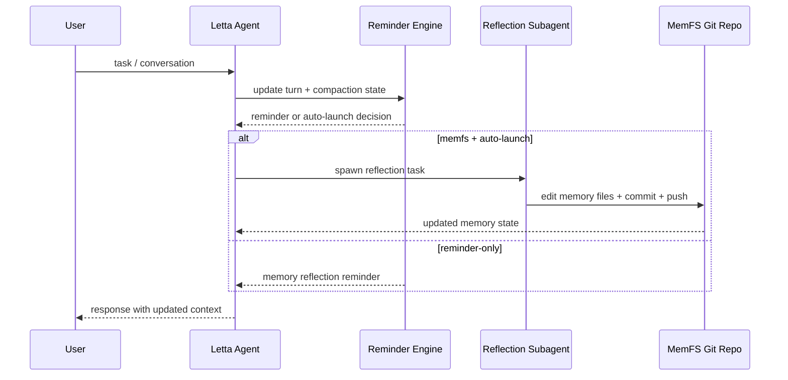
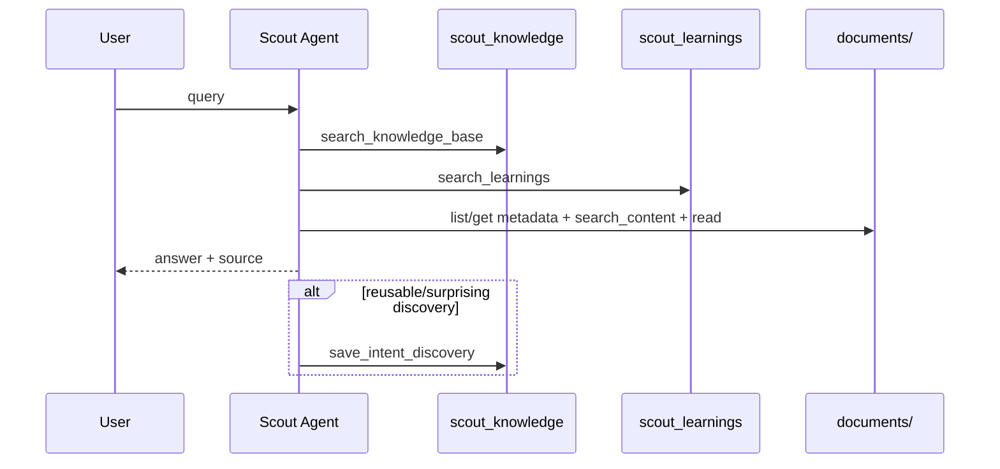
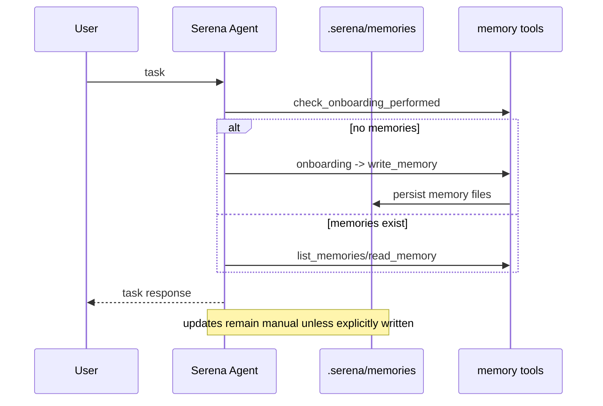

# Continual Learning Implementations Across Letta, Scout, and Serena

## 1. Purpose

This document is a deep implementation analysis of how `letta-code/`, `scout/`, and `serena/` handle continual learning in practice, and how to reuse their strongest ideas in a new or existing harness.

The analysis emphasizes **implementation realism**:

- What is actually implemented in code today
- What is documented but conditional/manual/partial
- What is aspirational and not fully closed-loop yet

It also includes a retrieval-focused appendix on integrating `frankensearch/` as a memory retrieval substrate.

---

## 2. Method and Evidence Model

### 2.1 Research process

- Launched a 6-agent explorer wave (2 per repo) for independent deep-dives:
  - `letta-code`: memory substrate + adaptation loops
  - `scout`: knowledge/retrieval substrate + learning loop behavior
  - `serena`: memory persistence mechanics + autonomy reality check
- Launched a second wave:
  - `Docs`: claim cross-checks
  - `frankensearch`: retrieval integration analysis
- Performed direct verification on key code paths before synthesis.

### 2.2 Continual learning rubric used throughout

A harness is evaluated on these linked stages:

1. **Capture**: what experience signals are observed
2. **Store**: where those signals persist and with what structure
3. **Retrieve**: how those memories are recalled into decision context
4. **Adapt**: how behavior/policies are updated from memory
5. **Validate**: how updates are tested and corrected over time

A system can be strong in memory persistence and still weak in continual learning if stages 4-5 are manual.

---

## 3. Shared Mental Model


The biggest practical difference across the three harnesses is where the loop breaks:

- Letta: strongest at **Capture/Store/Retrieve/Adapt**, weaker at automatic **Validate**
- Scout: strong at **Store/Retrieve**, moderate **Adapt**, partial **Validate closure**
- Serena: strong **Store/Retrieve**, mostly manual **Adapt/Validate**

---

## 4. Letta Code: Memory-First Runtime with Reflection Mechanics

## 4.1 Architecture and memory modes

Letta has two memory operating modes:

- **Standard memory blocks** mode
- **MemFS (filesystem + git-backed memory)** mode

Prompt reconciliation enforces mode-correct memory language and detects drift:

- `reconcileMemoryPrompt(...)` and `detectMemoryPromptDrift(...)` (`letta-code/src/agent/memoryPrompt.ts:146`)
- Standard prompt memory contract (`letta-code/src/agent/prompts/system_prompt_memory.txt:4`)
- MemFS prompt contract (`letta-code/src/agent/prompts/system_prompt_memfs.txt:6`)

### Diagram: Letta memory architecture



## 4.2 Read path (retrieval into context)

- In standard mode, memory blocks are described as pinned core memory and accessed via memory tools (`letta-code/src/agent/prompts/system_prompt_memory.txt:5`).
- In memfs mode, files under `memory/system/` are pinned in the system prompt and the memory filesystem view is embedded (`letta-code/src/agent/prompts/system_prompt_memfs.txt:13`).
- Turn and compaction reminders pick memfs-aware prompts (`letta-code/src/cli/helpers/memoryReminder.ts:205`).

## 4.3 Write/update path

Tool attachment is model-aware and mode-aware:

- OpenAI/Codex prefers `memory_apply_patch`
- Claude/Gemini prefers `memory`
- MemFS mode detaches all server memory mutation tools

Evidence:

- Tool selection and detachment logic (`letta-code/src/tools/toolset.ts:53`, `letta-code/src/tools/toolset.ts:141`)
- MemFS toggle pipeline (`applyMemfsFlags`) (`letta-code/src/agent/memoryFilesystem.ts:152`)

MemFS setup/update includes:

- prompt reconciliation
- local memfs state persistence
- git tag coordination
- clone/pull and pre-commit enforcement

Evidence:

- MemFS apply flow (`letta-code/src/agent/memoryFilesystem.ts:157`)
- pre-commit rules protecting frontmatter (`letta-code/src/agent/memoryGit.ts:140`)
- clone/pull with fallback and status reporting (`letta-code/src/agent/memoryGit.ts:311`, `letta-code/src/agent/memoryGit.ts:359`, `letta-code/src/agent/memoryGit.ts:408`)

## 4.4 Continual learning loop behavior

Letta’s adaptation machinery is the most explicit of the three:

- Reflection triggers:
  - step-count trigger
  - compaction-event trigger
- Reflection behaviors:
  - reminder-only
  - auto-launch subagent (when memfs enabled)

Evidence:

- Trigger/behavior settings and reminders (`letta-code/src/cli/helpers/memoryReminder.ts:19`, `letta-code/src/reminders/engine.ts:201`)
- Auto-launch gating on memfs (`letta-code/src/reminders/engine.ts:249`)
- Compaction sets pending reflection and skill reinjection flags (`letta-code/src/cli/helpers/accumulator.ts:1136`)

Subagent workflow is operationally explicit (branch, commit, merge, push) rather than hand-wavy:

- Reflection playbook (`letta-code/src/agent/subagents/builtin/reflection.md:12`)

Skills are used as reusable learning artifacts and reinjected around compaction transitions:

- Skills reminder/reinjection handling (`letta-code/src/reminders/engine.ts:132`)

## 4.5 Strengths and weaknesses

### Strongest implementation points

1. **Mode-safe memory architecture**: prompt reconciliation + drift detection prevents silent divergence.
2. **Git-native memory durability**: explicit sync semantics and protected frontmatter rules are production-meaningful.
3. **Real adaptation hooks**: reflection triggers and subagent path are concrete, not just conceptual.

### Gaps

1. Validation remains weakly automated; reflection can write memory without a strong evaluator gate.
2. MemFS automation still depends on git health and environment constraints (cloud/local gating).
3. Auto-learning is not fully autonomous in all modes; memfs-off behaves like reminder-only memory hygiene.

---

## 5. Scout: Retrieval-First Knowledge Agent with Dynamic Learnings Store

## 5.1 Architecture

Scout composes two vector-backed knowledge stores:

- `scout_knowledge`: curated/static routing and source intelligence
- `scout_learnings`: dynamic discovered patterns

Evidence:

- Dual store creation (`scout/scout/agent.py:37`)
- Learning machine wiring (`scout/scout/agent.py:202`)
- Hybrid pgvector + OpenAI embedder config (`scout/db/session.py:42`)

### Diagram: Scout memory/retrieval architecture



## 5.2 Read/retrieval behavior

Retrieval-first behavior is hardcoded in instructions:

- “Always start with `search_knowledge_base` and `search_learnings`” (`scout/scout/agent.py:97`)
- Uses source awareness + grep-like file search (`scout/scout/agent.py:98`, `scout/scout/tools/search.py:60`)

Metadata/routing priors are loaded from structured files:

- Source registry and limitations (`scout/scout/knowledge/sources/files.json:1`)
- Intent routing (`scout/scout/knowledge/routing/intents.json:1`)

## 5.3 Write/update behavior

Implemented structured write path:

- `save_intent_discovery` validates and inserts JSON payloads (`scout/scout/tools/save_discovery.py:15`)

Curated knowledge ingestion path:

- `load_knowledge` loads sources/routing/patterns, optional recreate (`scout/scout/scripts/load_knowledge.py:13`)

Notable implementation asymmetry:

- Prompt references `save_learning`, but no local custom `save_learning` tool is implemented in this repo.
- `rg` only finds `save_learning(` inside prompt examples (`scout/scout/agent.py:109`).

This means part of “automatic learning” depends on external framework behavior or future implementation, while `save_intent_discovery` is concrete.

## 5.4 Continual learning maturity

Scout has a real evolving memory substrate but incomplete loop closure:

- Strong: retrieval + structured discovery writes
- Partial: adaptation policies are mostly prompt-directed
- Weak: evaluation is present but does not auto-write back into learnings

Evidence:

- Eval harness runs and grades (`scout/scout/evals/run_evals.py:49`)
- No direct pipeline from eval failures to automatic memory correction

## 5.5 Strengths and weaknesses

### Strongest implementation points

1. **Two-store memory architecture** cleanly separates curated priors from emergent discoveries.
2. **Retrieval-first control flow** makes memory usage a default behavior.
3. **Low-friction structured discovery capture** via `save_intent_discovery`.

### Gaps

1. Learning write path is partly implied in prompts (`save_learning`) rather than fully implemented as a local concrete tool.
2. Evaluation outputs are observational; no closed remediation loop.
3. Scaling/coverage constraints from local text search limits and file-type handling.

---

## 6. Serena: Robust Project Memory Persistence, Mostly Manual Adaptation

## 6.1 Architecture

Serena persists project memory as markdown files under `.serena/memories/` via `MemoriesManager`.

Evidence:

- Memory directory creation and file operations (`serena/src/serena/project.py:27`)
- Activation message exposing available memories (`serena/src/serena/project.py:167`)

### Diagram: Serena memory architecture



## 6.2 Read/write semantics

Memory tools are explicit and straightforward:

- `write_memory` with max length guard (`serena/src/serena/tools/memory_tools.py:11`)
- `read_memory` (`serena/src/serena/tools/memory_tools.py:33`)
- `list_memories` (`serena/src/serena/tools/memory_tools.py:48`)
- `edit_memory` via replace-content tool (`serena/src/serena/tools/memory_tools.py:69`)

Onboarding is explicit and often one-time per project:

- Workflow docs for onboarding and memory creation (`serena/docs/02-usage/040_workflow.md:101`)

Modes can disable memory tooling entirely:

- `no-memories` mode (`serena/src/serena/resources/config/modes/no-memories.yml:1`)

## 6.3 Continual learning reality

Serena has strong persistence discipline but limited autonomous adaptation:

- Reflection tools (`think_about_*`) are explicit prompts, not background learners (`serena/src/serena/tools/workflow_tools.py:56`).
- Analytics track tool token usage but do not update policy (`serena/src/serena/analytics.py:161`).
- Dashboard/logging provide observability, not automatic learning updates (`serena/docs/02-usage/060_dashboard.md:5`, `serena/docs/02-usage/065_logs.md:5`).

## 6.4 Strengths and weaknesses

### Strongest implementation points

1. **Clear project-scoped memory model** that is inspectable and versionable.
2. **Good tool ergonomics** for deterministic memory CRUD.
3. **Excellent mode controls** (e.g., disable memory path when needed).

### Gaps

1. Little autonomous adaptation.
2. No automatic policy updates from telemetry.
3. Relies heavily on manual discipline for memory freshness.

---

## 7. Docs Cross-Check: Claims vs Reality

### 7.1 Useful framing

- Letta docs/blog framing around `/init` and `/remember` is directionally correct for explicit memory operations (`Docs/letta-code-blog.md:15`).

### 7.2 Over-broad phrasing to treat carefully

- “Improves every session” style messaging can hide that memory updates often require explicit command/tool invocation.
- Scout’s docs imply fully automatic learning; code shows partial automation plus prompt-dependent writes.

Takeaway: treat doc claims as product intent, then verify loop closure in code paths.

---

## 8. Comparative Matrices (Qualitative)

## 8.1 Continual learning maturity matrix

| Dimension | Letta | Scout | Serena |
|---|---|---|---|
| Capture signals | Strong (turn + compaction triggers) | Medium (prompt-directed discovery capture) | Medium (manual onboarding + think tools) |
| Persistent store | Strong (memfs git + memory blocks) | Strong (dual pgvector stores) | Strong (markdown memory files) |
| Retrieval integration | Strong (prompt-pinned + reminders) | Strong (retrieval-first workflow) | Medium (explicit read when needed) |
| Autonomous adaptation | Medium-High (auto-launch reflection with memfs) | Medium (learning machine configured, but write path partial) | Low (mostly manual) |
| Validation loop | Medium-Low | Low-Medium | Low |
| Operational guardrails | High (prompt drift + git checks + hooks) | Medium (metadata/routing + eval scripts) | High (mode gating + explicit tools) |

## 8.2 Failure mode profile

| Failure mode | Letta | Scout | Serena |
|---|---|---|---|
| Memory drift | Mitigated with prompt reconciliation + git status | Possible via stale routing metadata | Possible via stale manual memories |
| Write inconsistency | Mitigated by pre-commit frontmatter rules | Discovery write path clear for one tool, partial for others | Low risk (simple file CRUD) |
| Retrieval mismatch | Lower in memfs with pinned context | Depends on index freshness + route quality | Depends on whether relevant memory is manually loaded |
| Loop closure gaps | Validation not deeply automated | Eval not auto-connected to memory updates | No autonomous correction loop |

---

## 9. Sequence Diagrams (Memory + Learning Loop)

### 9.1 Letta loop



### 9.2 Scout loop



### 9.3 Serena loop



---

## 10. Strongest Implementation Points to Reuse

## 10.1 From Letta

1. **Prompt-memory mode reconciliation** (`memoryPrompt.ts`) to prevent silent mode drift.
2. **Git-backed memory with policy guardrails** (`memoryGit.ts` pre-commit protections).
3. **Event-driven reflection triggers** (turn and compaction hooks) with optional background agent execution.

## 10.2 From Scout

1. **Dual memory planes**: curated priors vs emergent learnings.
2. **Retrieval-first interaction contract** to force memory utilization.
3. **Structured discovery payloads** for future query acceleration.

## 10.3 From Serena

1. **Simple, inspectable project memory store** with deterministic CRUD semantics.
2. **Mode-based capability gating** (`no-memories`, onboarding-focused modes).
3. **Operationally useful telemetry surfaces** without coupling to model internals.

---

## 11. Hybrid Harness Blueprint (Greenfield + Incremental)

## 11.1 Target architecture

```mermaid
flowchart TD
  I[Interaction/Event] --> C[Capture Layer]
  C --> WQ[Write Qualification]
  WQ --> PM[Policy Memory (rules/preferences)]
  WQ --> EM[Episodic Memory (events/outcomes)]
  WQ --> KM[Knowledge Memory (curated/static)]

  PM --> R[Retrieval Orchestrator]
  EM --> R
  KM --> R

  R --> FS[frankensearch Two-Tier Retrieval]
  FS --> CTX[Context Assembler]
  CTX --> AG[Agent Runtime]

  AG --> EV[Eval + Drift Detector]
  EV --> FB[Feedback Translator]
  FB --> WQ
```

## 11.2 Concrete design choices

1. **Memory model split**
- Policy memory: durable user/project conventions
- Episodic memory: timestamped outcomes, failures, corrections
- Knowledge memory: curated docs/maps/routing priors

2. **Write policy**
- Auto-write only on high-value events (user correction, successful novel path, repeated failure pattern)
- Use protected schemas and frontmatter constraints (Letta-style guardrails)

3. **Retrieval policy**
- Retrieval-first for non-trivial tasks
- Two-phase return (initial/refined) via frankensearch for latency + quality
- Keep deterministic tie-breaking and phase telemetry

4. **Adaptation policy**
- Compaction-event and step-count triggers for reflection jobs
- Reflection jobs produce structured deltas, not raw prose edits

5. **Validation policy**
- Every memory update path gets a validation stage:
  - syntax/schema validation
  - contradiction checks against protected memory
  - replay checks on a regression query set

## 11.3 Incremental retrofit strategy

### If starting from Serena-like system
- Add dual memory planes (curated + episodic) before autonomous reflection.
- Add evaluator-connected memory writebacks.

### If starting from Scout-like system
- Close the loop from eval failures to memory patch proposals.
- Harden discovery schema and conflict resolution rules.

### If starting from Letta-like system
- Add stronger post-reflection validation gates and rollback heuristics.
- Add explicit confidence tracking per memory write.

---

## 12. Frankensearch Integration Appendix

## 12.1 Why frankensearch fits continual learning retrieval

Frankensearch already exposes progressive two-tier retrieval with graceful degradation:

- `Initial` fast phase
- `Refined` quality phase
- `RefinementFailed` fallback phase

Evidence:

- Feature and phase model (`frankensearch/README.md:92`)
- Searcher callback contract (`frankensearch/crates/frankensearch-fusion/src/searcher.rs:9`)

It also provides explicit knobs for latency/quality tradeoff:

- `FRANKENSEARCH_FAST_ONLY`, `FRANKENSEARCH_QUALITY_WEIGHT`, `FRANKENSEARCH_RRF_K` (`frankensearch/README.md:155`)

## 12.2 Adapter patterns by harness

### Letta adapter

Integration point:

- Message search path (`letta-code/src/cli/components/MessageSearch.tsx:166`)

Pattern:

- Replace backend search endpoint with frankensearch-powered retrieval
- Keep existing mode flags (`vector|fts|hybrid`) mapped to frankensearch config
- Return phase-streamed results to UI

### Scout adapter

Integration point:

- `search_content` tool path (`scout/scout/tools/search.py:60`)

Pattern:

- Add `search_hybrid_content` tool backed by frankensearch
- Keep `save_intent_discovery` on successful novel hits
- Log phase quality (initial/refined) for learning confidence

### Serena adapter

Integration point:

- Memory/read tools and MCP tool registry (`serena/src/serena/tools/memory_tools.py:28`)

Pattern:

- Add a semantic retrieval tool returning ranked snippets + memory candidates
- Keep explicit human/agent write confirmations for memory updates

## 12.3 Risks and mitigations

| Risk | Mitigation |
|---|---|
| Higher latency from quality tier | Use phase streaming; default to fast-first UX |
| Relevance drift over domain shifts | Periodic eval corpora + quality weight tuning |
| Operational complexity | Start with limited knobs; add advanced controls later |
| Overwriting stable memory with noisy updates | Protected fields + validator + rollback checkpoints |

---

## 13. Implementation Recommendations for Your Harness

If your goal is a true continual learning harness (not just persistent memory), implement in this order:

1. **Dual memory planes** (Scout pattern)
2. **Mode-safe prompt/memory orchestration** (Letta pattern)
3. **Explicit memory CRUD + mode gates** (Serena pattern)
4. **Progressive retrieval layer** (Frankensearch)
5. **Reflection worker with strict write contracts** (Letta pattern, hardened)
6. **Evaluation-to-memory feedback translation** (currently missing strongest closure in all three)

Minimum success criteria:

- Every memory write has provenance metadata
- Every retrieval includes confidence and phase provenance
- Every adaptation loop has measurable before/after task outcomes

---

## 14. Evidence Index (Key References)

### Letta
- `letta-code/src/agent/memoryPrompt.ts:146`
- `letta-code/src/agent/memoryFilesystem.ts:152`
- `letta-code/src/tools/toolset.ts:21`
- `letta-code/src/reminders/engine.ts:201`
- `letta-code/src/cli/helpers/memoryReminder.ts:205`
- `letta-code/src/cli/helpers/accumulator.ts:1136`
- `letta-code/src/agent/memoryGit.ts:140`
- `letta-code/src/agent/subagents/builtin/reflection.md:12`
- `letta-code/src/cli/commands/registry.ts:34`
- `letta-code/src/cli/App.tsx:8212`
- `letta-code/src/cli/components/MessageSearch.tsx:166`

### Scout
- `scout/scout/agent.py:37`
- `scout/db/session.py:42`
- `scout/scout/tools/save_discovery.py:15`
- `scout/scout/scripts/load_knowledge.py:13`
- `scout/scout/tools/search.py:60`
- `scout/scout/knowledge/sources/files.json:1`
- `scout/scout/knowledge/routing/intents.json:1`
- `scout/scout/evals/run_evals.py:49`

### Serena
- `serena/src/serena/project.py:27`
- `serena/src/serena/tools/memory_tools.py:6`
- `serena/src/serena/tools/workflow_tools.py:11`
- `serena/src/serena/analytics.py:161`
- `serena/docs/02-usage/040_workflow.md:101`
- `serena/docs/02-usage/050_configuration.md:113`
- `serena/src/serena/resources/config/modes/no-memories.yml:1`
- `serena/docs/02-usage/060_dashboard.md:5`
- `serena/docs/02-usage/065_logs.md:5`

### Docs (cross-check context)
- `Docs/letta-code-blog.md:15`

### Frankensearch
- `frankensearch/README.md:79`
- `frankensearch/README.md:171`
- `frankensearch/README.md:453`
- `frankensearch/README.md:155`
- `frankensearch/docs/architecture/overview.md:5`
- `frankensearch/crates/frankensearch-fusion/src/searcher.rs:1`
- `frankensearch/crates/frankensearch-core/src/traits.rs:30`
- `frankensearch/crates/frankensearch-core/src/host_adapter.rs:233`

---

## 15. Final Take

- **Best current continual-learning substrate**: Letta (because it operationalizes reflection + durable memory workflows).
- **Best retrieval-centric memory intelligence pattern**: Scout (because retrieval and learning are first-class in the query workflow).
- **Best disciplined persistence interface**: Serena (because memory semantics are explicit, simple, and mode-governed).

If you build your own harness, the strongest composite is:

- Letta-style adaptation triggers and durable memory workflow
- Scout-style dual memory planes and retrieval-first behavior
- Serena-style explicit memory governance and operational clarity
- Frankensearch-style progressive retrieval engine under the hood

That combination gives you the best chance of building a continual-learning harness that is both adaptive and production-manageable.
