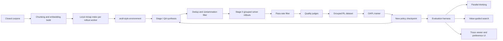
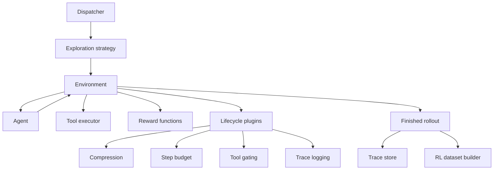
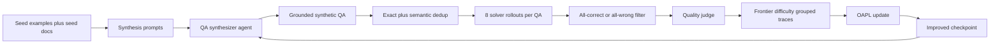
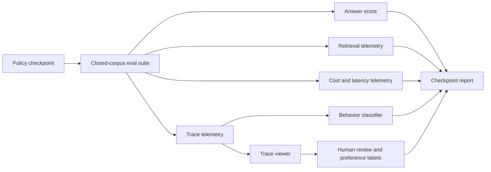

# Reproducing KARL Requires a Closed-Corpus Rollout Stack with Synthetic Frontier Tasks and Compression-Aware RL

This note is a companion to [[multi-task RL on heterogeneous search behaviors produces knowledge agents that generalize across grounded reasoning tasks]].

## Executive Thesis

The paper's real contribution is not a new retrieval trick.

It is a four-part system:

1. a heterogeneous grounded-reasoning benchmark that forces different search behaviors,
2. a synthetic data flywheel that manufactures frontier-difficulty agent tasks,
3. an offline grouped RL objective that can train long-horizon tool-use traces without online-RL infrastructure complexity,
4. a unified rollout harness where synthesis, evaluation, training, and test-time compute all share the same environment contract.

If we want our own implementation, that is the system to copy.

The cheapest mistake would be to imitate the headline and skip the harness discipline. If we just add RL to a normal RAG stack, we will not get what KARL gets.

## What The Paper Actually Proves

### Strong claims that are well-supported

- Multi-task RL over two very different search regimes creates better out-of-distribution grounded reasoning than single-task experts or expert-trace distillation.
- Offline grouped RL can improve long-horizon search behavior without the infrastructure burden of online GRPO-style training.
- Compression is not just a context hack. It becomes a learned capability when it is trained end to end inside the task loop.
- Search policy quality can improve cost and latency at the same time because the model learns to stop wasting searches after enough evidence is already present.
- Test-time compute composes with RL. RL improves the quality of each rollout, then parallel thinking or value-guided search compounds the gain.

### Claims that are suggestive rather than fully closed

- Their behavior taxonomy is useful, but its rule system only achieved about 75% agreement with human annotation, so it should be treated as operational telemetry rather than ground truth science.
- The quality-filter judges clearly help, but the paper does not quantify the exact marginal gain of each filter stage with ablations.
- The paper omits important training hyperparameters for direct reproduction: optimizer, learning rate schedule, batch shape, update counts, and exact OAPL coefficient settings.

## Figure-Level Read Of The Paper

### The story told by the main figures

- Figure 1 is the headline: KARL moves the frontier on both cost and latency, not just raw score.
- Figures 2 and 3 show the real engine: a two-stage data production line that creates RL-ready frontier tasks.
- Figures 4 through 6 define the system architecture: general parallel thinking, task-specific value-guided search, and a unified rollout harness.
- Figures 8 through 11 argue that RL learned broader search capability, not just sharper sampling of existing answers.
- Figures 12 through 20 explain the mechanism: better stopping, higher document diversity, better reasoning given the same retrieval status, and less post-retrieval waste.
- Figure 37 and the quality-filter examples expose the hidden cost center: synthetic task generation is expensive and yields are low.
- Figure 41 shows compression is a heavy-tailed operational problem, not a rare edge case.
- Figures 42 and 43 show they built internal product tooling, not just benchmark scripts. The feedback loop includes preference collection and qualitative trace inspection.

## Linked Image Analysis

The source note links 29 image assets. Some figures are split across multiple files because of PDF extraction. Grouped below, every linked image is accounted for.

| Linked image asset(s) | Paper figure | What the image shows | Why it matters for our implementation |
|---|---|---|---|
| `karl-_page_0_Figure_5.jpeg`, `karl-_page_0_Figure_6.jpeg` | Figure 1 | Two Pareto plots: cost-quality and latency-quality. KARL sits on the frontier alone at low cost, then remains frontier-optimal as parallel rollouts scale. | Our success bar cannot be raw score only. We need per-query cost, latency, and score tracked together from day one. |
| `karl-_page_6_Figure_1.jpeg` | Figure 2 | Stage I synthesis: examples plus corpus feed a QA synthesizer that explores via tools before deduplication. | Synthetic task generation must be grounded in the same environment as inference, not static prompt-only synthesis. |
| `karl-_page_7_Figure_1.jpeg` | Figure 3 | Stage II synthesis: multiple solver rollouts create pass-rate estimates, then a quality filter produces final RL data. | Medium-difficulty filtering is load-bearing. We should keep only prompts near the model frontier. |
| `karl-_page_9_Figure_1.jpeg` | Figure 4 | Parallel thinking architecture: N solver rollouts then a generative aggregation rollout. | Our TTC path should support answer synthesis, not just best-of-N selection. |
| `karl-_page_10_Figure_1.jpeg` | Figure 5 | Value-guided search tree: candidate continuations scored with a value model at each step. | We should treat VGS as an optional task-specific accelerator for short-answer tasks, not the default TTC mechanism. |
| `karl-_page_11_Figure_1.jpeg` | Figure 6 | `aroll` harness layers: dispatcher, strategy, environment, lifecycle plugins, agent, rollout output. | This is the architecture to reproduce most faithfully. The harness is the paper. |
| `karl-_page_14_Figure_1.jpeg` | Figure 7 | Training trajectory distributions across iterations. BrowseComp gets much shorter; TREC gets slightly longer. | The right measure is not shorter-is-better. Efficient trajectories depend on task structure. |
| `karl-_page_16_Figure_1.jpeg` | Figure 8 | Distillation vs RL bar chart. RL wins especially on OOD and scales with TTC; SFT plateaus OOD. | We should avoid expert-trace distillation as the main generalization path. |
| `karl-_page_16_Figure_7.jpeg` | Figure 9 | Iterative training curves. Additional RL iterations keep improving both ID and some OOD metrics. | Outer-loop iteration is part of the training design, not a one-shot finetune. |
| `karl-_page_17_Figure_1.jpeg` | Figure 10 | Max@k and parallel-thinking curves improve across all k after RL. | This is the best evidence that RL expands coverage rather than only sharpening choice probabilities. |
| `karl-_page_18_Figure_1.jpeg` | Figure 11 | Pass-rate flow chart and transition matrix from base model to KARL-BCP. Unsolved and partial prompts move upward. | We should instrument pass-rate state transitions across training checkpoints. |
| `karl-_page_19_Figure_1.jpeg` | Figure 12 | Search horizon and retrieved-doc count ablations. Too many docs per retrieval hurts; more steps help until plateau. | Retrieved token budget is a first-class control knob. Bigger `k` is not automatically better. |
| `karl-_page_20_Figure_1.jpeg` | Figure 13 | Parallel thinking scaling across all tasks. KARL stays ahead of the base model at every `N`. | RL and TTC should be measured as complementary, not substitute, levers. |
| `karl-_page_21_Figure_7.jpeg` | Figure 14 | VGS scaling on BrowseComp-Plus, with WMV beating MV and BoN. | For discrete-answer tasks, value-weighted aggregation can beat general-purpose generative aggregation. |
| `karl-_page_22_Figure_1.jpeg` | Figure 15 | Alluvial plots of step-count bins by pass-rate class. Solved, partial, and unsolved traces all shorten. | Trajectory-length analysis belongs beside success buckets, or it becomes misleading. |
| `karl-_page_23_Figure_1.jpeg` | Figure 16 | Longer original trajectories shift toward more partial and solved outcomes after RL. | Hard, long-horizon prompts are where RL shows the clearest expansion of capability. |
| `karl-_page_23_Figure_6.jpeg`, `karl-_page_23_Figure_7.jpeg` | Figure 17 | Document diversity curves. KARL retrieves more unique documents over time on both BrowseComp and TREC. | Query diversity is a valuable derived metric even if not directly rewarded. |
| `karl-_page_24_Figure_1.jpeg` | Figure 18 | Accuracy conditioned on retrieval status. KARL improves accuracy even when retrieval coverage is fixed. | We need retrieval-conditioned accuracy to separate search gains from reasoning gains. |
| `karl-_page_25_Figure_1.jpeg` | Figure 19 | Search-efficiency bars. After full recall, KARL wastes far fewer searches and accuracy still rises. | This is the most operationally useful behavior figure. We should log searches-before-full-recall and searches-after-full-recall. |
| `karl-_page_26_Figure_1.jpeg` | Figure 20 | Pie charts of behavior categories across models. KARL shifts away from exhaustive no-convergence toward explore-then-commit. | A behavior taxonomy is worth building, but only as debug telemetry. |
| `karl-_page_51_Figure_1.jpeg`, `karl-_page_51_Figure_2.jpeg`, `karl-_page_51_Figure_3.jpeg`, `karl-_page_51_Figure_4.jpeg` | Figure 37 | Four pipeline panels for BrowseComp and TREC across two iterations. The yield from synthetic QA to final RL data is much lower than most people would expect, especially on BrowseComp. | We need stage-by-stage pipeline accounting or we will underestimate data generation cost by an order of magnitude. |
| `karl-_page_71_Figure_2.jpeg` | Figure 41 | Compression-count distribution with a strong long tail. Many questions need few compressions; a minority need a lot. | Compression budget and summarization stability are operational bottlenecks, not optional polish. |
| `karl-_page_76_Picture_3.jpeg` | Figure 42 | Internal testing app for pairwise preference judgments on real user queries. | We should build human preference collection into the loop early if we want production alignment. |
| `karl-_page_76_Picture_6.jpeg` | Figure 43 | Qualitative trace viewer comparing model search behavior by question. | A trace viewer is required for understanding failure modes that scalar metrics will hide. |

## The Minimum Reproducible Interpretation Of KARL

### 1. Benchmark design

KARLBench works because the tasks are structurally different.

The training pair is deliberately asymmetric:

- BrowseComp-Plus forces deep, narrow, multi-hop search with fragile commitment decisions.
- TREC-Biogen forces wide evidence gathering and long-form synthesis.

That is enough diversity to induce some OOD transfer to:

- FreshStack for procedural technical reasoning,
- FinanceBench for long-document numerical reasoning,
- QAMPARI for exhaustive entity retrieval,
- PMBench for noisy internal-note synthesis.

The lesson is simple: our own benchmark suite should cover search regimes, not domains.

### 2. Data flywheel

The paper's training loop is:

1. synthesize grounded QA tasks with an agent using the same environment,
2. run grouped solver rollouts,
3. keep only mixed-difficulty prompts,
4. remove ambiguity and bad labels with judges,
5. train offline,
6. use the improved checkpoint to synthesize better data.

That is the flywheel.

### 3. OAPL in practice

OAPL matters because it makes offline grouped traces sufficient.

The practical implications are:

- rollouts come from a lagged policy,
- tool outputs are masked when computing sequence probability,
- compression boundaries split long traces into trainable segments,
- the same final rollout reward is assigned to each segment,
- all-correct and all-wrong groups are filtered out because they provide poor frontier signal.

This is much simpler operationally than full online RL for long-horizon tool use.

### 4. Infrastructure discipline

The paper's harness eliminates train-serve drift by keeping the same environment contract across:

- synthesis,
- offline rollout collection,
- evaluation,
- inference-time TTC.

That single decision is probably responsible for more of the result than any individual prompt.

## Concrete Open Implementation Blueprint

Below is the stack I would build if we wanted an open-source KARL-like system.

### Proposed stack

| Layer | Recommended open implementation | Reason |
|---|---|---|
| Base policy model | `Qwen3` reasoning model or another strong open instruct/reasoning model | Easier to serve and finetune than opaque closed models |
| Rollout serving | `vLLM` | Matches the paper's serve-time assumption and high-throughput rollout collection |
| Vector embeddings | `Qwen3` embeddings or `bge-m3` class retrievers | Good enough quality and easy batching |
| Embedded vector store | `LanceDB`, `Faiss`, or `Qdrant local` | Reproduces the local in-process retrieval pattern |
| Trace store | Parquet on object storage plus lightweight metadata DB | Easy offline replay and analysis |
| Reward and judge layer | LLM judges plus deterministic task scorers where available | Mirrors their nugget-plus-judge setup |
| Offline trainer | custom PyTorch trainer over grouped traces, optionally with `DeepSpeed`/FSDP | OAPL is specialized enough that a custom trainer is the cleanest route |
| Value model for VGS | small 3B to 7B model | Cheap enough to run stepwise |
| Eval dashboard | custom web UI plus trace viewer | Needed for Figures 42 and 43 style workflows |

### End-to-end system diagram

### Rollout harness diagram

### Data flywheel diagram

## What We Should Copy Exactly

- One-tool closed-corpus environment first.
- Compression inside the task loop, not as a separate summarizer service.
- Grouped rollouts per prompt, not single trajectories.
- Medium-difficulty filtering based on grouped outcomes.
- Shared environment contract for synthesis, training, eval, and inference.
- Retrieval-conditioned and efficiency-conditioned diagnostics, not only final-answer accuracy.

## What We Should Change In Our Version

### Replace PMBench with an open or internal equivalent

PMBench is private. We need our own internal-notes benchmark.

Good replacements would look like:

- messy meeting notes plus product docs plus CRM snippets,
- customer support incident logs,
- wiki pages plus changelogs plus tickets,
- internal sales notes with cross-document aggregation questions.

### Add arithmetic and table-aware tools earlier

The paper itself shows a weakness: once evidence is present, the model can still fail at arithmetic or structured comparison. We should not wait to discover that later.

A stronger version of this system would add a restricted structured tool set after the vector-search-only baseline is stable:

- simple calculator,
- dataframe or table extraction tool,
- JSON schema normalizer,
- optional SQL or DuckDB micro-executor for table-heavy tasks.

### Treat compression as a product subsystem

The compression appendix makes clear that compression events are frequent and heavy-tailed. For our system, compression needs:

- its own telemetry,
- its own ablation track,
- failure-case review,
- potentially hierarchical summaries rather than repeated flat summarization.

### Build observability before scaling

We should implement the trace viewer and pairwise preference UI before large training runs. Otherwise we will not understand whether a gain came from:

- better retrieval,
- better stopping,
- better aggregation,
- or accidental judge exploitation.

## Evaluation Plan For Our Reproduction

We should copy their score types and add a few they only imply.

### Core metrics

- task score per benchmark,
- in-distribution mean,
- out-of-distribution mean,
- total mean,
- cost per query,
- latency per query.

### Search behavior metrics

- searches until first full recall,
- searches after full recall,
- total trajectory length,
- unique documents retrieved over time,
- repeated-query rate,
- answer-proposed step,
- final-commit step,
- compression count per question.

### Error-splitting metrics

- accuracy when all gold docs retrieved,
- accuracy when some gold docs retrieved,
- accuracy when none of the annotated gold docs retrieved,
- calculator-required failure rate,
- quality-judge rejection rate,
- dedup rejection rate,
- final RL-data yield rate.

### Evaluation loop diagram

## The Environment I Would Build First

### Phase 0: smallest honest system

Build a 2-task open reproduction before chasing a 6-task benchmark.

Use:

- BrowseComp-Plus style deep-search task,
- TREC-Biogen style wide-synthesis task,
- vector search only,
- compression plugin,
- offline grouped RL,
- parallel thinking only.

This gives us the minimal shape of the KARL result.

### Phase 1: infrastructure hardening

Add:

- per-worker local vector indices,
- grouped-trace storage and replay,
- judge services,
- cost and latency dashboards,
- trace viewer.

### Phase 2: production realism

Add:

- internal-notes benchmark,
- preference collection UI,
- value-guided search,
- structured reasoning tools,
- hierarchical compression.

### Milestone plan

| Phase | Deliverable | Exit criteria |
|---|---|---|
| 0 | closed-corpus harness | one task solved end to end with replayable traces |
| 1 | synthesis pipeline | synthetic QA, grouped rollouts, dedup, and quality filtering all operational |
| 2 | OAPL trainer | offline grouped improvement over base policy on held-out prompts |
| 3 | TTC layer | parallel thinking improves score at acceptable latency overhead |
| 4 | observability | trace viewer, retrieval telemetry, preference UI live |
| 5 | broader benchmark | at least one OOD task shows transfer |

## Important Unknowns The Paper Leaves Open

These gaps matter if we want a faithful reproduction:

- exact optimizer and LR schedule,
- exact `beta_1` and `beta_2` settings for OAPL,
- number of offline gradient updates per rollout batch,
- rollout/training batch sizing,
- reward normalization details,
- trainer memory strategy for segmented trajectories,
- whether any reward hacking countermeasures were needed in practice.

Those missing details mean we should frame our work as a principled reproduction, not a claim of bit-for-bit replication.

## Practical Risks In Building This

### 1. Data yield will be worse than expected

The paper's own numbers show BrowseComp-style synthesis can produce very low yield. We should budget for that from the start.

### 2. Judges can become the hidden bottleneck

Deduplication and quality filtering rely on LLM judges. If these are slow or inconsistent, the entire flywheel slows down.

### 3. Compression can become the real failure mode

A long-tail of hard questions may be dominated by summary degradation rather than retrieval failure.

### 4. Small benchmark gains can hide bad policies

A model can look more efficient simply because it gives up earlier. Their own qualitative analysis points to this risk.

### 5. Remote retrieval services will bottleneck rollout throughput

If we use a networked vector DB for rollout collection, we will likely miss the throughput regime that makes this pipeline practical.

## Bottom Line

A credible KARL-style reproduction should look like this:

- closed-corpus search agent,
- embedded per-worker retrieval,
- compression-aware rollout environment,
- synthetic task generation with dedup and quality filters,
- grouped offline RL over frontier-difficulty prompts,
- strong trace instrumentation,
- TTC as a separate but composable inference layer.

If we do not build the harness, the data flywheel, and the telemetry, we are not reproducing KARL. We are just adding RL to RAG.

## Recommended Next Build

If I were implementing this now, I would start with:

1. `aroll-lite`: a local rollout framework with dispatcher, environment, agent, plugin hooks, and full trace capture.
2. a local vector-search environment using an embedded index per worker.
3. BrowseComp-style synthesis and grouped solver rollouts.
4. OAPL trainer over segmented long-horizon traces.
5. a basic trace viewer and pass-rate dashboard before any large multi-iteration training.

That is the shortest path to learning whether the paper's core claim transfers into our own stack.
