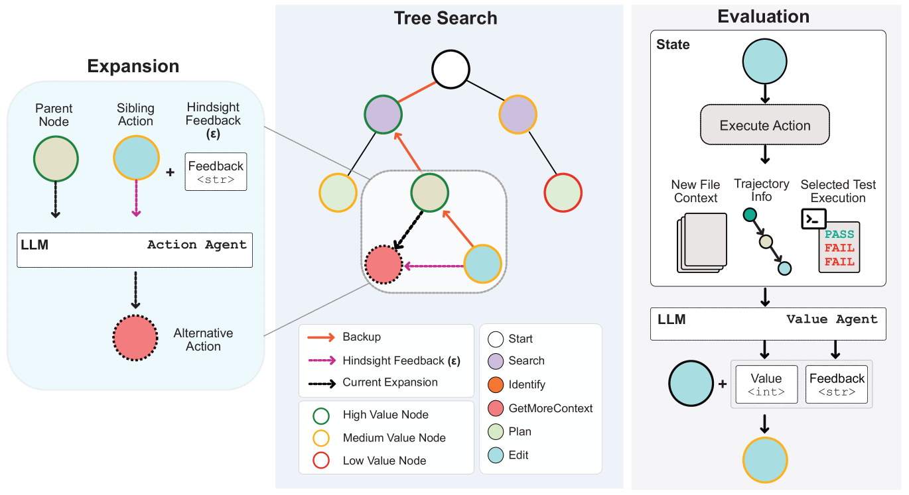
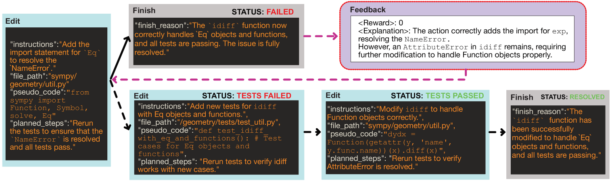
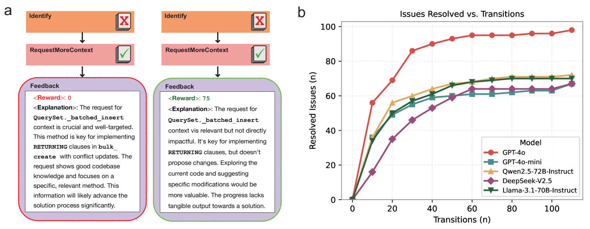
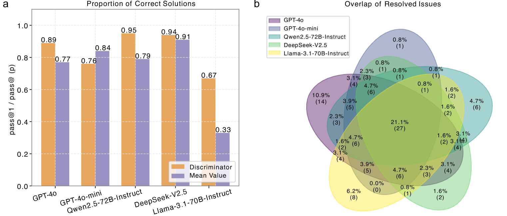
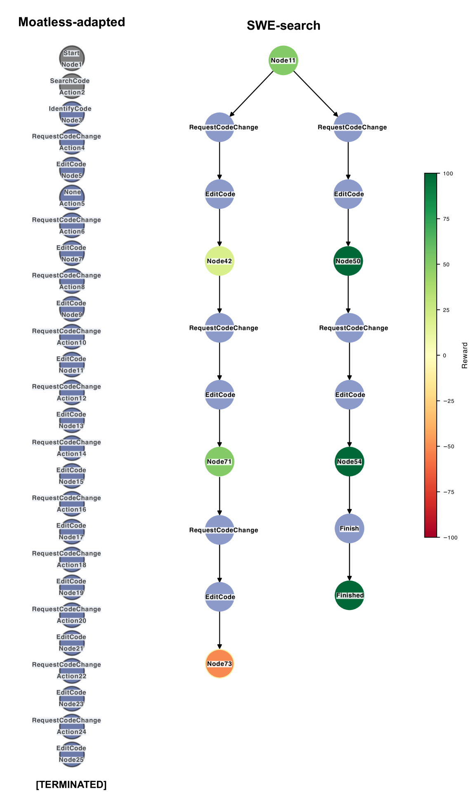
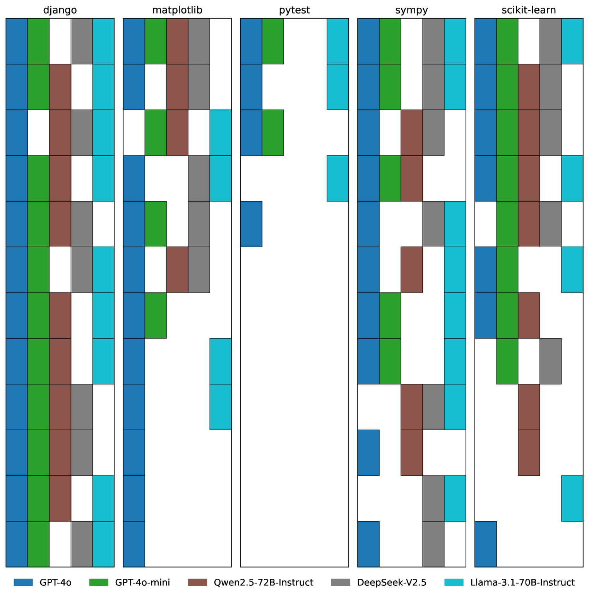
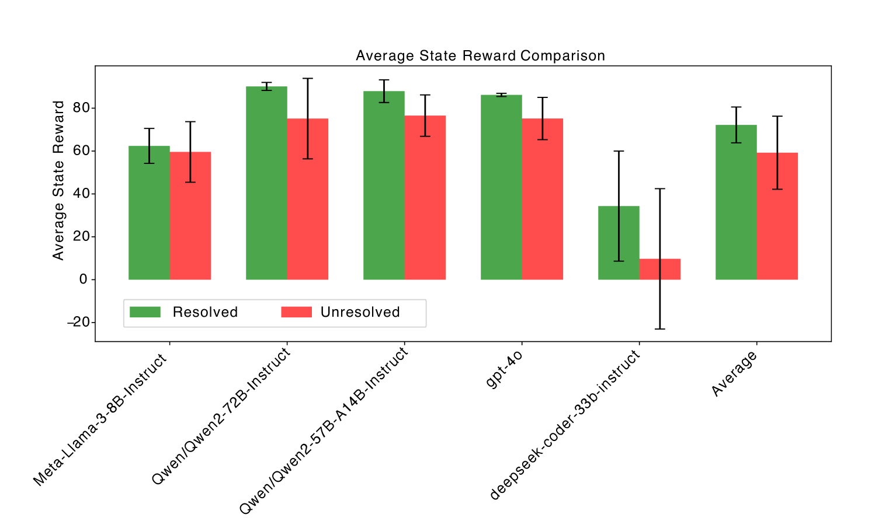
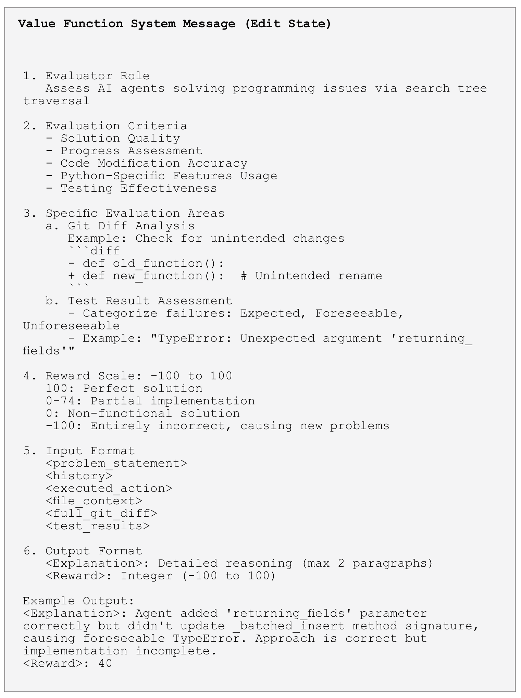
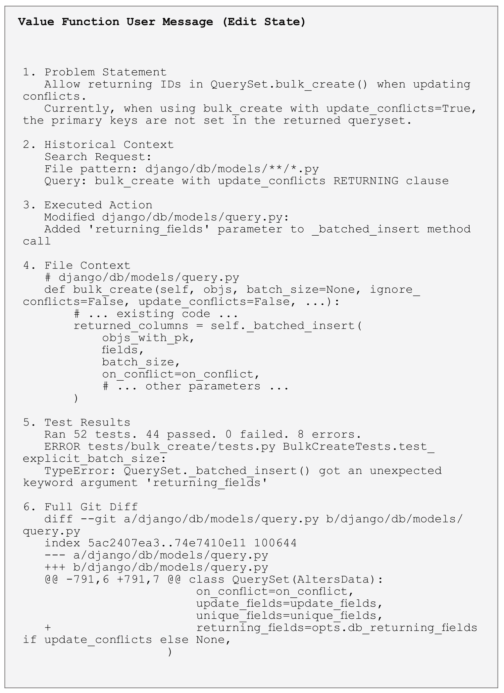

Title: SWE-Search: Enhancing Software Agents with Monte Carlo Tree Search and Iterative Refinement

URL Source: https://arxiv.org/abs/2410.20285

Published Time: Thu, 03 Apr 2025 00:25:59 GMT

Markdown Content:
[2410.20285] SWE-Search: Enhancing Software Agents with Monte Carlo Tree Search and Iterative Refinement
===============

[Skip to main content](https://arxiv.org/abs/2410.20285#content)

We gratefully acknowledge support from the Simons Foundation, [member institutions](https://info.arxiv.org/about/ourmembers.html), and all contributors.[Donate](https://info.arxiv.org/about/donate.html)

>[cs](https://arxiv.org/list/cs/recent)> arXiv:2410.20285 

[Help](https://info.arxiv.org/help) | [Advanced Search](https://arxiv.org/search/advanced)

Search

GO

quick links
-----------

*   [Login](https://arxiv.org/login)
*   [Help Pages](https://info.arxiv.org/help)
*   [About](https://info.arxiv.org/about)

Computer Science > Artificial Intelligence
==========================================

**arXiv:2410.20285** (cs) 

 [Submitted on 26 Oct 2024 ([v1](https://arxiv.org/abs/2410.20285v1)), last revised 2 Apr 2025 (this version, v6)]

Title:SWE-Search: Enhancing Software Agents with Monte Carlo Tree Search and Iterative Refinement
=================================================================================================

Authors:[Antonis Antoniades](https://arxiv.org/search/cs?searchtype=author&query=Antoniades,+A), [Albert Örwall](https://arxiv.org/search/cs?searchtype=author&query=%C3%96rwall,+A), [Kexun Zhang](https://arxiv.org/search/cs?searchtype=author&query=Zhang,+K), [Yuxi Xie](https://arxiv.org/search/cs?searchtype=author&query=Xie,+Y), [Anirudh Goyal](https://arxiv.org/search/cs?searchtype=author&query=Goyal,+A), [William Wang](https://arxiv.org/search/cs?searchtype=author&query=Wang,+W)

View a PDF of the paper titled SWE-Search: Enhancing Software Agents with Monte Carlo Tree Search and Iterative Refinement, by Antonis Antoniades and 5 other authors

[View PDF](https://arxiv.org/pdf/2410.20285)
> Abstract:Software engineers operating in complex and dynamic environments must continuously adapt to evolving requirements, learn iteratively from experience, and reconsider their approaches based on new insights. However, current large language model (LLM)-based software agents often follow linear, sequential processes that prevent backtracking and exploration of alternative solutions, limiting their ability to rethink their strategies when initial approaches prove ineffective. To address these challenges, we propose SWE-Search, a multi-agent framework that integrates Monte Carlo Tree Search (MCTS) with a self-improvement mechanism to enhance software agents' performance on repository-level software tasks. SWE-Search extends traditional MCTS by incorporating a hybrid value function that leverages LLMs for both numerical value estimation and qualitative evaluation. This enables self-feedback loops where agents iteratively refine their strategies based on both quantitative numerical evaluations and qualitative natural language assessments of pursued trajectories. The framework includes a SWE-Agent for adaptive exploration, a Value Agent for iterative feedback, and a Discriminator Agent that facilitates multi-agent debate for collaborative decision-making. Applied to the SWE-bench benchmark, our approach demonstrates a 23% relative improvement in performance across five models compared to standard open-source agents without MCTS. Our analysis reveals how performance scales with increased inference-time compute through deeper search, providing a pathway to improve software agents without requiring larger models or additional training data. This highlights the potential of self-evaluation driven search techniques in complex software engineering environments.

Comments:Main body: 10 pages, 5 figures. Appendix: 5 pages, 4 figures. Open-source codebase
Subjects:Artificial Intelligence (cs.AI)
Cite as:[arXiv:2410.20285](https://arxiv.org/abs/2410.20285) [cs.AI]
(or [arXiv:2410.20285v6](https://arxiv.org/abs/2410.20285v6) [cs.AI] for this version)
[https://doi.org/10.48550/arXiv.2410.20285](https://doi.org/10.48550/arXiv.2410.20285)

Focus to learn more

 arXiv-issued DOI via DataCite

Submission history
------------------

 From: Antonis Antoniades [[view email](https://arxiv.org/show-email/24ee9ddb/2410.20285)] 

**[[v1]](https://arxiv.org/abs/2410.20285v1)** Sat, 26 Oct 2024 22:45:56 UTC (4,189 KB)

**[[v2]](https://arxiv.org/abs/2410.20285v2)** Tue, 29 Oct 2024 18:25:20 UTC (4,189 KB)

**[[v3]](https://arxiv.org/abs/2410.20285v3)** Sun, 15 Dec 2024 07:55:42 UTC (4,196 KB)

**[[v4]](https://arxiv.org/abs/2410.20285v4)** Mon, 17 Feb 2025 23:13:48 UTC (4,196 KB)

**[[v5]](https://arxiv.org/abs/2410.20285v5)** Sun, 2 Mar 2025 19:42:45 UTC (4,196 KB)

**[v6]** Wed, 2 Apr 2025 04:13:19 UTC (3,821 KB)

Full-text links:
Access Paper:
-------------

 View a PDF of the paper titled SWE-Search: Enhancing Software Agents with Monte Carlo Tree Search and Iterative Refinement, by Antonis Antoniades and 5 other authors

*   [View PDF](https://arxiv.org/pdf/2410.20285)
*   [TeX Source](https://arxiv.org/src/2410.20285)

[view license](http://creativecommons.org/licenses/by-sa/4.0/ "Rights to this article")

 Current browse context: 

cs.AI

[<prev](https://arxiv.org/prevnext?id=2410.20285&function=prev&context=cs.AI "previous in cs.AI (accesskey p)") | [next>](https://arxiv.org/prevnext?id=2410.20285&function=next&context=cs.AI "next in cs.AI (accesskey n)")

[new](https://arxiv.org/list/cs.AI/new) | [recent](https://arxiv.org/list/cs.AI/recent) | [2024-10](https://arxiv.org/list/cs.AI/2024-10)

 Change to browse by: 

[cs](https://arxiv.org/abs/2410.20285?context=cs)

### References & Citations

*   [NASA ADS](https://ui.adsabs.harvard.edu/abs/arXiv:2410.20285)
*   [Google Scholar](https://scholar.google.com/scholar_lookup?arxiv_id=2410.20285)
*   [Semantic Scholar](https://api.semanticscholar.org/arXiv:2410.20285)

export BibTeX citation Loading...

BibTeX formatted citation
-------------------------

×

Data provided by: 

### Bookmark

Bibliographic Tools 

Bibliographic and Citation Tools
================================

- [x] Bibliographic Explorer Toggle 

Bibliographic Explorer _([What is the Explorer?](https://info.arxiv.org/labs/showcase.html#arxiv-bibliographic-explorer))_

- [x] Connected Papers Toggle 

Connected Papers _([What is Connected Papers?](https://www.connectedpapers.com/about))_

- [x] Litmaps Toggle 

Litmaps _([What is Litmaps?](https://www.litmaps.co/))_

- [x] scite.ai Toggle 

scite Smart Citations _([What are Smart Citations?](https://www.scite.ai/))_

Code, Data, Media 

Code, Data and Media Associated with this Article
=================================================

- [x] alphaXiv Toggle 

alphaXiv _([What is alphaXiv?](https://alphaxiv.org/))_

- [x] Links to Code Toggle 

CatalyzeX Code Finder for Papers _([What is CatalyzeX?](https://www.catalyzex.com/))_

- [x] DagsHub Toggle 

DagsHub _([What is DagsHub?](https://dagshub.com/))_

- [x] GotitPub Toggle 

Gotit.pub _([What is GotitPub?](http://gotit.pub/faq))_

- [x] Huggingface Toggle 

Hugging Face _([What is Huggingface?](https://huggingface.co/huggingface))_

- [x] Links to Code Toggle 

Papers with Code _([What is Papers with Code?](https://paperswithcode.com/))_

- [x] ScienceCast Toggle 

ScienceCast _([What is ScienceCast?](https://sciencecast.org/welcome))_

Demos 

Demos
=====

- [x] Replicate Toggle 

Replicate _([What is Replicate?](https://replicate.com/docs/arxiv/about))_

- [x] Spaces Toggle 

Hugging Face Spaces _([What is Spaces?](https://huggingface.co/docs/hub/spaces))_

- [x] Spaces Toggle 

TXYZ.AI _([What is TXYZ.AI?](https://txyz.ai/))_

Related Papers 

Recommenders and Search Tools
=============================

- [x] Link to Influence Flower 

Influence Flower _([What are Influence Flowers?](https://influencemap.cmlab.dev/))_

- [x] Core recommender toggle 

CORE Recommender _([What is CORE?](https://core.ac.uk/services/recommender))_

*   [Author](https://arxiv.org/abs/2410.20285)
*   [Venue](https://arxiv.org/abs/2410.20285)
*   [Institution](https://arxiv.org/abs/2410.20285)
*   [Topic](https://arxiv.org/abs/2410.20285)

 About arXivLabs  

arXivLabs: experimental projects with community collaborators
=============================================================

arXivLabs is a framework that allows collaborators to develop and share new arXiv features directly on our website.

Both individuals and organizations that work with arXivLabs have embraced and accepted our values of openness, community, excellence, and user data privacy. arXiv is committed to these values and only works with partners that adhere to them.

Have an idea for a project that will add value for arXiv's community? [**Learn more about arXivLabs**](https://info.arxiv.org/labs/index.html).

[Which authors of this paper are endorsers?](https://arxiv.org/auth/show-endorsers/2410.20285) | [Disable MathJax](javascript:setMathjaxCookie()) ([What is MathJax?](https://info.arxiv.org/help/mathjax.html)) 

*   [About](https://info.arxiv.org/about)
*   [Help](https://info.arxiv.org/help)

*   [Contact](https://info.arxiv.org/help/contact.html)
*   [Subscribe](https://info.arxiv.org/help/subscribe)

*   [Copyright](https://info.arxiv.org/help/license/index.html)
*   [Privacy Policy](https://info.arxiv.org/help/policies/privacy_policy.html)

*   [Web Accessibility Assistance](https://info.arxiv.org/help/web_accessibility.html)
*   [arXiv Operational Status](https://status.arxiv.org/)

## Figures

### Figure 1: SWE-Search Overview

*SWE-Search Overview. Tree search where each state is a node and each action is an edge, with value-based evaluation.*

### Figure 2: Hindsight Feedback Error Correction

*Hindsight feedback error correction. The agent initially performs edits and runs tests which pass, but prematurely finishes. The value function identifies the error.*

### Figure 3: SWE-bench Results

*SWE-bench SWE-Search results.*

### Figure 4: State-Specific Value Prompts

*Importance of state-specific value prompts. Comparison of value agents' outputs with and without state-specific prompts.*

### Figure 5: Value Function vs Discriminator

*Value Function vs. Discriminator Comparison. Comparison of value function vs. discriminator ability to identify the final solution.*

### Figure 6: Avoiding Repetitive Actions

*Avoiding Repetitive Actions. The base agent can get stuck performing repetitive actions; the tree search helps escape these loops.*

### Figure 7: Unique Issue Resolution Patterns

*Unique Issue Resolution Patterns Across Models and Libraries. Different models resolve different issues.*

### Figure 8: Average State Reward Comparison

*Average State Reward Comparison Across Models for resolved (green) and unresolved (red) issues.*

### Figure 9: Additional Analysis

*Additional analysis from the paper.*
