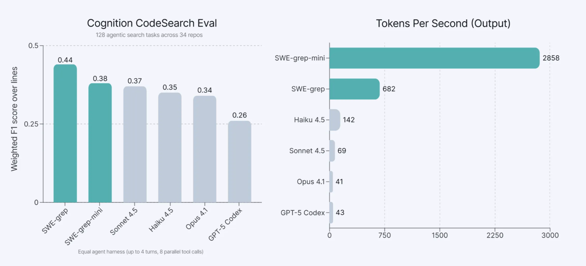
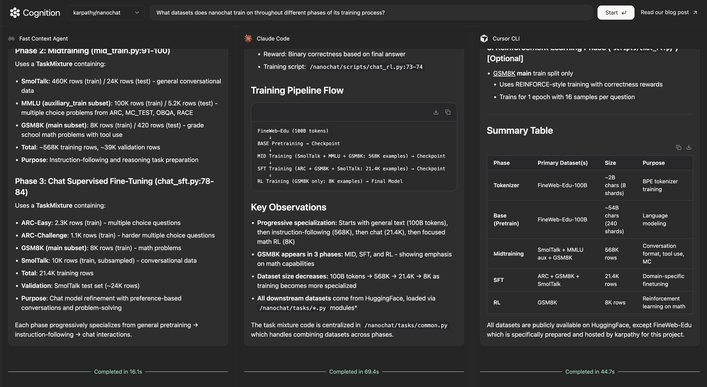
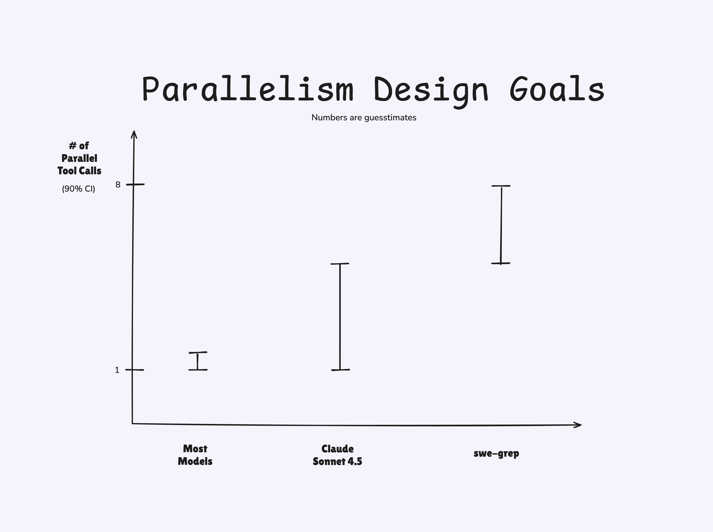
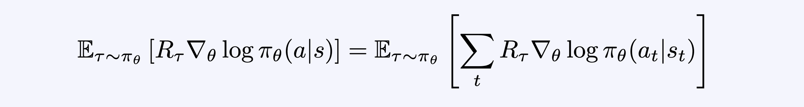
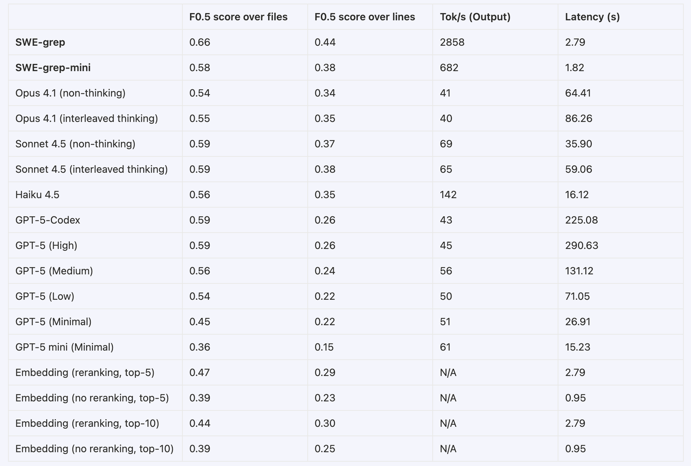
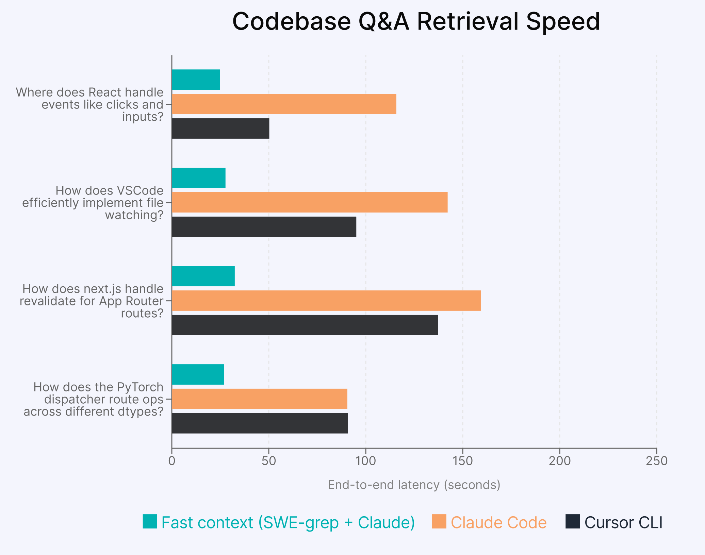
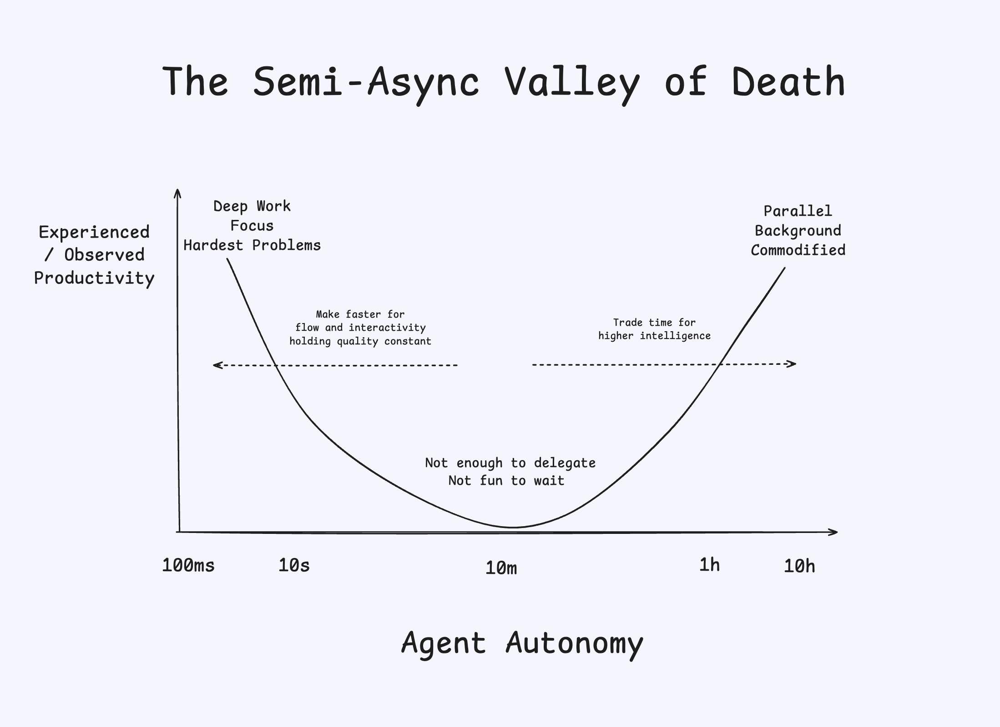

Title: Cognition | Introducing SWE-grep and SWE-grep-mini: RL for Multi-Turn, Fast Context Retrieval

URL Source: https://cognition.ai/blog/swe-grep

Published Time: Wed, 25 Feb 2026 01:07:51 GMT

Markdown Content:
**TL;DR: We trained SWE-grep and SWE-grep-mini, fast agentic models specialized in highly parallel context retrieval. They match the retrieval capabilities of frontier coding models, while taking an order of magnitude less time. Available now in Windsurf’s new Fast Context subagent!**

Modern coding agents face a fundamental tradeoff between **speed** and **intelligence**. Frontier models can solve complex tasks, but it can take minutes of searching before they edit a single file, breaking your flow. In Windsurf and Devin, we observed that our agent trajectories were often spending >60% of their first turn just retrieving context.

Context retrieval has been historically done in 2 ways:

*   **Embedding Search (RAG)**: once the upfront work of indexing the codebase is done, queries are fast. But:
    *   The results can be inaccurate, especially for complex queries that require to jump across the codebase multiple times (such as tracing through some execution path in a large codebase).
    *   The embeddings can even be counterproductive, as the agent can give too much weight to irrelevant information.

*   **Agentic Search**: the model uses CLI tools to explore a codebase, much like a human would do. [Both Claude Code and Cline have noted](https://x.com/pashmerepat/status/1926717705660375463) that this works well for them, and up until today, we agreed. While much more flexible, agentic search has its drawbacks:
    *   it’s generally slow, requiring dozens of sequential roundtrips between the user’s device and the inference endpoint.
    *   It also forces the agent to attend to tens of thousands of tokens worth of irrelevant information before finding the relevant context. This exacerbates the slowness while also context poisoning the agent, significantly degrading answer quality.

This **speed-intelligence tradeoff** seemed inescapable — until we trained **SWE-grep** and **SWE-grep-mini:** models which match the retrieval capabilities of frontier coding models, while taking an order of magnitude less time. These models now power **Fast Context**, a subagent that helps you stay in flow.

[Where to try Fast Context](https://cognition.ai/blog/swe-grep#where-to-try-fast-context)
-----------------------------------------------------------------------------------------

We will be rolling **Fast Context** out progressively to Windsurf users, starting from the [latest release](https://windsurf.com/changelog). There is no required UI or command to try it - just use Windsurf Cascade as per normal. When you make a query that requires code search, Fast Context will trigger (you can also force it to trigger by submitting the query with `Cmd+Enter`).

Check out how Fast Context reduces the time it takes to understand large codebases:

You can try it out in our playground now at [https://playground.cognition.ai/](https://playground.cognition.ai/).

Since we are offering direct comparisons between our agent and alternative agents, we should mention what is going on here and our attempts to make it a fair comparison. We host the two agents - a Fast Context Agent stripped out of Windsurf and stock Claude Code - in their own Modal containers and pipe the inputs/outputs through stdin/stdout. This is meant to reflect the experience of using each agent locally. This is not meant to be an extremely rigorous benchmark, just a demo experience we cooked up on the side to answer the obvious question of “how does Fast Context compare to what I’m used to outside of Windsurf?” You should run these tests in your own environment (with Fast Context in Windsurf) for best fidelity to your actual experience.

[Motivation](https://cognition.ai/blog/swe-grep#motivation)
-----------------------------------------------------------

There are a few reasons why we think that context retrieval is a uniquely suited task for a custom subagent:

*   _It conserves context budget (and intelligence) for the main agent._ By having the main agent delegate retrieval to a subagent, we save on (valuable) agent tokens and avoid polluting the agent's context with irrelevant information. This allows the main agent to only attend to the relevant tokens. This avoids a whole host of “context pollution” failure modes as better explained by Drew Breunig’s famous [How Contexts Fail](https://www.dbreunig.com/2025/06/22/how-contexts-fail-and-how-to-fix-them.html).
*   _Retrieval is a versatile, broadly useful ability_. All layers of the AI-assisted coding stack can benefit from fast and agentic context retrieval. From what an autocomplete model sees before giving a suggestion, to Cascade before implementing a set of changes, to Devin during a big PR, context retrieval subagents are the perfect “hand-off point” between a smart model & a fast model.
*   _Retrieval is a verifiable task._ Often sub-agents are implemented such that they summarize their findings for the main agent. This has two downsides: 1. A fast model summary can draw wrong conclusion and mislead the smart model. 2. It is hard to grade free-form summaries. Instead, the Fast Context sub agent is designed to retrieve a list of files with line ranges. For this we can define an objective ground-truth dataset, which allows us to compute a clean deterministic reward to do RL.

### What makes `SWE-grep` fast?

A few things were key to unlocking this level of intelligence at blazing-fast speeds:

1.   **Parallel tool calls and limited serial turns:** Each serial turn has a big latency cost due to tool call & network overhead. Whereas agentic search can commonly take 10-20 serial turns, we found that we can get strong results with only 4 serial turns – by leveraging highly parallel tool calls. We trained the SWE-grep models to run 8 parallel tool calls (grep, glob search, reads, etc.) at each turn and use its 4 turns as efficiently as possible. The model can perform deep searches in just a few seconds by exploring different parts of the codebase at once.
2.   **Fast tool calls**. To match the speeds that we want for SWE-grep, the time that a _single_ tool call takes becomes significant. We optimized how these tool calls run (e.g. indexing, multi-threading, carefully restricted tool set) and co-designed the SWE-grep models with this custom set of tool calls.
3.   **Fast inference.** We worked with **Cerebras**, the fastest inference provider, to deploy and optimize our custom SWE-grep models. This allows us to serve **SWE-grep-mini** at over 2,800 tokens/second and **SWE-grep** at over 650 tokens/second. This is 20x faster and 4.5x faster than Haiku 4.5 at 140 tokens/second, the second-fastest model we evaluated.

[RL for training fast, parallel agentic code search models](https://cognition.ai/blog/swe-grep#rl-for-training-fast-parallel-agentic-code-search-models)
--------------------------------------------------------------------------------------------------------------------------------------------------------

Most coding agents take so long to fetch context because they only issue one (or a few) tool calls at a time. Each turn of tool calls incurs an additional prefill, an extra network roundtrip, and decoding overhead: to explore codebases as efficiently as possible, search subagents should be doing _many_ tool calls in parallel.

While many models technically support parallel tool calls, it’s difficult to get them to use them effectively. Models are getting better than this—Sonnet in particular has improved greatly from 3.6 to 4.5—but we felt that models didn’t exploit them optimally. Here is a rough sketch of the model design space that we targeted for `SWE-grep`:

Increasing parallelism also lets us use fewer tool calls. Across our ablations, we discovered that, by increasing the amount of parallelism from 4 to 8 searches per turn, we could reduce the number of turns spent searching from 6 to 4 while retaining the same performance.

We thus trained the `SWE-grep` models to natively issue up to 8 parallel tool calls per turn in a maximum of 4 turns (3 turns of exploration and 1 turn for the answer). The SWE-grep models are given a restricted set of tool calls (`grep`, `read`, `glob`, ...) to ensure cross-platform compatibility (we have loads of Windows users!) and guarantee safety.

We train `SWE-grep` directly with [multi-turn](https://cognition.ai/blog/kevin-32b) reinforcement learning. Then we distill `SWE-grep` into `SWE-grep-mini` and perform additional reinforcement learning to boost the model’s performance on the task. Our reward function is an average of weighted F1 scores over file retrieval and line retrieval tasks, with respect to our ground truth dataset. This objective was sufficient for `SWE-grep` to naturally learn to make more tool calls to its advantage over the course of training, without us explicitly incentivizing this behavior:

We’ll explain some details about our training algorithm, a modified version of the policy gradient, and some tweaks that helped us keep training stable.

### Policy Gradient

Given an LLM policy and outcome reward R, the policy gradient is given by

where the sum is over the tokens in a single trajectory. If we are able to sample from the training policy, we can use a simple Monte Carlo estimate for the gradient, which is unbiased when the data is on-policy. However, standard training and inference libraries have [different numerics](https://thinkingmachines.ai/blog/defeating-nondeterminism-in-llm-inference/), which effectively turns the sampled data into off-policy data. This is amplified when using low-precision rollouts, a common optimization in RL frameworks. The solution is to apply importance sampling. Recent works have proposed using [per-token importance sampling](https://fengyao.notion.site/off-policy-rl) ratios. Per-token ratios, though, do not fully remove the bias. Indeed, at step t we have an action-choice mismatch, a state-distribution mismatch, and a reward-signal mismatch. A per-token ratio corrects only the action-choice mismatch. To derive an unbiased estimate, we apply per-sequence importance sampling

We expand at the token-level, subtract a leave-one-out baseline to reduce the variance, and rescale by a constant factor (absorbed in the learning rate), obtaining a surrogate loss (for a given prompt) that gives the correct gradient estimation (the notation []_∇ denotes a stop gradient):

where we sample _g_ completions from the same prompt for the Monte Carlo estimate, Aⱼ = Rⱼ - mean(R₁, ... ,R₉) and T_max is the maximum number of sampled tokens allowed during training (like [Dr. GRPO](https://arxiv.org/pdf/2503.20783)).

### Instabilities

A large number of parallel tool calls over multiple turns introduces a lot of tokens from the environment in the trajectories. These tokens are not generated by the model, leading to instabilities, especially when training small models. We found the following techniques to be helpful in stabilizing these runs:

*   masking from the loss overlong trajectories
*   masking from the loss trajectories that have [extreme importance sampling ratios](https://yingru.notion.site/When-Speed-Kills-Stability-Demystifying-RL-Collapse-from-the-Training-Inference-Mismatch-271211a558b7808d8b12d403fd15edda)
*   removing any format reward
*   interrupting and assigning a zero reward to each trajectory with an incorrectly formatted tool call or answer
*   scaling _advantages_ by the average number of tool calls used per turn. We observe that during RL training small models quickly converge to the maximum number of parallel tool calls, but ineffectively (e.g. by duplicating tool calls). By scaling the advantages, we continue to reinforce the right behavior while incentivizing the model to learn first how to use effectively a small budget of tool calls.

[Data and Evals](https://cognition.ai/blog/swe-grep#data-and-evals)
-------------------------------------------------------------------

To train SWE-grep and evaluate models on the context retrieval task, we used an internal dataset consisting of real-world repositories, user queries, and a labeled ground truth of relevant files and line ranges, drawn from our hardest bug reports and internal tests. We call this **the Cognition CodeSearch Eval**.

When evaluating models for context retrieval, we care about two metrics:

*   Weighted F1 score of files and line ranges vs. the ground truth, aka F-β with β=0.5
*   End-to-end latency

We use a _weighted_ F1 score, where precision is prioritized over recall, precisely because we found that context pollution matters. We found that polluting the context of the main agent was more detrimental than leaving some context out, as the agent is typically only a few searches away to recover any remaining context. To evaluate models, we allow each model 4 turns of up to 8 parallel tool calls (searches, reads, etc.), and benchmark them on the above metrics.

Our results on our evaluation set demonstrate that SWE-grep and SWE-grep-mini are an order of magnitude faster than frontier models, while matching or outperforming them at context retrieval.

### Downstream analysis

We also evaluated how well the SWE-grep models work when used as a subagent in larger agent pipelines.

**Coding tasks.** To evaluate how well it works in Windsurf’s Cascade agent, we use an randomly selected subset of difficult SWE-Bench Verified tasks. When using the Fast Context subagent, the agent (using Sonnet 4.5 as the main model) accomplishes the same number of tasks in significantly lower end-to-end time.

*_on internal runners_

**_search file steps include greps, file reads, glob searches, etc._

**Codebase Q&A.** We show the end-to-end latency on some example queries over open-source repositories. As with our playground setup, we benchmark the Fast Context agent—as it would be used in Windsurf—against Claude Code and Cursor CLI by measuring end-to-end latency.

[Fast Context as the first step to Fast Agents](https://cognition.ai/blog/swe-grep#fast-context-as-the-first-step-to-fast-agents)
---------------------------------------------------------------------------------------------------------------------------------

The **Fast Context** subagent in Windsurf is our first stepping stone on our roadmap for **Fast Agents**. The `SWE-grep` models will be deployed in DeepWiki, Devin, Windsurf Tab and future products as we validate and tune for those use cases - future directions we want to explore include much more variable turn length, even higher intelligence, and tools speed optimizations.

End-to-end latency is a moderately non-consensus dimension of research for agent labs. In a world where coding agents grab headlines for having 2-30 hours of autonomy, the marketing incentive is to make agents _slower,_ not faster. But we think the pendulum will swing the other way soon — simply because we have the unfair advantage of seeing actual user behavior across sync and async code agents at massive scale.

The goal of Windsurf is to keep you in flow, which [Mihaly Csikszentmihalyi](https://en.wikipedia.org/wiki/Flow_(psychology)) defines as “a state of complete absorption in an activity”. Roughly, we estimate that **your P(breaking flow)** geometrically increases 10% every second that passes while you wait for agent response, with the exact threshold varying based on perceived complexity of the request. The arbitrary “**flow window**” we hold ourselves to is 5 seconds.

Our ultimate goal at the combined Cognition+Windsurf is to maximize your software engineering productivity, and we are simultaneously researching both the directions of pushing the frontier of coding agent autonomy -AND- making them faster given a “good enough” bar. The best mental model we’ve found is the one we’ve arrived at below - avoid the Semi-Async Valley of Death at all costs!

## Images

All images downloaded from the [original blog post](https://cognition.ai/blog/swe-grep) and stored locally in `../../../../_media/`.

| # | File | Description |
|---|------|-------------|
| 00 | [cognition-swe-grep-00-og-social-preview.png](../../../../_media/cognition-swe-grep-00-og-social-preview.png) | Open Graph / social media preview image for the blog post |
| 01 | [cognition-swe-grep-01-fast-context-speed-comparison.png](../../../../_media/cognition-swe-grep-01-fast-context-speed-comparison.png) | Fast Context speed comparison showing retrieval time improvements |
| 02 | [cognition-swe-grep-02-playground-screenshot.png](../../../../_media/cognition-swe-grep-02-playground-screenshot.png) | SWE-grep playground at playground.cognition.ai comparing Fast Context Agent vs Claude Code |
| 03 | [cognition-swe-grep-03-model-design-space-parallelism.gif](../../../../_media/cognition-swe-grep-03-model-design-space-parallelism.gif) | Animated diagram of the model design space showing parallelism vs serial turns tradeoff |
| 04 | [cognition-swe-grep-04-tool-calls-increase-during-training.png](../../../../_media/cognition-swe-grep-04-tool-calls-increase-during-training.png) | Chart showing tool calls naturally increasing during RL training without explicit incentivization |
| 05 | [cognition-swe-grep-05-policy-gradient-formula.png](../../../../_media/cognition-swe-grep-05-policy-gradient-formula.png) | Mathematical formula for the policy gradient with outcome reward R |
| 06 | [cognition-swe-grep-06-importance-sampling-formula.png](../../../../_media/cognition-swe-grep-06-importance-sampling-formula.png) | Per-sequence importance sampling formula for unbiased gradient estimation |
| 07 | [cognition-swe-grep-07-surrogate-loss-formula.png](../../../../_media/cognition-swe-grep-07-surrogate-loss-formula.png) | Surrogate loss formula with leave-one-out baseline for variance reduction |
| 08 | [cognition-swe-grep-08-codesearch-eval-results.png](../../../../_media/cognition-swe-grep-08-codesearch-eval-results.png) | Cognition CodeSearch Eval results: scatter plot of weighted F1 score vs end-to-end latency across models |
| 09 | [cognition-swe-grep-09-swe-bench-downstream-results.png](../../../../_media/cognition-swe-grep-09-swe-bench-downstream-results.png) | SWE-Bench Verified downstream results showing Fast Context reduces end-to-end time while maintaining solve rate |
| 10 | [cognition-swe-grep-10-codebase-qa-latency-comparison.png](../../../../_media/cognition-swe-grep-10-codebase-qa-latency-comparison.png) | Codebase Q&A latency comparison table: Fast Context Agent vs Claude Code vs Cursor CLI |
| 11 | [cognition-swe-grep-11-semi-async-valley-of-death.png](../../../../_media/cognition-swe-grep-11-semi-async-valley-of-death.png) | Semi-Async Valley of Death diagram showing the tradeoff between agent autonomy duration and user productivity |
