# SANM 2026-04-26 pre-earnings re-rate thesis — ZT-AMD deal positions Sanmina for AI rack and 1.6T optics ramp

## Key takeaways

- **Setup**: Crux holds [[Sanmina (SANM)]] (averaged into the $130s) into the 2026-04-27 earnings call, arguing the legacy-EMS valuation lens is stale. Equity value ~$10.5B against $3.19B Q1 FY26 revenue (~$12.8B run rate) and management's $16B+ CY27 target.
- **ZT Systems is the fulcrum**: SANM acquired the manufacturing arm of ZT Systems from [[Advanced Micro Devices (AMD)]] (AMD kept the rack-scale AI systems design + customer-enablement team). ZT brings NJ/TX/Netherlands facilities, advanced liquid-cooling capability, and made SANM AMD's preferred U.S.-based NPI partner for cloud rack + cluster-scale AI solutions.
- **Q1 FY26 print**: revenue $3.19B (+59% YoY), 6.0% non-GAAP op margin, $2.38 non-GAAP diluted EPS (+66% YoY), $179M OCF. Communications Networks + Cloud & AI Infrastructure = $1.964B (vs $737M Q1 FY25) — 62% of revenue is now the AI/cloud segment.
- **Optics angle**: per 10-K, SANM supports 400G/800G/1.6T shelves, modules, transceivers + optical advanced packaging from 100G→1.6T; management said 1.6T is starting to ship. Crux frames this as optics exposure through the manufacturing/integration layer — broader than pure-play [[Fabrinet (FN)]], [[Coherent (COHR)]], [[Lumentum (LITE)]].
- **Power leg**: medium-voltage transformers, grid-scale transformers, battery storage. New Houston facility starts production 2027; co-design partnership with Croatian KONCAR. Initial customer commitments in hand; first shipments late 2026, full production CY2027. Crux treats power as a 2027 ramp, not current driver.
- **Balance sheet**: $1.42B cash, $0 drawn on $1.5B revolver, $3.6B liquidity, 0.8x net leverage, 32.1% non-GAAP pre-tax ROIC. Working capital absorption around ZT inventory flagged as a watch-item.
- **CY27 valuation cases** (Crux):
  - **Bear (failed re-rate)**: $14.5B rev × 5.75% OM × 0.50x sales ≈ **$130/sh**.
  - **Base (partial re-rate)**: $16.5B rev × 6.25% OM × 0.90x sales ≈ **$270/sh**.
  - **Bull (AI-infra re-rate)**: $19B rev × 6.75% OM × 1.20x sales ≈ **$415/sh**.
- **Risks**: ZT integration slippage, older-platform revenue rolling down faster than new programs scale, customer concentration, working-capital drag, margin compression chasing $16B target, power timing slipping past 2027, and a crowded-trade entry risk if multiple is pulled forward pre-print.
- **Strategy**: hold through print; add on beat-and-raise; add on $170–175 dip if in-line; cut if thesis breaks.

## Why this matters

This is the cleanest articulation yet of Crux's "AI-infrastructure re-rate" framework being applied to a non-Photonics name — a $10B mkt-cap EMS that the author argues has already mutated into a physical-AI-buildout play (rack systems, liquid cooling, optical packaging, transformers, hyperscaler programs) but still trades on legacy multiples. Earnings tomorrow (2026-04-27) is the catalyst.

## Watch on the call

1. ZT integration status (margin parity with core SANM, technical-team progress).
2. AMD ramp cadence — accelerated compute weighted late 2026 → 2027.
3. Core SANM independent growth (no ZT halo).
4. Optical advanced packaging + 1.6T networking — real shipment momentum vs talking point.
5. Power orders concrete vs concept; production-line ready CY2027.
6. Margin discipline — operating margin staying ≥6% as revenue scales to $16B+.
7. Working capital normalization once ZT has full quarter of cost-of-goods in numbers.

## Related

- [[Sanmina (SANM)]] — subject hub
- [[Advanced Micro Devices (AMD)]] — ZT Systems counterparty; SANM is AMD's preferred U.S. NPI manufacturer for cloud rack + AI cluster solutions
- Optics peers (Crux contrasts SANM's manufacturing-layer angle vs pure-play components): [[Fabrinet (FN)]], [[Coherent (COHR)]], [[Lumentum (LITE)]]
- AI-CAPEX context for the thesis backdrop: [[AI CAPEX 2026-Q1 hyperscaler reads bullish - $700B-plus 2026 spend funds optics, networking, and inference buildout per Crux]]

## Original Content

There is a company I think far too few people are talking about.

It has some exposure to three of the hottest infrastructure themes right now:

**Optics**

**Power**

**CPU Infrastructure**

Its current revenue run-rate already exceeds its equity value, and management is pointing to a much larger 2027 revenue base.

The stock has started to wake up (but only up ~25% YTD), and the business reset still looks larger than the price move in my opinion.

It's listed on NASDAQ.

It reports earnings this week.

And after years of being valued like a sleepy manufacturer, it may finally be setting up for a re-rate.

This is one of those setups I love looking for: a business still labeled one way, even as the actual exposure underneath the surface is changing quickly.

AI racks. Accelerated compute systems. High-speed optical networking. Liquid cooling. Power equipment. U.S.-based manufacturing.

This company touches more of the physical AI buildout than people probably realize.

So the question is simple:

Is this the next AI infrastructure re-rate candidate?

Let's dive in.

---

*Behind the paywall, I'm breaking down what the company is, what it actually builds, why recent deal changed the story, how AMD fits into the thesis, where the optics and power exposure show up, what I need to hear on earnings, what could break the setup, what my YE 2027 forecasts are, and what my own strategy will be tomorrow.*

---

The company is Sanmina ($SANM).

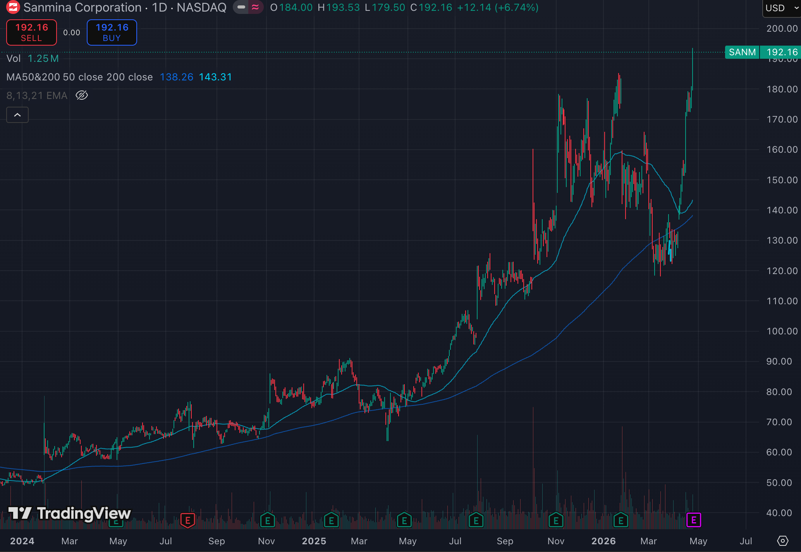

At first glance, Sanmina definitely looks boring. Especially when I first wrote about it in March. It is an electronics manufacturing and systems integration company. It helps customers build complex hardware across communications, cloud, industrial, energy, medical, defense, aerospace, automotive, and transportation verticals. Yawn.

That old label is accurate, but it is too narrow for the version of Sanmina emerging today.

The company is increasingly tied to the physical layer of AI infrastructure. We're talking racks, servers, storage systems, high-speed networks, optical hardware, liquid cooling, power products, advanced packaging, and full-system integration.

Do any of those terms sound familiar? Just some of the biggest buzzwords we hear in the market today that stocks are catching massive bids for.

---

### The Setup

I first wrote about Sanmina on March 12 as an early thesis.

Please read here:

#### Sanmina ($SANM): An Early Thesis

[Gaetano](https://substack.com/profile/410947583-gaetano) · Mar 12 · [Read full story](https://cruxcapitalgroup.substack.com/p/sanmina-sanm-an-early-thesis)

My idea was that Sanmina still carried the label of a legacy manufacturer, while the business underneath was shifting toward the physical buildout of AI infrastructure.

Since then, the stock has started to move.

But I think the bigger question is still ahead of us.

Has the valuation caught up with what Sanmina is becoming?

I am far from convinced.

The deeper I look, the more this seems like a potential re-rate setup.

But tomorrow's earnings call should make it break it.

---

### Why Sanmina Fits The AI Buildout

Sanmina's value comes from turning complex hardware programs into repeatable production across servers, storage, networking systems, optical assemblies, memory modules, cooling hardware, power products, and full racks.

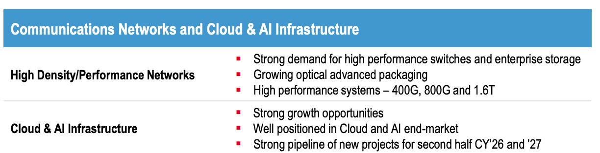

We'll get into the ZT deal in a bit, but it moves Sanmina deeper into AI data-center systems integration at the exact point where rack complexity, power density, and deployment volume are rising.

---

### What Sanmina Builds

Before getting into the AI angle, I want to be clear about what Sanmina actually does.

Sanmina is a manufacturing and integration partner. It helps customers design, manufacture, assemble, test, and scale complex electronics and systems.

That can include printed circuit boards, assemblies, backplanes, cables, enclosures, racks, cooling systems, storage systems, optical modules, optical subsystems, RF and microelectronics modules, memory modules, and power products.

This is why I keep using the phrase "physical AI infrastructure."

Sanmina is upstream of deployment and downstream of design. It takes complex hardware programs and helps turn them into real products at scale.

---

### The ZT Deal Changed The Company

The biggest reason this story has changed is the ZT Systems manufacturing acquisition from AMD.

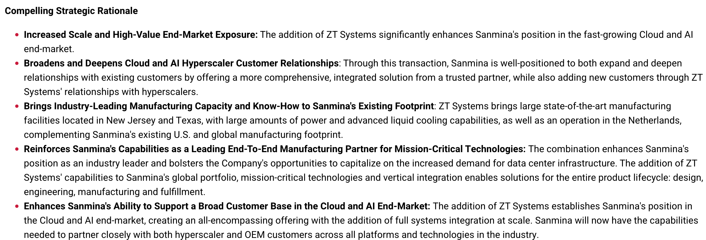

ZT Systems was a private company known for building complex server and rack-scale infrastructure for hyperscale cloud and AI data centers. AMD acquired ZT to strengthen its rack-scale AI systems capabilities, then sold the manufacturing business to Sanmina while keeping the design and customer-enablement teams.

AMD kept the part tied to rack-scale AI system design and customer engagement. Sanmina acquired the part tied to manufacturing, scale, and deployment.

So I think AMD wanted the strategic AI systems layer while placing high-volume manufacturing with a specialist that already knows how to build complex infrastructure at scale.

That is exactly why Sanmina wanted ZT.

ZT gives Sanmina a stronger path into AI racks, accelerated compute systems, liquid cooling, hyperscaler infrastructure, and full-system integration. It also deepens Sanmina's relationship with AMD, because Sanmina became AMD's preferred U.S.-based NPI manufacturing partner for AMD cloud rack and cluster-scale AI solutions.

This is the fulcrum of the thesis.

Sanmina was already a complex manufacturing company. ZT moved it closer to the layer where AI systems are built, tested, integrated, and shipped.

The ZT manufacturing business also brought real physical assets. It added manufacturing facilities in New Jersey and Texas, a Netherlands operation, advanced liquid-cooling capabilities, high-quality manufacturing capacity, and deep experience building cloud and AI infrastructure for hyperscalers.

That is exactly the type of capacity that becomes valuable when AI racks get denser, hotter, larger, and harder to deploy.

In their Q1 report management said ZT integration is on track, the business is immediately accretive to EPS, ZT margins are in line with core Sanmina, and the technical team is in place.

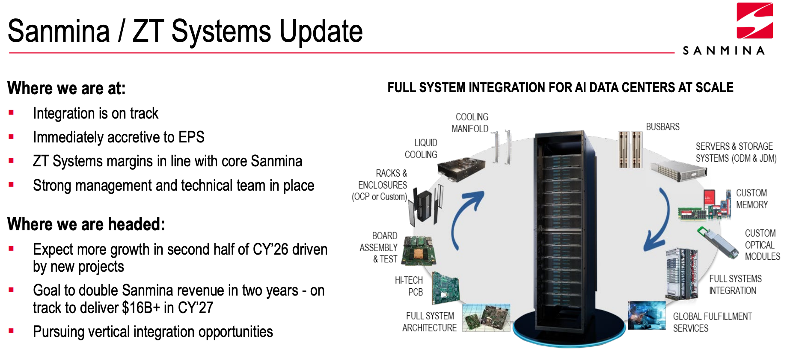

More importantly, Sanmina said it expects more growth in the second half of calendar 2026 from new projects, has a goal to double revenue in two years, and is on track to deliver $16B+ in calendar 2027.

---

### Why This Connects To Inference

Inference changes the AI spend cycle from building giant training clusters to deploying many production systems that run all day.

Once models serve users across apps, agents, search, enterprise workflows, RAG, and tool-calling products, demand shifts from a single headline chip to repeatable system deployment.

That is where Sanmina fits.

Sanmina gets paid when complex AI infrastructure moves from design into production. ZT makes that exposure much more direct because its core business was cloud rack and cluster-scale infrastructure. With ZT inside Sanmina, the company is closer to the layer where AI systems are assembled, validated, cooled, powered, and ramped for hyperscale customers.

So when I say Sanmina has CPU / inference exposure, I mean this:

Inference creates more physical system volume. Sanmina helps turn that volume into deployable infrastructure.

---

### The Optics Angle

The optics angle is one of the reasons this caught my attention in the first place.

Sanmina is broader than Fabrinet, Coherent, Lumentum, or other more direct optics names. This is a manufacturing, packaging, and integration angle around optics rather than a pure optical component story.

Sanmina's 10-K says the company supports optical 400G, 800G, and 1.6T shelves, modules, and transceivers, along with switches, servers, storage, racks, and cooling for traditional, edge, and AI-centric data-center applications.

It also says Sanmina supplies optical products from 100G through 1.6T for optical communication, AI, high-performance computing, quantum computing, and data-center infrastructure.

Then the Q1 call made the setup more current.

Management said Sanmina is seeing strong demand for high-performance switches and enterprise storage. They also said the company is growing and expanding its optical advanced packaging products business, and that Sanmina does high-performance network systems across 400G, 800G, and 1.6T, with 1.6T starting to ship.

As we know, and as we have talked about in depth on this page, AI data centers need more bandwidth.

More bandwidth pushes the industry toward faster optical systems, higher-density packaging, tighter integration, and more complex manufacturing.

Sanmina is positioned in the layer that helps bring those systems into deployment.

So the way to distill this is that Sanmina gives us optics exposure through the manufacturing and integration layer.

That can change the valuation lens.

A low-growth EMS label gives you one valuation framework.

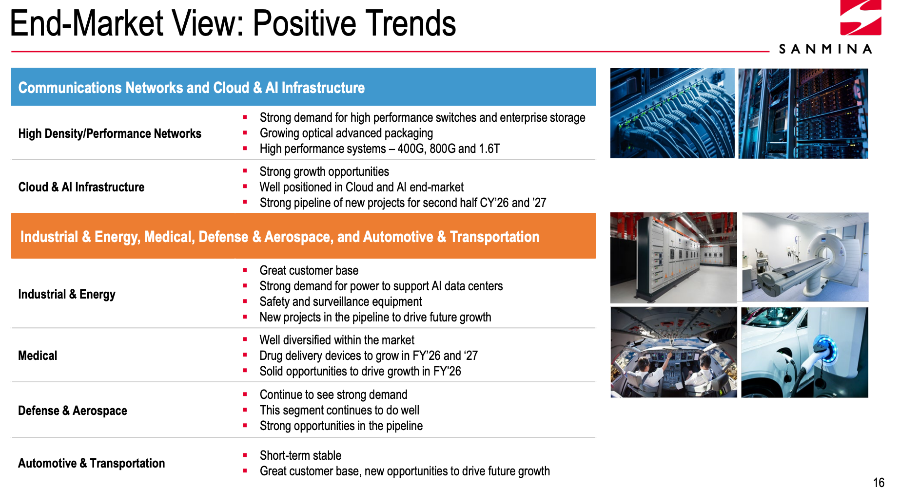

A scaled manufacturing partner for high-speed AI networking and optical systems gives you a different framework.

---

### The Power Angle

AI data centers are creating huge demand for electrical infrastructure. That includes transformers, power distribution, switchgear, battery systems, bus bars, and grid-related equipment.

Sanmina is building exposure directly into this layer.

Management laid out the opportunity clearly on the Q1 call.

For distribution, Sanmina is focusing on medium-voltage transformers.

For transmission, it is focusing on grid-scale transformers.

For storage, it is focusing on battery storage systems.

They also discussed its ability to participate from early-stage product design through full systems, using internal capabilities like electronics, machining, fabrication, and bus bars.

Sanmina also said the new Houston facility will support the U.S. energy infrastructure with medium-voltage distribution transformers, instrument transformers, and switchgear. Production is expected to start in 2027, and the company said it already had initial customer commitments.

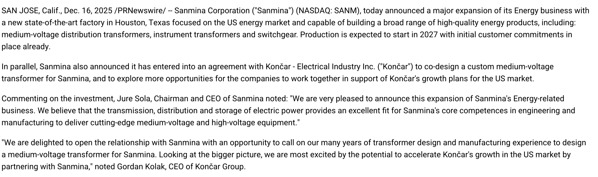

Sanmina also said it is working with KONCAR, a Croatian electrical equipment company, to co-design custom medium-voltage transformers for customers and additional U.S. opportunities.

Management then said it has a long-term commitment from a large strategic customer, expects to ship a few units in late 2026, and plans to be ready for full production in calendar 2027.

This also fits the broader backdrop.

Power has become one of the central bottlenecks in AI data-center expansion. Developers are running into grid interconnection issues, local approval pushback, and long lead times for electrical equipment.

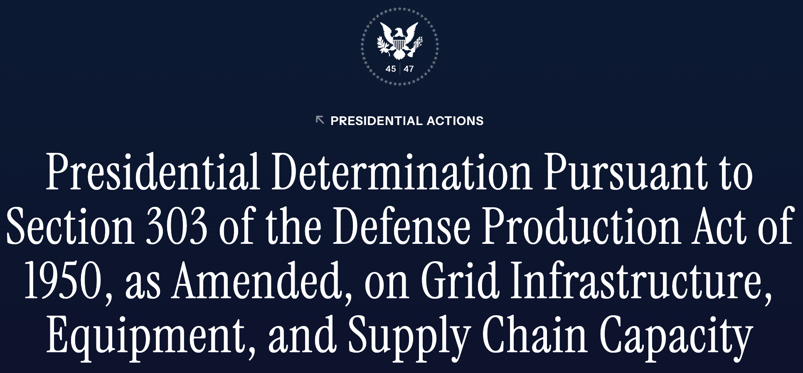

The White House has also started treating data-center power as a national infrastructure issue, with recent policy language pushing hyperscalers and AI companies to build, bring, or buy the power needed for data centers and cover related infrastructure costs.

That makes Sanmina's power push timely.

The company is gaining exposure to the electrical bottleneck around AI data centers.

The timing of this is important to acknowledge too as the current revenue engine is ZT, communications networks, cloud, and AI infrastructure and the power business looks more like a 2027 ramp.

So this gives Sanmina another leg of the physical AI infrastructure thesis.

---

### Liquid Cooling And Rack Density

With power density rising and thermal management getting more complex, rack-level integration is becoming a bigger part of the value chain.

Sanmina's ZT slide directly includes liquid cooling in the full-system integration diagram, and management said its AI data-center capabilities run from components and liquid-cooling racks to full system integration at scale.

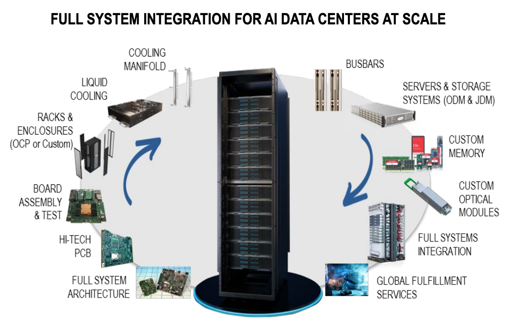

Customers need partners that can handle all this as one integrated system.

---

### The Numbers

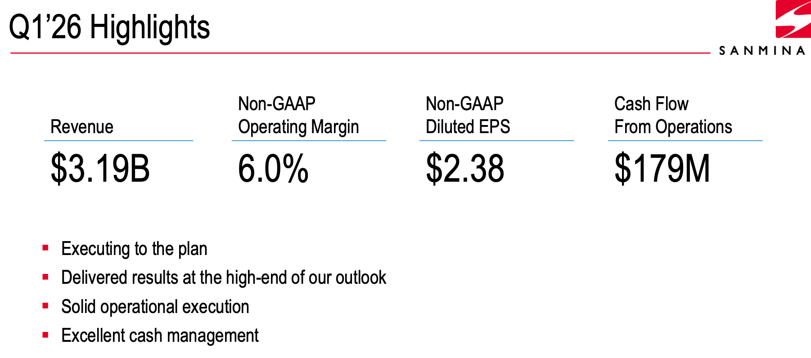

In Q1 FY26, Sanmina reported $3.19B of revenue, 6.0% non-GAAP operating margin, $2.38 of non-GAAP diluted EPS, and $179M of operating cash flow.

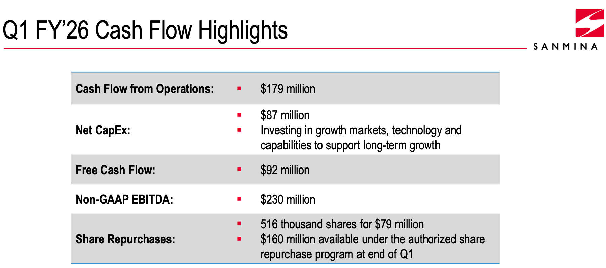

Management said revenue and operating margin came in toward the high end of its outlook, while EPS exceeded guidance.

The year-over-year growth was significant.

Revenue grew 59%.

Non-GAAP operating profit rose to $192M.

Non-GAAP EPS increased 66.1%.

Management attributed the revenue growth primarily to communications networks, cloud and AI infrastructure, and the addition of ZT Systems.

The financial profile gives the thesis credibility.

This is a lower-margin manufacturing and systems integration company, so investors should judge it through that lens.

The key is that Sanmina is growing quickly while holding operating margin around 6%, generating cash, and investing for future growth.

The balance sheet also supports the setup.

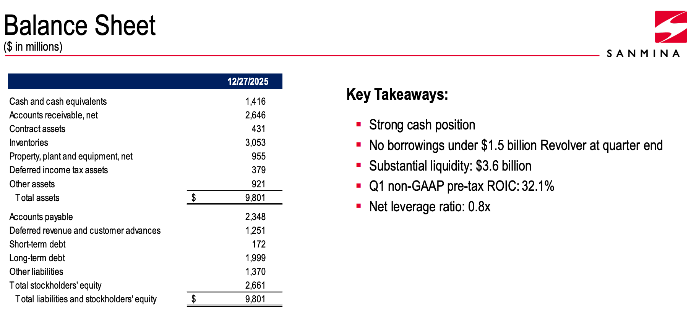

Sanmina ended Q1 with $1.42B in cash, no borrowings under its $1.5B revolver, approximately $3.6B of liquidity, a 0.8x net leverage ratio, and 32.1% non-GAAP pre-tax ROIC.

The company is growing, yet still showing return discipline.

---

### The Mix Shift Is The Re-Rate Argument

The re-rate case comes down to mix.

In Q1 FY26, Communications Networks and Cloud & AI Infrastructure generated $1.964B of revenue, up from $737M in Q1 FY25.

The rest of the company (Industrial & Energy, Medical, Defense & Aerospace, Automotive & Transportation) generated $1.226B.

That means roughly 62% of Q1 revenue came from the part of the business most tied to cloud, AI infrastructure, and high-performance networking.

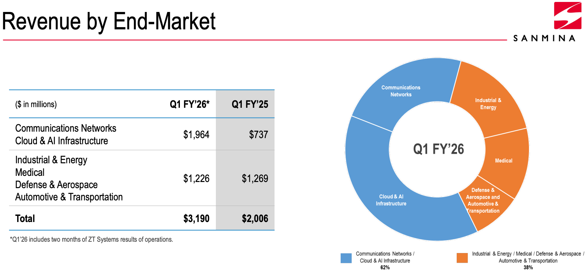

That is the key.

If the largest part of the company is now tied to cloud, AI infrastructure, high-performance networking, and ZT, the old valuation lens starts to look stale.

Sanmina still has a diversified base, which helps reduce cyclicality.

But valuation usually follows growth, visibility, and strategic exposure.

If the growth business becomes the core business, the stock can trade differently.

---

### The Valuation Setup

Sanmina is producing revenue at a scale that looks large relative to its equity value.

As I am writing this, the company is valued around **$10.5B**.

Q1 revenue of **$3.19B** annualizes to roughly **$12.8B**. Management has also talked about a path toward roughly **$14B of FY26 revenue**, while the Q1 presentation points to **$16B+ in calendar 2027**.

That is the re-rate math.

I would frame year-end 2027 in three cases.

#### Bear Case: Failed Re-Rate

The bear case is that Sanmina grows, but the stock gives back the AI infrastructure premium it has started to earn.

ZT integration works, but the transition looks uneven. Older platforms pressure the ramp. AMD timing stays vague. Power remains more of a 2028 contributor. Optical and networking stay healthy, but valuation falls back toward the old Sanmina framework.

In that case, I would use roughly **$14.5B of revenue**, **5.75% operating margin**, and about **0.50x sales** and **$130 per share**.

That lines up with the recent area where the stock traded before this breakout.

#### Base Case: Partial Re-Rate

The base case is that management is directionally right.

Sanmina grows into ZT. AI hardware demand stays strong through 2027. Optical advanced packaging and high-performance networking keep expanding. Power begins to contribute, even if it remains early.

In that case, I would use roughly **$16.5B of revenue**, **6.25% operating margin**, and about **0.90x sales** and **$270 per share**.

#### Bull Case: AI Infrastructure Re-Rate

The bull case is that ZT turns Sanmina into one of the cleaner public ways to play AI data-center systems manufacturing.

AMD-related ramps hit. Hyperscaler demand stays strong. 1.6T and optical advanced packaging keep scaling. Power becomes visible in the 2027 numbers. Operating margins move toward the higher end of management's long-term range.

In that case, I would use roughly **$19B of revenue**, **6.75% operating margin**, and about **1.20x sales** or about **$415 per share**.

That is where the real upside case lives.

Revenue growth. AI mix. ZT scale. Optical and networking exposure. Power optionality. Cash generation. Possible margin expansion.

That is a real re-rate recipe if you ask me.

But, of course we need to see what tomorrow's earnings has in store.

---

### Why Earnings Could Be The Catalyst

The upcoming earnings call is the event that could either validate or cool the setup. It's tomorrow (Monday 04/27)

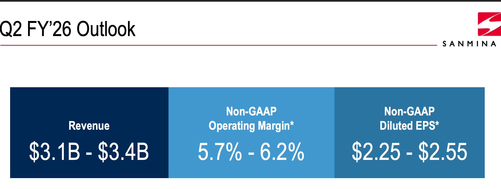

I care less about one quarter in isolation and more about whether management gives enough confidence in the 2027 ramp.

The key question is whether Q1 was simply a ZT step-up or the beginning of a multi-year AI infrastructure buildout cycle.

The most important signals will be ZT integration, AMD-related demand, accelerated compute timing, older platform transitions, core Sanmina growth, optical and networking demand, power project progress, margin stability, and confidence around the $16B+ CY27 target.

The last call already gave us all the pieces.

Management said core Sanmina and ZT both performed near the high end. ZT was in line with expectations. The transition was proceeding as expected. The company was focused on executing new opportunities.

Jure Sola also said there was no way Sanmina could get to $16B in 2027 without the ZT potential and new platforms coming out.

That is why this earnings report is so important.

If management gives the Street more confidence around that path, the stock can keep re-rating.

---

### The earnings call

The ZT questions come first. Is integration still on track? Are margins holding in line with core Sanmina? Are AMD-related opportunities progressing, and are the accelerated compute ramps still weighted toward late 2026 and into 2027?

Beyond ZT, I want to hear that core Sanmina is still growing independently, that optical advanced packaging and high-performance networking demand remain strong, and that 1.6T shipments are building real momentum rather than staying a talking point. On power, are projects moving from concept to committed orders with real production timelines, or is 2027 still a placeholder?

The thread running through all of it is margin discipline. Revenue scaling toward $16B means less if the operating margin compresses below 6% to get there. I want to hear that management believes both can happen together.

If the $16B+ CY27 framework stays intact and the ZT ramp is on schedule, this call gives us something to underwrite.

---

### What Can Go Wrong

The biggest risk is execution.

Sanmina is integrating a major acquisition while trying to scale into large AI data-center opportunities. If ZT integration slows, if AMD-related ramps take longer, if older ZT platform revenue rolls down faster than new programs scale, or if customer concentration becomes a bigger issue, the valuation can reset quickly.

Margins are another key risk. This is still a manufacturing and integration company. Operating margins are far lower than software or semiconductor IP businesses. If revenue grows but mix pressure holds margins down, the re-rate could stall.

Working capital also needs attention. Fast hardware growth can consume inventory and cash. Management already discussed inventory dynamics around ZT, including the impact of having a full amount of ZT inventory with only two months of cost of goods sold in the Q1 calculation.

They expect a clearer view once ZT has a full quarter in the numbers. This is important because hardware growth can absorb cash before it creates earnings leverage.

Sanmina is scaling a business that requires components, customer-specific raw materials, receivables, and large program ramps. If the ramp works, working capital supports revenue growth. If timing slips, inventory and cash conversion can pressure the model.

Then we have customer concentraiton. Sanmina works with large customers and large programs. That can produce very strong growth when the cycle is working, but it can also increase dependency on a smaller number of major platforms.

The power business also has timing risk. The transformer opportunity sounds strong, but shipments are expected to begin in late 2026, with full production planned for calendar 2027. That makes power a future growth vector rather than the current driver.

The final risk is the stock move itself. If investors have already pulled forward too much optimism before earnings, even a solid quarter can create volatility.

The thesis can still be right while the entry gets tricky.

---

### My Strategy

I own shares in Sanmina averaged in the 130's. I will be holding this position through earnings. If everything I just highlighted looks good and goes above and beyond. I will look to add to my position. If it's in-line, I might add on any possible dip in the 170-175 area, depending on the velocity of the move. If for some reason the thesis breaks and everything slows down or the narrative changes, I will cut my position.

I will write up a full break down once the earnings call is over.

---

***Disclaimer:** This report is for research and educational purposes only and is not financial advice. I am not a financial advisor. Please do your own due diligence and consider your own risk tolerance, time horizon, and financial situation before making any investment decisions. Stocks can be volatile, and valuation assumptions, revenue estimates, and price targets can change quickly as new information comes out. I may own, buy, or sell shares of companies discussed in this report at any time.*
