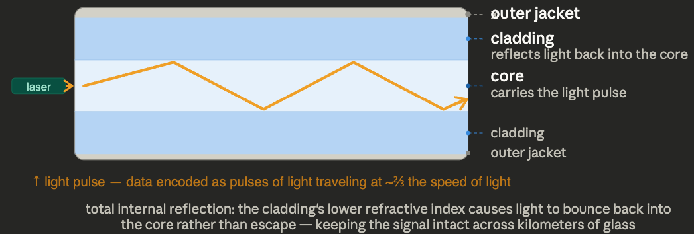
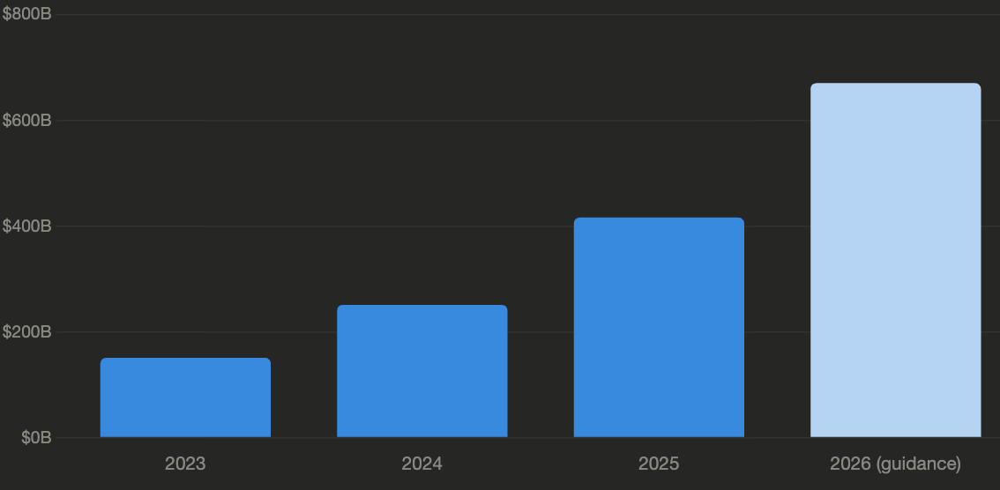
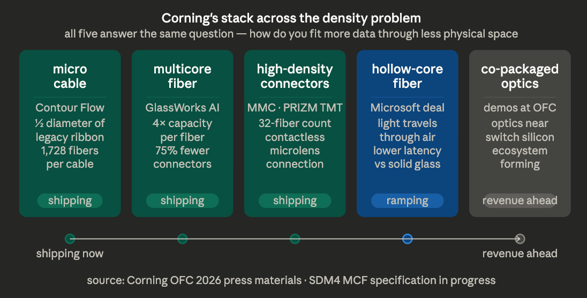
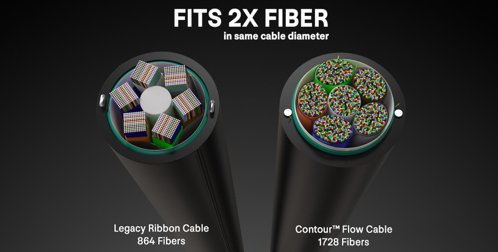
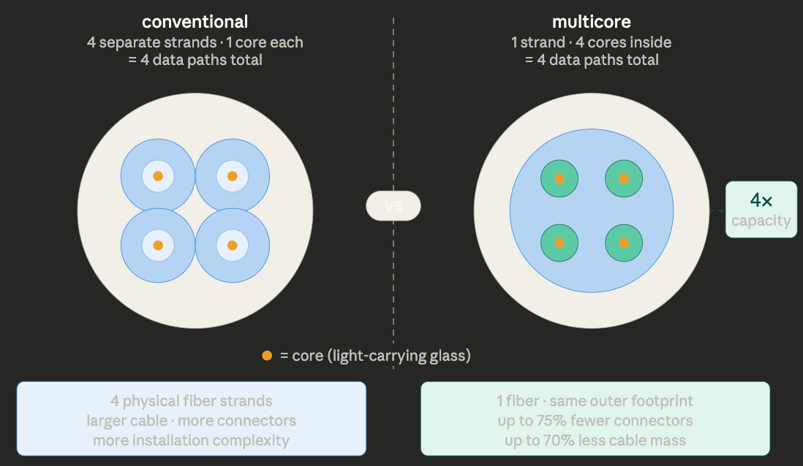
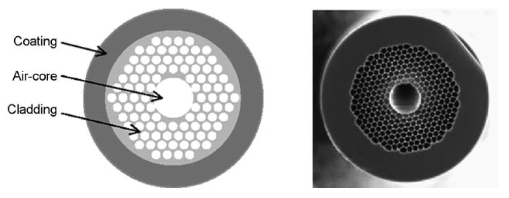
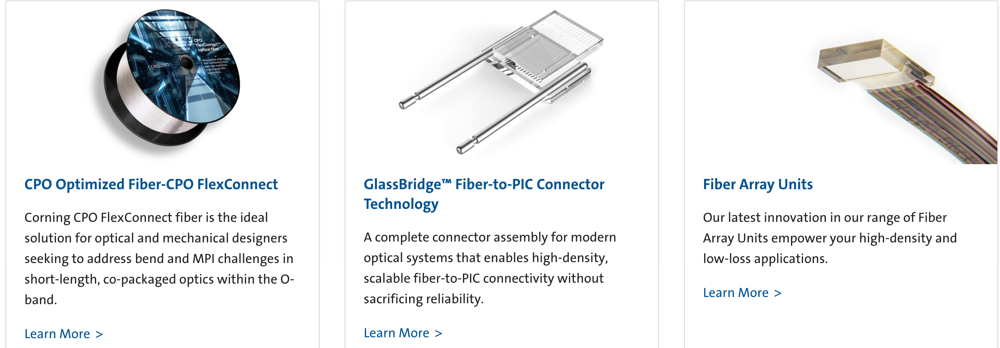

# A Physical Constraint — Corning (GLW)

Crux's thesis on [[Corning (GLW)]] reframes the AI optical buildout around a question that isn't bandwidth, latency, or power per bit — it's **how much fiber can physically fit in the space available**. Cable trays, conduits, raceways, and connector real-estate are fixed; fiber miles per AI rack are not. Corning is positioned across every product that relieves this constraint.

## The setup quote

John McGirr (SVP, Corning Optical Communications), late 2025: *"The surge in hyperscale and AI network loads has significantly increased our expectations for fiber demand. Enterprise sales grew 58% YoY in Q3 2025, driven by continued strong adoption of our Gen AI products. We see no signs of AI network growth slowing down."* Crux's frame: companies with >50 years of fiber experience speak conservatively — when one says expectations "significantly increased," it's a signal.

## Why AI changes the equation

- The four largest hyperscalers ([[Amazon (AMZN)]], [[Alphabet (GOOGL)]], [[Meta Platforms (META)]], [[Microsoft (MSFT)]]) guided to **~$670B combined 2026 capex** — >4x what they spent 3 years ago. Goldman projects ~$1.15T from 2025–2027.
- AI training is **>75% east-west** (AllReduce across all GPUs every training step), versus traditional cloud's north-south dominance. East-west is fundamentally more fiber per rack.
- [[Nvidia (NVDA)]] Blackwell 72-GPU nodes need dramatically more fiber than legacy cloud switch racks. AI-focused datacenters need **~36x more fiber than CPU-heavy infrastructure** (STL estimate).
- The US alone needs to add **~213M fiber miles by 2029** — more than doubling the installed base from 160M to 373M miles.
- **Ribbon fiber lead times >60 weeks** as of early 2026. Wendell Weeks: if Corning could make more high-density product, they could sell more.

## Corning's product stack against the constraint

### Micro cable
Smaller diameter = more fibers per fixed pathway. **Corning Contour Flow micro cable** is ~half the diameter of legacy ribbon, carrying **1,728 fibers** (double previous generation in same space). ~30% faster cable prep time.

### Multicore fiber
**Four cores per single fiber** — quadruples capacity without more physical space. Real deployments: up to **75% fewer connectors, 70% less cable mass, 60% less install time**. Launched at OFC 2026; Corning joined the **SDM4 multi-source agreement** alongside Fujikura, Sumitomo, and TeraHop — when you help write the standard, switching becomes expensive.

### High-density connectors
**32-fiber MMC connector** (extending 12/16/24-fiber line). **PRIZM TMT ferrule** uses precision-aligned microlenses rather than fiber-to-fiber contact: **70% lower mating force**, viable at AI-datacenter density.

### Hollow-core fiber
Light through air, not glass — faster propagation, lower latency. **September 2025: manufacturing partnership with Microsoft to produce Microsoft's hollow-core fiber at scale from North Carolina facilities.** Microsoft picked two manufacturers globally. **Revenue sits outside current financial modeling.**

### Co-packaged optics (CPO)
Demonstrated full CPO ecosystem at OFC 2026 with [[Broadcom (AVGO)]] silicon and assembled switch trays. Management said on the Q4 call there are scenarios where this generates meaningful revenue **before 2028**. **Outside the current growth plan.**

## Commercial signal already showing up

- **Enterprise (datacenter) +61% FY2025**, hyperscale portion growing significantly faster (Ed Schlesinger, Q4 call).
- Wendell Weeks: high-density Gen AI products are supply-constrained — "if we could make more we'd sell more."
- **[[Meta Platforms (META)]] multiyear agreement, up to $6B** is the visible one. Weeks: Corning is concluding **several similar agreements of comparable size with other major customers**. Impact builds into 2027–2028.
- Deal structure: **prepayments + long-term take-or-pay** for capacity years in advance. This is the contract shape when buyers believe a constraint is durable, not cyclical.
- Value capture: better optical performance in half the space at lower install cost → "some of it tends to accrue to shareholders as manufacturing matures."

## What's not in the numbers yet

Each item has a named counterparty, stated timeline, or signed agreement — none of it is in current guidance:
- Hollow-core manufacturing ramp (Microsoft) — barely begun vs. Microsoft's described scale.
- CPO ecosystem revenue (excluded from growth plan).
- SDM4 standard finalization (standards tend to pull procurement forward).
- The additional Meta-comparable agreements in negotiation.

The gap between currently visible numbers and what is likely to arrive is where the opportunity sits.

## Images

## Original Content

In late 2025, John McGirr, SVP and General Manager at Corning Optical Communications, said something I believe is worth paying attention to:

> "*The surge in hyperscale and AI network loads has significantly increased our expectations for fiber demand. Enterprise sales grew 58% year over year in Q3 2025, driven by continued strong adoption of our Gen AI products. We see no signs of AI network growth slowing down.*"

This is a company with over 50 years of optical fiber manufacturing behind it. Companies like that usually speak conservatively. When one of them says demand expectations have shifted in a meaningful way, the comment deserves a closer look.

That is what I want to explore with this report.

Bandwidth still matters. Faster optics, lower power, better latency etc. All of that remains central to the AI buildout.

But there is another pressure point rising alongside it that has been building that I don't discuss often.

As AI infrastructure gets larger, denser, and more optical, the industry is running into a more practical question.

How much fiber can actually fit into the space available?

That is where this story begins.

*Disclosure: This content is for informational and educational purposes only and should not be construed as investment advice or a recommendation to buy, sell, or hold any security.*

### What Fiber Is

To understand why AI is reshaping fiber demand, it helps to start with what fiber actually is.

An optical fiber is a strand of glass thinner than a human hair. Data travels through it as pulses of light. A laser fires at one end, the light moves down the core of the strand through a phenomenon called total internal reflection, and a receiver at the other end decodes those pulses back into information. The whole journey happens at roughly two-thirds the speed of light.

The strand has two main layers. The inner core carries the light. The outer layer, called cladding, has a slightly different optical density that keeps light contained inside the strand rather than letting it escape. That containment is what allows signal to travel long distances with very little loss.

A single strand can only carry so much. So cables bundle hundreds or thousands of strands together, each carrying its own stream of data at the same time. A modern data center cable can carry 1,728 individual fibers. A transatlantic submarine cable might carry a dozen fiber pairs, with each strand supporting enormous traffic volumes through wavelength division multiplexing which is the process of sending multiple colors of light down the same strand at once, each color carrying its own independent data stream.

Fiber does a few things extremely well. It moves huge amounts of data over long distances, produces very little heat, avoids electromagnetic interference, and delivers attractive energy efficiency per bit. Whether the job is connecting GPUs across a data center floor, buildings across a campus, or continents across an ocean, fiber is the medium that scales.

### Why AI Changed the Equation

The scale of capital moving into AI infrastructure is useful context here.

The four largest hyperscalers (Amazon, Google, Meta, and Microsoft) guided to a combined roughly $670 billion in capital expenditure for 2026, based on their own earnings announcements. That is more than four times what those same companies spent just three years earlier. Goldman Sachs projects total hyperscaler capex from 2025 through 2027 at roughly $1.15 trillion.

This is infrastructure spending at an incredible pace.

That spend is flowing into systems that are far more optical than earlier generations and it has changed the nature of the traffic problem in a fundamental way.

Traditional cloud infrastructure handled mostly north-south traffic, so requests flowing from users down to servers, responses flowing back up. Server-to-server communication existed but was not the dominant load. AI training changes that completely.

Training a large model requires every GPU in the cluster to exchange gradient data with every other GPU at the end of every training step. This is called an AllReduce operation, and it means the network inside an AI cluster is all-to-all rather than hierarchical. More than 75% of AI cluster traffic now flows east-west, machine to machine, rather than vertically. That is a fundamentally different topology, and it requires far more optical fiber per rack than traditional cloud infrastructure ever did.

The physical scale follows from that. Each new generation of GPU architecture pushes the fiber requirement higher. Nvidia's Blackwell 72-GPU nodes require dramatically more fiber than traditional cloud switch racks. AI-focused data centers more broadly require roughly 36 times more fiber than conventional CPU-heavy infrastructure, according to STL.

The U.S. alone will likely need to add 213 million more fiber miles by 2029, more than doubling its current installed base from 160 million miles to 373 million miles.

The supply side is already straining. Ribbon fiber lead times exceeded 60 weeks as of early 2026. Corning's own management said if they could make more of the high-density products, they could sell more.

Round cables take up space. Buffer tubes add mass. Connectors consume real estate. Cable trays fill up. At some point the question I am asking on this page is how much infrastructure can physically fit inside the space available.

That is where the product roadmap starts to get interesting.

### What the Industry Is Building and Where Corning Sits

The answers emerging from the industry right now make the physical problem concrete. They are arriving simultaneously because the constraint became urgent at the same time. Corning has positioned itself across nearly all of them.

**Micro cable**

Traditional cable designs use protective tubes and structures that add bulk. Micro cable cuts that. Smaller diameter means more fibers fit inside the same conduit, raceway, and cable tray

Corning's Contour Flow micro cable is approximately half the diameter of legacy ribbon cables, carrying 1,728 fibers which is double the capacity of its previous generation in the same space. It also reduces cable preparation time by around 30%. When the pathway is fixed and demand keeps rising, those gains matter significantly in practice.

**Multicore fiber**

Instead of one core per strand, multicore fiber packs four cores into a single fiber, quadrupling capacity without requiring more physical space. In real deployments that translates to up to 75% fewer connectors, 70% less cable mass, and 60% less installation time.

Corning launched its multicore solution at OFC 2026 and joined the SDM4 multi-source agreement alongside Fujikura, Sumitomo, and TeraHop, helping define the standard that future hyperscaler deployments will build around. When you help write the standard and your customers are signing capacity commitments around your architecture, switching becomes expensive.

**High-density connectivity**

Getting more fiber into the building is only part of the job. Terminating it, organizing it, and servicing it cleanly at higher density is where connectors become a meaningful constraint.

Corning's new 32-fiber MMC connector (expanding on existing 12, 16, and 24-fiber offerings) pushes more capacity through a single mating point. The PRIZM TMT ferrule version uses precision-aligned microlenses rather than direct fiber-to-fiber contact, reducing mating force by 70% and making high-volume installation more practical at the density AI data centers require.

**Hollow-core fiber**

Traditional fiber sends light through solid glass. Hollow-core sends it through air. Because light moves faster through air, latency falls and that matters increasingly in AI environments where round-trip time between systems affects performance.

In September 2025, Corning announced a manufacturing collaboration with Microsoft to produce Microsoft's hollow-core fiber at scale from its North Carolina facilities. Microsoft selected two manufacturers globally for the program. That gives Corning a position in a part of the optical stack that could become significantly more valuable as AI systems grow larger and more distributed. The revenue is building over time and sits outside current financial modeling.

**Co-packaged optics**

Co-packaged optics moves optical components closer to switch silicon, and eventually toward the GPU itself, reducing power and increasing bandwidth density at the chip level. Corning demonstrated a full CPO ecosystem at OFC 2026, including Broadcom silicon and assembled switch trays. Management said on the Q4 call there are scenarios where this generates meaningful revenue before 2028. It sits outside the current growth plan entirely.

**The commercial signal**

The demand is already showing up in the numbers. Ed Schlesinger said on the Q4 2025 call that the enterprise business, inside the data cente, grew 61% for the full year, with the hyperscale portion growing significantly faster. Wendell Weeks described the driver specifically as high-density Gen AI products, and said that if Corning could make more of them, it could sell more. That is a supply-constrained growth story on the products that matter most.

Then you get to the contracts, which sharpen the picture further.

The Meta agreement (multiyear, up to $6 billion) is the most visible. But Weeks said on the call that Corning is concluding several similar agreements of comparable size with other major customers. The financial impact builds into 2027 and 2028.

The structure of those deals is important too. Customers are paying prepayments and committing to long-term take-or-pay arrangements to secure capacity years in advance. That is what it looks like when buyers believe a constraint is durable, not cyclical.

Weeks also gave useful color on value capture. These innovations deliver better optical performance in roughly half the space, with significantly lower installation cost. When Corning creates that much value, he said, some of it tends to accrue to shareholders as manufacturing matures.

So the tie together is more density, lower installation burden, better product mix, better economics over time, and a commercial structure that is already locking that trajectory in.

### What Remains Ahead

The parts of this story already showing up in Corning's financials, the 61% enterprise growth, the Meta agreement, the product mix shift toward high-density innovations, are the parts the market has had time to look at. What sits ahead is larger.

The hollow-core manufacturing ramp has barely begun relative to the scale Microsoft has described. The CPO ecosystem is demonstrating at OFC but generating no revenue yet, and management has explicitly excluded it from the growth plan. The SDM4 multicore standard is still being finalized, and standards tend to pull forward procurement significantly once they land. And the additional capacity agreements Weeks described on the Q4 call (each comparable in size to Meta, still in negotiation) have yet to appear in guidance at all.

None of that is speculative in the sense of being invented. Each item has a named counterparty, a stated timeline, or a signed agreement behind it. What makes this section of the thesis interesting is simply that none of it is in the numbers yet. The gap between what is currently visible and what is likely to arrive is where the opportunity sits.

*Disclosure: This content is for informational and educational purposes only and should not be construed as investment advice or a recommendation to buy, sell, or hold any security. I may hold positions in securities mentioned and may change those positions at any time without notice. Please do your own research and consult a qualified financial professional before making any investment decisions.*
