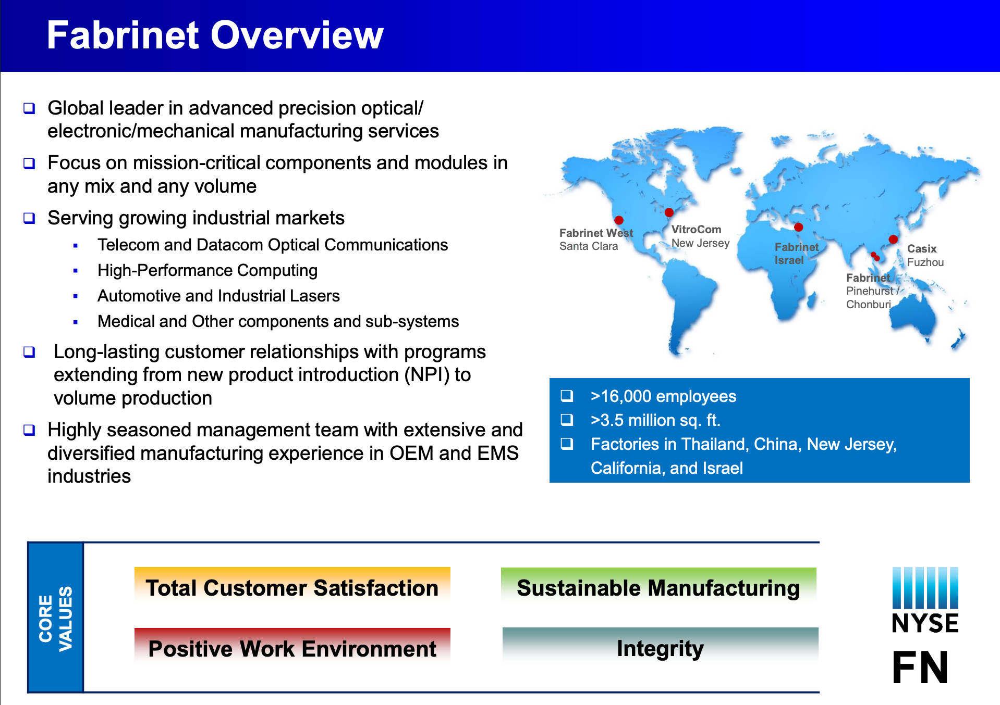
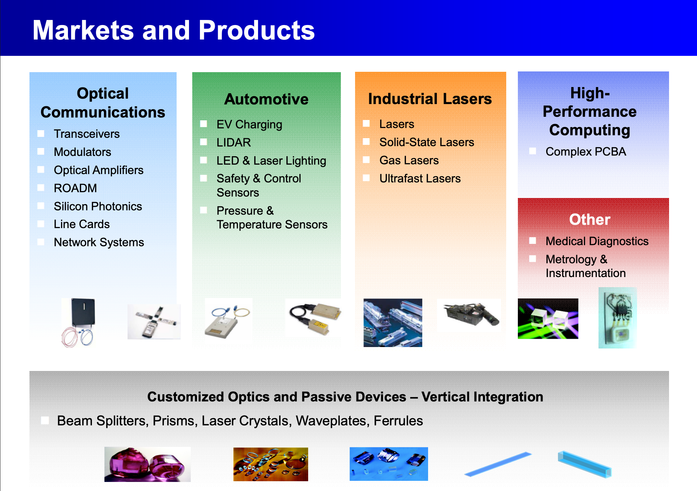
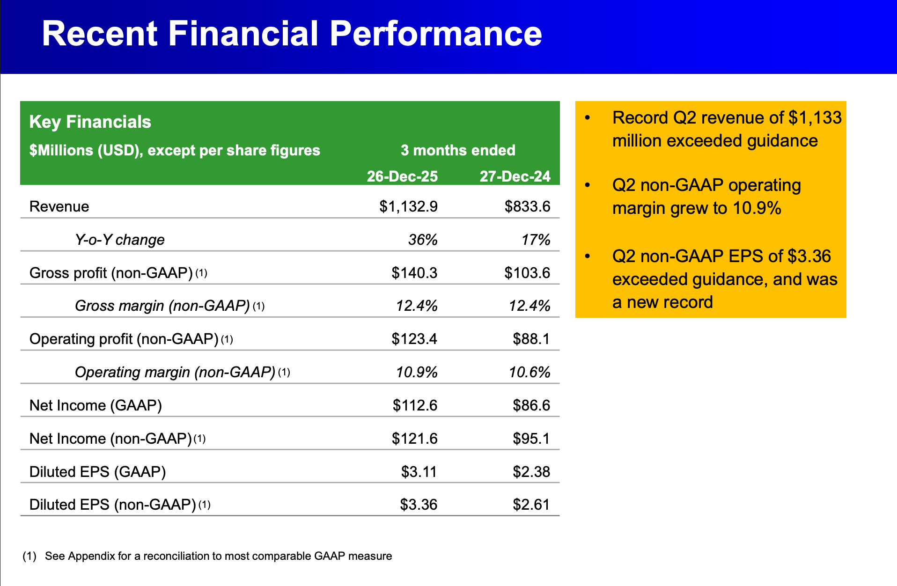
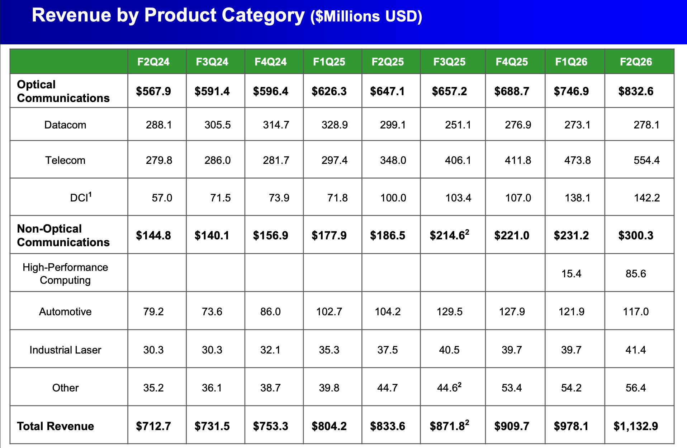

# FN 2026-05-04 pre-earnings intro and watchlist — HPC ramp toward $150M/qtr, datacom EML-supply test, capacity pull-forward and CPO/OCS optionality

## Key takeaways

- **Framing**: [[Fabrinet (FN)]] is the manufacturing layer behind complex optical + electronic hardware — process design, precision assembly, optical packaging, qualification, volume ramp. Sticky because optical qualification takes 3–6 months and switching introduces yield / reliability risk.
- **Footprint**: 16,000+ employees, 3.5M+ sq ft, factories in Thailand, China, NJ, CA, Israel. Thailand (Pinehurst + Chonburi) is the gravity center.
- **Q2 FY26 inflection (already reported)**: $1.13B revenue (+36% YoY, +16% QoQ — fastest YoY growth since IPO). Telecom $554M (+59% YoY), DCI $142M (+42% YoY), Datacom $278M (+2% QoQ — EML laser supply-capped), HPC $85.6M (vs $15.4M in Q1).
- **Customer concentration**: FY25 10-K had [[Nvidia (NVDA)]] at 27.6% and Cisco at 18.2%. Four 10%-plus customers = 59.1% of Q2 revenue.
- **Four AI-infrastructure growth legs**:
  1. **Telecom + DCI**: watch full telecom bucket, not just DCI line — Crux says coherent/embedded coherent and [[Ciena (CIEN)]]-related systems sit in telecom even when serving cloud/AI buildout.
  2. **Datacom 800G/1.6T**: demand-above-shipment-capacity due to EML laser supply. Second EML source approved in Q2 — this print is the clean test for shipment conversion. Hyperscaler/merchant transceiver pursuit is "quarters away."
  3. **HPC** (PCBA — referenced as AWS, non-exclusive, second-source on program): ramp path toward $150M/qtr target; key signals are line qualification + share gain or additional programs.
  4. **CPO + OCS**: 3 CPO programs, [[Coherent (COHR)]]-adjacent silicon photonics OCS via iPronics dedicated line for the ONE Series. Optionality, not 2026 revenue.
- **Capacity-pull-forward tell**: Building 10 at Chonburi planned 2M sq ft; 250k sq ft pulled forward 6–8 months, mid-CY26 target, ~$132.5M expected project cost. Pinehurst office/warehouse conversion = ~120k sq ft → $150M+ revenue upside. Balance sheet supports it: $961M cash + ST investments, zero debt.
- **Financial model**: low-teens GM (Q2 12.4%), 10.9% operating margin, 42.0% ROIC. Q2 FCF was -$5M as capex ($52M) ran ahead of OCF ($46M) — acceptable if demand converts.
- **Bear case**: customer concentration, optical-comms market concentration, EML supply caps, FX (Thailand) margin pressure, premium valuation needing a beat.
- **Earnings bar (above guide)**: guide is $1.15–$1.20B rev / $3.45–$3.60 non-GAAP EPS. Crux wants $1.20B+ rev and $3.60+ EPS; cleaner bull >= $1.22B + $3.70.
  - HPC: $100–110M+ progress toward $150M target.
  - Datacom: $300M+ proves EML second-source thesis.
  - Telecom: continued sequential growth across DCI/systems/network programs.
  - Op margin near 11% despite FX drag.
  - Q4 guide sequential growth across HPC/datacom/telecom.
- **Strategy**: no position into print. Watching for "headline beat → initial negative reaction" setup (similar to recent [[Cohu (COHU)]] pattern). Two levels watched: $650 and $595 (the $595 area is "much more attractive" risk/reward).

## Why this matters

This is Crux's introduction to FN as their next major optics-layer name plus the explicit earnings-call playbook. The four-legs framing (DCI/telecom, 800G-datacom, HPC, CPO/OCS) is a useful template the author plans to use to track the AI-networking buildout broadly. FN print is treated as a "pulse check for the broader optical infrastructure trade."

## Related

- [[Fabrinet (FN)]] — subject hub
- Optical peers FN manufactures for: [[Coherent (COHR)]], [[Lumentum (LITE)]], [[Nvidia (NVDA)]], [[Marvell Technology (MRVL)]], [[Ciena (CIEN)]]
- Recent [[Cohu (COHU)]] earnings used as analogue for the "beat then dip then call" reaction pattern
- AI CAPEX backdrop: [[AI CAPEX 2026-Q1 hyperscaler reads bullish - $700B-plus 2026 spend funds optics, networking, and inference buildout per Crux]]
- OCS optionality: [[OCS optical circuit switching - MEMS vs liquid crystal Coherent vs Lumentum and Google Jupiter validation (2026-04-01)]]

## Original Content

Fabrinet (FN) reports after the close today, and this is one of those companies that can definitely look boring. And it doesn't get too much coverage on X (from myself included)

But think about the optical companies we follow all the time. A supplier may design lasers, optical engines, transceivers, coherent modules, silicon photonics packages etc. But designing the product is only one step. Someone still has to help turn that product into a repeatable manufacturing process.

Fabrinet is the factory layer behind complex optical and electronic hardware. Customers bring the product, the design, the IP, and the brand. Fabrinet helps with process design, precision assembly, optical packaging, supply-chain management, qualification, final assembly, testing, and volume ramp.

That role is becoming more valuable as AI networking gets harder too. Faster optics, denser modules, coherent DCI (Data Center Interconnect), silicon photonics, CPO (Co-packaged Optics), OCS (Optical Circuit Switching), and HPC (High Performance Compute) hardware are all really crucial. Those products have to be built at scale, with tight tolerances, high yields, and enough factory capacity to support customer demand.

Fabrinet gives us a read into whether the AI networking supply chain is still accelerating beneath the surface. The company touches telecom, datacom, DCI, HPC, and next-generation optical architectures, which makes this call a useful pulse check for the broader optical infrastructure trade.

With this post I just want to quickly introduce Fabrinet and go over what I will be watching for earnings.

---

### What Fabrinet Builds

Fabrinet's product slide looks wide at first, but it is really one capability showing up across several markets. They take difficult hardware and make it manufacturable.

The main engine is optical communications. This is where Fabrinet built its reputation. Think of the hardware that moves data through fiber inside AI data centers, between data centers, and across carrier networks. This is the bucket tied to datacom, DCI, coherent optics, silicon photonics, and network systems.

The newer investor focus is HPC. Fabrinet labels this category as complex PCBA, or complex printed circuit board assembly. Basically they are helping build dense board-level hardware used inside high-performance compute systems. That gives FN a second AI infrastructure leg tied to compute hardware, alongside the optical network.

Then there are the precision markets around the core like automotive, industrial lasers, and others. These categories are smaller pieces of the thesis today, but they show the type of company Fabrinet is. This is a business built for products with tight tolerances, long qualification cycles, reliability requirements, and repeatable production.

Then there is also the custom optics layer. Fabrinet has vertical integration in passive optical components like prisms, beam splitters, laser crystals, and ferrules. That gives them more control over parts of the optical manufacturing chain and helps explain why customers use Fabrinet for harder optical builds.

The manufacturing footprint is large. Fabrinet lists more than 16,000 employees, more than 3.5 million square feet of capacity, and factories in Thailand, China, New Jersey, California, and Israel. Thailand is the center of gravity through the Pinehurst and Chonburi campuses.

---

### Why This Manufacturing Is Hard

With a normal electronics build, the main question is whether the components are connected correctly and the board passes electrical test. With optical hardware, the product also has to move light cleanly through tiny paths at very high speed. This is very difficult.

A laser has to line up with a fiber or photonic chip and the package has to hold that alignment through heat, vibration, aging, and volume production. A tiny shift can create signal loss, higher power consumption, lower reach, lower yield, or field reliability issues.

That is the real value Fabrinet provides. It helps take a product that works in the lab and turn it into a factory process that can be repeated over and over again. This also makes the customer relationship stickier. Once a product is qualified on a Fabrinet line, the manufacturing process becomes part of the product. The tools, materials, assembly steps, inspection flow, and test process all have to be validated. Fabrinet says optical device qualification and field testing can take 3-6 months or longer before volume production.

So switching manufacturers can create real risk. A customer may save money on paper, but they could introduce yield problems, qualification delays, or reliability issues.

---

### The Inflection Quarter

Q2 FY26 was the quarter that made the story really pop.

Fabrinet reported record revenue of $1.13 billion, up 36% year over year and 16% sequentially. Management said this was the fastest year-over-year growth since the company's IPO.

The segment mix showed the shift.

Optical communications is still the largest category, but non-optical is becoming a real contributor. In Q2, non-optical communications reached $300 million, up 61% year over year and 30% sequentially. The driver was HPC.

That changes the way I think about the company. Fabrinet used to screen mostly as an optical manufacturing compounder. It now has multiple AI-linked growth legs: DCI, datacom, HPC, CPO, OCS, and capacity expansion.

---

### Growth Leg 1: Telecom and DCI

Telecom is the strongest optical bucket right now, but we need to make sure we read it right.

In Q2, telecom revenue reached $554 million, up 59% year over year and 17% sequentially. DCI reached $142 million, up 42% year over year and 3% sequentially.

The easy mistake would be looking only at the DCI line and assuming that tells the full AI data-movement story. Fabrinet's DCI line captures coherent modules management believes are being used for data-center interconnect. Broader telecom systems sit outside that specific line, even when they serve the same cloud and AI infrastructure buildout.

That is why I am watching the full telecom bucket.

I want to see whether strength is still broad across DCI modules, embedded coherent products, Ciena-related systems, network systems, and new program wins.

If telecom keeps growing while 800ZR is still early, that tells me AI traffic is pulling more optical hardware through Fabrinet's factories than the formal DCI line alone would suggest.

---

### Growth Leg 2: Datacom, 800G, and 1.6T

Datacom is the inside-the-data-center piece. The setup here is really about shipment conversion.

Management has said demand for leading-edge 800G and 1.6T products was above what Fabrinet could ship, mainly because of EML laser supply. During Q2, a second EML source was approved. That gives us a clean test for this call. Did that approval turn into actual shipment growth?

Q2 datacom was $278 million, up only 2% sequentially. If datacom moves higher with supply-relief language, the market gets a cleaner signal that the 800G/1.6T cycle is being held back by components rather than demand.

If datacom stays flat with the same constraint language, the upside gets pushed out in my opinion.

The other thing I want is customer breadth. Fabrinet said it is pursuing transceiver opportunities directly with hyperscalers and merchant vendors, and described those as quarters away rather than years away. Any update there would give datacom a second path beyond the main customer.

---

### Growth Leg 3: HPC

HPC is the newest line item and the biggest swing factor in this print.

The ramp started small. Fabrinet first broke out HPC revenue in Q1 FY26 at $15.4 million. One quarter later, it reached $85.6 million.

That is a huge step function.

The key question now is whether that was the beginning of a larger production ramp or the easy first move off a small base. Management said the current HPC program should be north of $150 million per quarter once fully ramped. At that level, one program alone would be running above $600 million annualized.

So let's pay attention to line qualification. Fabrinet had two automated lines running and additional lines in qualification. If more lines are qualified or close, the path toward the $150 million quarterly target becomes much more credible.

Also, management referenced AWS, described the relationship as non-exclusive, and said Fabrinet is currently a second source on the program. That gives FN two ways to grow: take more share inside the current program through execution, or use that track record to pursue additional HPC customers.

So one of the risks here is cadence as management already said HPC growth can be lumpy because the category is new. I care less about a perfectly linear move and more about whether the production ramp is still progressing.

For this print, I want three answers:

* Is HPC moving closer to the $150 million quarterly target?
* Are additional automated lines qualified or close?
* Does management still sound confident about share gain or additional HPC programs?

---

### Growth Leg 4: CPO and OCS

CPO and OCS are future architecture optionality. This section isn't really about Q3 revenue. I care more about whether Fabrinet is sitting inside the next networking design cycle.

Management has said CPO revenue is already present but small, and the company is working on three customer programs. That makes it relevant, while still too early to underwrite as a large revenue driver.

OCS has a similar shape. Management said Fabrinet is engaged on several fronts, and iPronics has announced a dedicated Fabrinet line for its ONE Series silicon-photonics optical circuit switch. That external announcement is useful because it shows Fabrinet's role in a real manufacturing flow, beyond generic ecosystem language.

For this call, I am listening for any movement from project work to ramp timing. More customers, clearer production milestones, or small revenue scaling would make CPO/OCS more than a 2027+ story. Generic "we are excited" language would leave it as strategic optionality.

So CPO and OCS probably will not drive this quarter, but they can tell us whether Fabrinet is already positioned for the next AI networking architecture shift. For now, this is optionality. Over time, it could become a larger part of the story.

---

### Capacity

Capacity is the tell!

Fabrinet is building ahead of customer demand. Building 10 at the Chonburi campus is planned as a 2 million square foot facility. The company said it was pulling forward the first 250,000 square feet by roughly six to eight months, with completion targeted around the middle of calendar 2026. The latest 10-Q pegs the expected cost of the project around $132.5 million.

They are also converting office and warehouse space at Pinehurst into manufacturing space. Management sized that at roughly 120,000 square feet and said it could create more than $150 million of revenue upside, depending on mix.

Management tied the need for space to several drivers we already touched on like telecom demand, DCI, additional telecom wins, datacom growth, direct hyperscaler opportunities, merchant transceiver opportunities, and HPC.

The balance sheet supports the strategy as at the end of Q2, Fabrinet had roughly $961 million of cash and short-term investments and zero debt.

Factories are expensive and slow. Pulling space forward usually means customer demand has moved ahead of the original plan. That is a great sign, as long as they can bring the supply.

---

### The Financial Model

Fabrinet is a scale and execution business.

Q2 non-GAAP gross margin was 12.4%. Non-GAAP operating margin was 10.9%. Those are manufacturing margins, rather than software-style margins. The appeal comes from volume, utilization, cost control, and operating leverage.

The deck also showed ROIC at 42.0% for Q2 FY26. That is the key to understanding the capacity strategy. Fabrinet does run low gross margins, but it can still generate attractive returns when utilization is high, operating costs stay controlled, and new capacity fills with customer programs.

But there are tradeoffs. Capex is moving above maintenance levels because of Building 10 and Pinehurst. Q2 operating cash flow was $46 million, capex was $52 million, and free cash flow was a $5 million outflow. Inventory also increased to support higher demand.

That is acceptable if the demand converts into revenue. It becomes a problem if ramps slow.

---

### The Bear Case

The first risk is customer concentration.

Fabrinet's FY25 10-K listed Nvidia at 27.6% of revenue and Cisco at 18.2%. In the latest 10-Q, four customers each contributed at least 10% of Q2 revenue, and together they represented 59.1% of revenue.

That concentration cuts both ways. It can create explosive growth when the right programs ramp. It can also create large downside if a major customer delays a program, changes sourcing, presses pricing, or shifts volume internally.

The second risk is customer leverage. Fabrinet's own filing says the optical communications market it serves is highly concentrated. The filing also says many customer contracts provide limited assurance of future sales, with orders often coming through short-lead-time purchase orders that can be revised or canceled.

The third risk is supply. Datacom demand can be strong, but EML laser availability can still cap shipments. That has already happened.

The fourth risk is margin. This is a low-teens gross margin manufacturing business with FX exposure, especially around Thailand. Management expected a 20-30 basis point gross-margin headwind from FX in Q3, offset by operating leverage if revenue scales.

The fifth risk is valuation. The market is already paying for execution. A routine beat may be insufficient. The print likely needs to prove that AI-related ramps are broadening and that the forward guide still has momentum.

*The rest of this post is for paid subscribers. I will go over exactly what I am looking for, how I would expect the stock to react, and what my personal strategy will be.*

---

### Earnings Watchlist

Fabrinet reports Q3 FY26 after the close. Guide is $1.15B–$1.20B of revenue and $3.45–$3.60 of non-GAAP EPS.

My bar is above guidance because the stock has already rerated.

Headline numbers:
I want revenue above $1.20B and EPS above $3.60. A cleaner bull case to justify a strong positive reaction probably needs $1.22B+ of revenue and $3.70+ of EPS.

HPC:
Q2 was $85.6M, and management's fully ramped target is $150M+ per quarter. I want to see progress toward $100M–$110M+, plus more line qualification progress.

Datacom:
Q2 was $278.1M. I want to see evidence that second-source EML supply is turning into better shipments. $300M+ would be a strong signal.

Telecom / DCI:
Q2 telecom was $554.4M, with DCI at $142.2M. I want continued sequential telecom growth and evidence that strength is broad across DCI, systems, line cards, and network programs.

Margins:
Q2 gross margin was 12.4% and operating margin was 10.9%. I want operating margin near 11% despite FX pressure.

Q4 guide:
This may decide the stock reaction. I want sequential growth across HPC, datacom, and telecom.

Capacity:
Building 10 and Pinehurst need to stay on track. Any pull-forward or stronger demand language would be a positive.

CPO / OCS:
Future upside. I'm listening for more customers, clearer timing, or early revenue scaling.

Customer breadth:
Because concentration is high, I want to hear that growth is coming from multiple programs, rather than one HPC customer or one telecom ramp.

---

### My Strategy

I currently hold no position in FN going into earnings.

As I have been doing the last few calls, I will be listening live and taking notes in the paid sub chat and will call out anything that is noteable.

My ideal setup would be a headline beat followed by an initial negative stock reaction, with the call later providing enough detail to improve the tone. We saw a similar type of price action with COHU last week, although every earnings setup is different.

The two levels I am watching for my own account are:

$650
$595

The $595 area is where the risk/reward would become much more attractive for my own strategy and position sizing. I view that as a less likely outcome, but it is the level I would be watching most closely if the stock gets hit.

If that setup never develops, I will reassess after the print and call, then write up my updated strategy in the post-earnings analysis.

This is only my personal framework. It is general market commentary, with no individualized investment advice intended. This should never be read as a recommendation to buy, sell, or hold FN.

---

*Disclosure*

*I may hold a position in FN at the time of publication. This report reflects my own research and commentary. It is intended for informational and educational purposes only, with no individualized investment advice intended. Every reader's financial situation is different. Do your own work and consult a qualified financial professional before making investment decisions. Nothing here should be read as a recommendation to buy, sell, or hold any security.*
