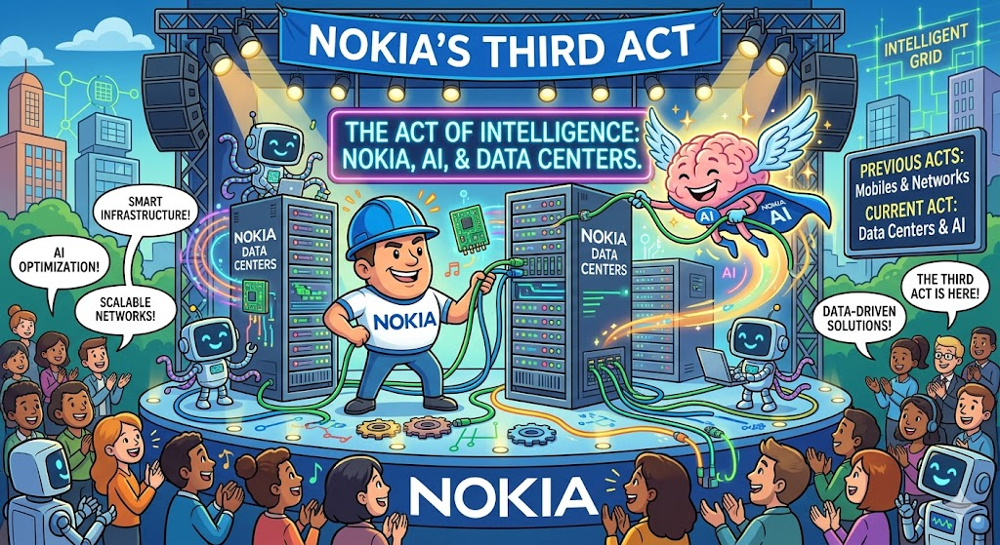
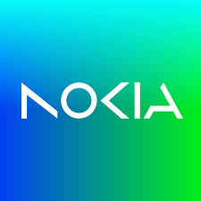
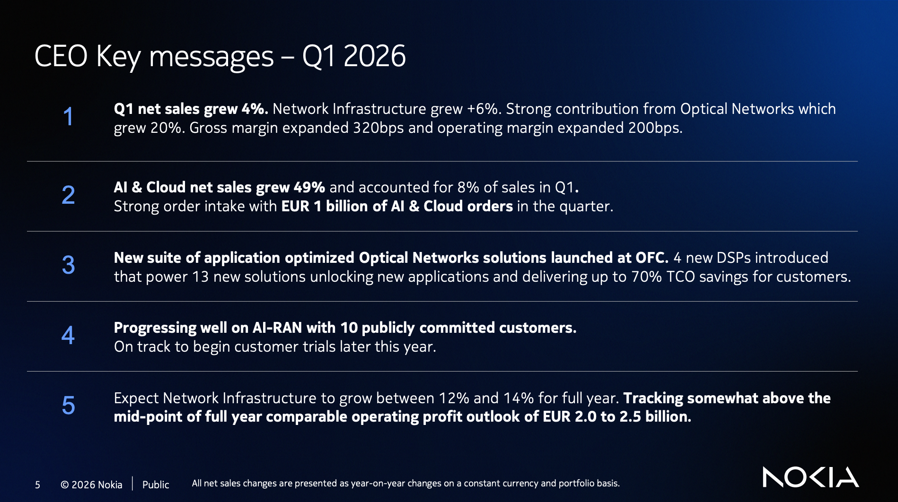
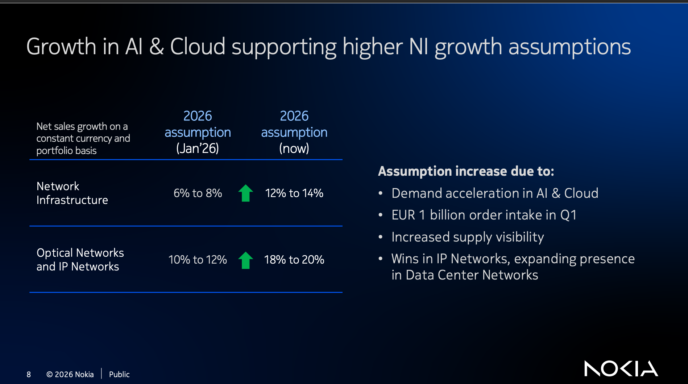
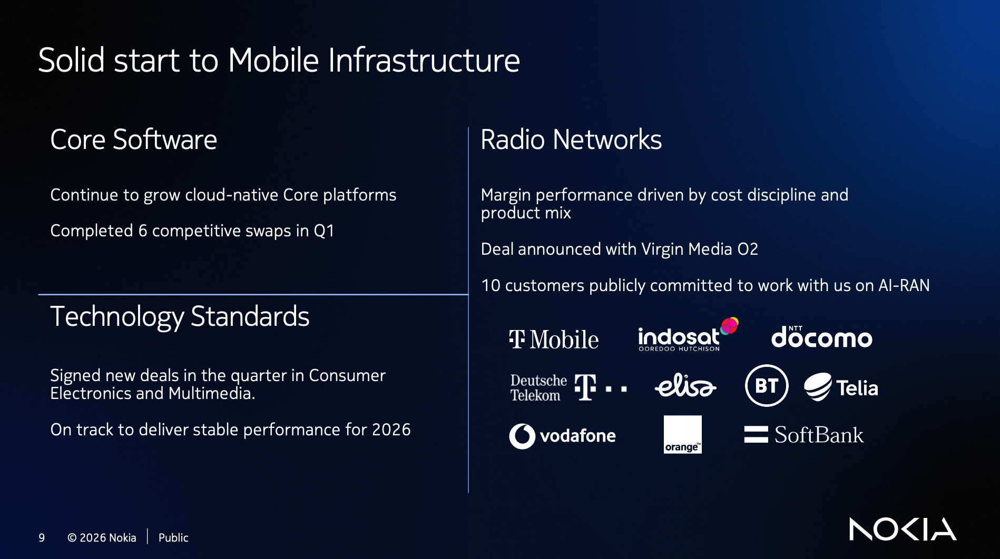

# Crux Capital 2026-04-23 — [[Nokia (NOK)]] Q1: AI/cloud thesis goes financial

**Ticker:** [[Nokia (NOK)]]
**Author:** Gaetano (Crux Capital Group, @cruxcapitalgroup)
**Source:** https://cruxcapitalgroup.substack.com/p/nokia-earnings-must-read
**Quarter:** Q1 (reported 2026-04-23)

## Key claims (Crux)

- AI/cloud **net sales +49% YoY**; **€1B in new AI/cloud orders** in the quarter.
- Network Infrastructure growth guide **raised 6-8% → 12-14%**; Optical & IP Networks **raised 10-12% → 18-20%**.
- AI/cloud TAM CAGR outlook **raised 16% → 27%**.
- Revenue +4% YoY to €4.5B; operating margin **+200bp to 6.2%**; gross margin **+320bp to 45.5%**.
- Free cash flow €629M; net cash €3.8B.
- Optical Networks +20% in quarter; €1B order book driven particularly by optical (800G pluggable + line systems).
- IP Networks pipeline growing — new design wins on switching/routing with AI/cloud customers.
- InP manufacturing facility in San Jose ramps later this year; Infinera deal underwriting fab/packaging scale.
- AI-RAN: on track for field trials with [[Nvidia (NVDA)]] by year-end; longer-dated option.
- CEO Hotard: "We've been making lasers for 25 years... We've never had a laser fail in the field."

## Author's strategy

Currently averaged in the $7s. Wants to add in low-$10s / high-$9s. Year-end scenarios: bear ~$8 / base ~$12-13 / bull ~$14. Staying conservative due to expected macro pressure.

## Original Content

Over the last few weeks, I have been writing that Nokia was starting to become easier to frame as an AI networking story rather than just a legacy telecom name.

That was the core idea behind *Nokia's Third Act Is Starting to Come Into View*

#### Nokia's Third Act Is Starting to Come Into View

[Gaetano](https://substack.com/profile/410947583-gaetano)

·

Apr 14

[Read full story](https://cruxcapitalgroup.substack.com/p/nokias-third-act-is-starting-to-come)

And the real question behind *Nokia Earnings Preview — What to Watch*.

#### NOKIA Earnings Preview - What to Watch

[Gaetano](https://substack.com/profile/410947583-gaetano)

·

Apr 20

[Read full story](https://cruxcapitalgroup.substack.com/p/nokia-earnings-preview-what-to-watch)

Was the architecture thesis actually starting to show up in the financials, or was this still mostly a story investors had to piece together from product launches, OFC commentary, and management language?

This quarter gave us the clearest answer yet. Nokia showed that AI and cloud demand is now large enough to move the numbers, move the guidance, and start changing how the company should be framed.

The parts of Nokia tied most directly to AI networking demand became too strong to keep treating as side angles.

So let's break everything down that I think is important from this call!

---

**What changed this quarter**

Three things got pulled forward this quarter and together they explain why the story feels different.

The feared air pocket never showed up. Hoorah! Going into the print, the setup carried real risk. Telecom drag was real. The AT&T headwind was real. The concern was that Nokia might still be stuck in an awkward transition where the old business was slowing before the new one was large enough to carry weight. The quarter came through much cleaner than that.

AI and cloud demand showed up directly in the numbers. In current sales, current orders, and current guidance. Many companies tell a good future story. The ones worth owning show the demand in the current period.

The story broadened beyond optical though. Optical is still doing the heavy lifting and remains the clearest proof point, but IP is starting to move alongside it. Nokia becomes a much more valuable story when it is selling into multiple layers of the network stack simultaneously.

This was the quarter where the AI networking thesis move from being theoretical and started being financial.

---

*The numbers behind all of this — the exact figures, the guidance raises, the order flow, the margin expansion, what I think it means for how Nokia gets valued from here, and what my strategy is for my investment — are below for paid subscribers.*

---

**The clearest proof**

The most important numbers from the quarter do most of the work on their own.

AI and cloud net sales grew 49%. Nokia booked €1 billion in new AI and cloud orders. The company raised Network Infrastructure growth guidance from 6-8% to 12-14%. It raised Optical and IP Networks growth guidance from 10-12% to 18-20%. It raised its AI and cloud addressable market growth outlook from a 16% CAGR to a 27% CAGR.

---

**The air pocket never showed up**

Management had already prepared us for a messy print. Telecom remained soft. The AT&T overhang was alive. The risk was that the transition story would stay muddled, especially if the newer optical and AI-linked businesses were still too small to offset the drag from older parts of the portfolio.

Nokia grew revenue 4% year over year to €4.5 billion and expanded operating margin 200 basis points to 6.2%. Gross margin expanded 320 basis points to 45.5%. Free cash flow came in at €629 million. They ended the quarter with €3.8 billion in net cash.

This directly answers one of the more persistent bear arguments. Nokia is funding its pivot while expanding profitability and generating strong cash. Simultaneously. This was supposed to be the quarter where legacy drag showed up most clearly. Instead Nokia widened margins and produced strong free cash flow.

---

**The network bottleneck is getting harder to ignore**

This is a physical network story as much as a Nokia story. AI is forcing more data through a layer of infrastructure that has improved at a fraction of the pace of compute.

Nokia framed that imbalance cleanly at OFC. Over the last 20 years, compute improved by roughly 60,000x while networking improved by only about 30x. That gap is why this layer is getting pulled forward so aggressively.

Hotard gave the present-day version on the earnings call:

> "Today, AI-driven traffic is estimated at around 20% of total network traffic, which is roughly 80 exabytes per month and is still primarily human to machine."
>
> "As we move deeper into agentic AI adoption and ultimately physical AI adoption, machine-to-machine traffic will become the primary driver of traffic, and that will lead to a step change in network traffic."

The traffic shift is already here. The larger machine-to-machine phase still sits ahead. That is the backdrop behind a multi-year rerating in optical and IP networking, and Nokia is selling into both.

---

**Optical did the heavy lifting**

Optical Networks grew 20% in the quarter. The €1 billion in new AI and cloud orders was driven particularly by optical. And what is driving the year is current products already shipping and already being pulled by customers today.

> "I really see momentum on the back of our 800G pluggable and then the associated line systems and the platforms that we have available in shipping today."

The Nokia story is already working. The current optical business is visibly strengthening and the future roadmap now sits on top of that base rather than substituting for it.

---

**The guidance raise was the real tell**

A beat alone is a single data point. The guidance raise in the exact businesses most exposed to AI networking demand is the signal worth focusing on.

Hotard was direct:

> "Since then, demand has accelerated."

Nokia then raised Network Infrastructure growth guidance from 6-8% to 12-14% and raised Optical and IP Networks guidance from 10-12% to 18-20%.

A company raising optical and IP growth targets like that in Q1 because AI and cloud demand came in stronger than expected deserves a different frame than legacy telecom and that is what this quarter established.

---

**IP is starting to move**

One of the key things I wanted to see was whether the story would stay mostly optical or start broadening into IP. The answer was encouraging.

> "In Q1, we also saw strong growth in our IP Networks pipeline as we built deeper engagements with our AI and cloud customers on switching and routing."
>
> "We were awarded new design wins and continue to build a strong pipeline of further opportunities."

Nokia gets meaningfully more interesting when it is selling deeper into the AI buildout rather than around the edges of it. Optical is one layer. Switching, routing, and broader data center network architecture are the next. Even the slower parts of the portfolio are being pushed toward the same opportunity.

Nokia launched a PON-based out-of-band management solution for data centers at OFC. If IP keeps developing and more of the portfolio keeps getting pulled toward AI infrastructure, the story becomes more durable and more valuable.

---

**Supply is better, with room to run**

Management raised the year while being clear that constraints have improved rather than disappeared:

> "I think one is a little bit more confidence on supply…"

That confidence extended to optical, DSPs, and the broader optical subsystem chain. Visibility improved enough to lift guidance. Capacity and execution remain strategic issues rather than background details which tells you demand is still running ahead of what Nokia can comfortably supply.

---

**The manufacturing moat**

Nokia's new indium phosphide manufacturing facility in San Jose is on track to begin ramping later this year. Optical demand is only as valuable as the ability to supply into it.

The Infinera deal keeps looking smarter in that context. Scale, fab capacity, packaging, and deeper optical integration all become more valuable when the market is pulling hard and lead times are stretching.

On reliability, which hyperscalers deploying at massive scale treat as seriously as capacity:

> "We've been making lasers for 25 years... We've never had a laser fail in the field."

Mic Drop!

And on the structural positioning:

> "We think long term, this is a structural market, and we're pretty uniquely positioned as one of a few manufacturers with indium phosphide manufacturing capability at scale."

The real bet is that Nokia is becoming one of the few players with the manufacturing base to stay relevant as the market compounds.

---

**This was bullish beyond a beat**

49% AI and cloud net sales growth. €1 billion in new AI and cloud orders. Sharp gross margin expansion. Strong free cash flow. Growth expectations for Optical and IP taken materially higher in Q1.

The market can dismiss a single quarter but it has a harder time dismissing a quarter where the businesses most exposed to AI networking demand got stronger, got louder, and got marked higher by management.

---

**AI-RAN is still the second act**

I still think Nokia's AI-RAN angle is worth tracking. I laid that out in *AI-RAN Keeps Running Through My Mind*. The company remains on track for field trials with NVIDIA by year-end. The new Doksuri radios and the software-upgrade path both still carry optionality.

AI-RAN is a longer-dated option. Optical and IP are what just moved the numbers.

---

**What still needs proving**

Three checkpoints remain.

IP design wins need to convert cleanly into revenue. The fab ramp and broader supply-chain scaling need to execute. AI-RAN needs to move from proof points and field trials into real commercial timing.

After a quarter like this, the market will watch all three more closely.

---

**What could go wrong**

Telecom drag could stay heavier for longer and offset the AI/networking upside.

Optical demand could remain strong, but supply, fab ramp, or subsystem constraints could limit how much Nokia can actually ship.

IP design wins still need to turn into real revenue. If that conversion is slower than expected, part of the bull case gets pushed out.

The market could also decide this is still mostly a legacy telecom company with one hot segment, which would cap the rerate even if fundamentals improve.

And AI-RAN is still longer-dated. If investors get ahead of themselves there, that part of the story could take much longer to monetize.

---

**My Strategy**

I would like to increase my position size.

I am currently averaged in the 7's. I would like to see low 10's / high 9's for an add. But I will stay dynamic.

There is something in me that tells me that we are still going to see alot of macro pressure, that's why I am being so conservative. Obviously I could be wrong and these stocks could just rip. But I just want to be candid.

Update forecasting for year end scenarios:

Bear: ~8

Base: ~12-13

Bull: ~14

---

*The information provided is for informational purposes only and does not constitute investment advice, a recommendation, or an offer to buy or sell any securities. The author may hold a position in the securities mentioned. Readers should conduct their own due diligence and consult with a financial advisor before making investment decisions.*
