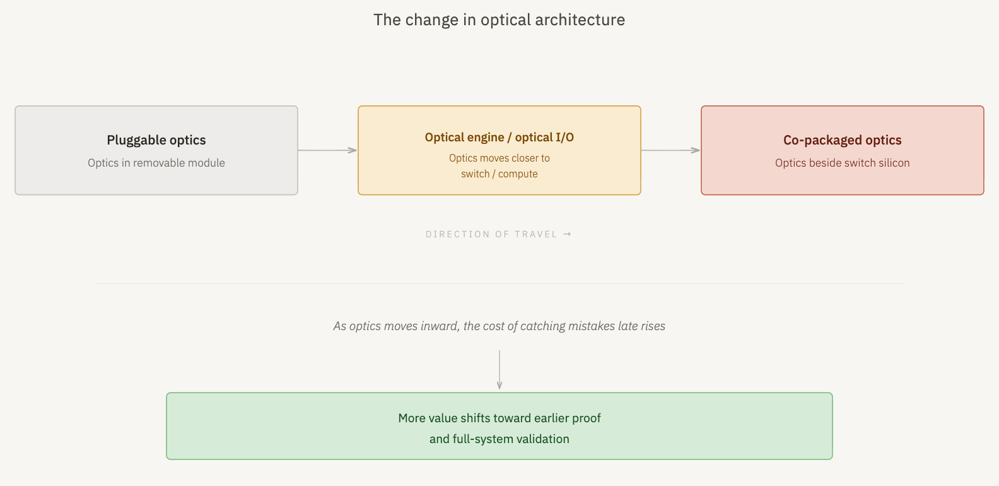
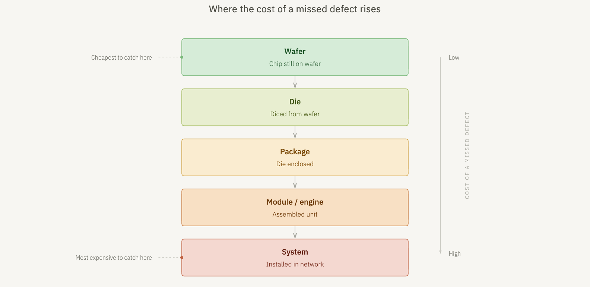
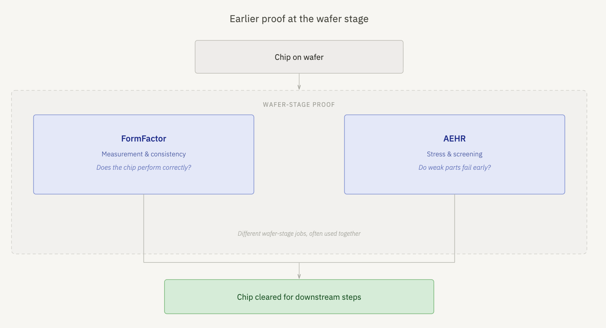
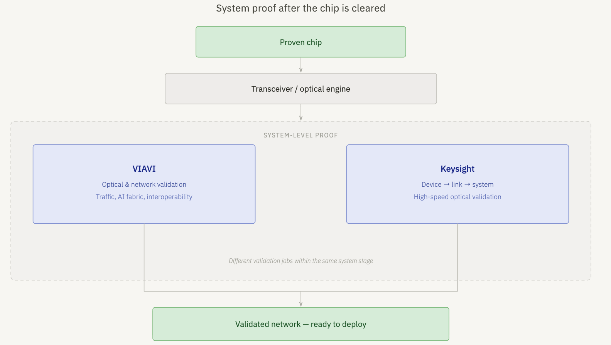

# Crux Capital 2026-04-07 - The Proof Layer in Optics (FORM, AEHR, VIAV, KEYS)

A thematic Crux piece arguing that as photonics gets pulled deeper into the expensive parts of the system — optical engines, optical I/O, eventually [[CPO]] — the cost of late mistakes balloons, so value shifts in **two directions** at the same time:

1. **Earlier (wafer-stage) proof** of the chip — split into measurement ([[FormFactor (FORM)]]) and stress screening ([[Aehr Test Systems (AEHR)]]).
2. **Later (system-stage) validation** of the full optical environment — VIAVI for network/traffic, [[Keysight (KEYS)]] for device→link→system bridging.

A photonics chip moves from wafer → die → package → module/engine → system. A weak die caught at wafer is cheap; a weak die caught after assembly is expensive. As architectures densify, the curve gets steeper, and the test toolchain becomes more valuable both at the front and the back of the pipeline.

The 4 companies sliced into the framework:

- **[[FormFactor (FORM)]]** — measurement at wafer. Helps customers test silicon photonics chips on the wafer in an automated, repeatable flow. Question answered: *does the chip perform correctly, and can the measurement scale across volumes and wafers?* The value rises with downstream cost — if the wafer measurement is slow or inconsistent it becomes the bottleneck before packaging.
- **[[Aehr Test Systems (AEHR)]]** — stress screening at wafer. Pushes devices under thermal/electrical stress while on the wafer so weak parts fail early instead of in expensive downstream assembly. Catches the failures that look fine in a single-measurement check.
- **[[Viavi (VIAV)]]** — network-side validation. High-speed Ethernet, traffic generation/analysis, AI-fabric validation. Proves the broader optical environment behaves cleanly under real traffic at real scale once thousands of links are running together.
- **[[Keysight (KEYS)]]** — bridges device, link, and system validation. High-speed interconnect validation, 1.6T optical validation. Useful where higher-speed failure modes don't localize cleanly to one layer (device vs link vs system).

Crux note: these are 4 of "a handful" in this space — flagging it's not an exhaustive enumeration.

## Why it matters

- The framing maps test-stack value to architecture complexity — explicitly tying the AI fabric / CPO ramp into earnings exposure for the proof layer.
- Wafer-stage test (FORM, AEHR) is an asymmetric option: tooling sales precede the volume ramp, so the test layer monetizes ahead of transceiver/engine maker revenue.
- System-stage validation (VIAV, KEYS) compounds as link speeds (1.6T, 3.2T) and fabric scale rise; this is also where multi-vendor interop matters and stresses bench equipment.

## Linked tickers

- [[FormFactor (FORM)]] (Semi Infrastructure)
- [[Aehr Test Systems (AEHR)]] (Photonics)
- [[Viavi (VIAV)]] (Photonics)
- [[Keysight (KEYS)]] (Semi Infrastructure)

## Original Content

In a prior post I introduced test as a layer in the optics trade.

Someone has to prove the device.

Someone has to screen weak parts early.

Someone has to validate the full system once that device becomes part of a larger optical engine or link.

The question here is where value starts to shift once the architecture gets harder.

In this post I will dig into the changes with the new architectures, how testing flow works, and briefly how 4 companies are positioned.

This Substack is reader-supported. To receive new posts and support my work, consider becoming a free or paid subscriber.

Subscribed

---

### The change

Optics is getting pulled closer to the expensive parts of the system.

A photonics chip starts life on a wafer. Then it gets diced into individual dies, packaged, assembled into a module or engine, and installed into a larger system. This sequence is important when we talk about testing phases.

A weak die found while it is still on the wafer is a manageable problem. A weak die found after packaging, assembly, and integration is a much more expensive one.

So this is the shift that we are looking at.

As the industry pushes toward architectures like optical engines, optical I/O, and eventually co-packaged optics (CPO), more optical complexity moves closer to the switch, the processor, and the package. And when the cost of late mistakes rises, more value shifts toward the part of the stack that catches those mistakes earlier and validates performance more completely.

---

### 1 - Prove the chip earlier

The first shift happens at the wafer stage.

This is where the industry tries to answer two separate questions before the chip moves downstream.

First, does the chip perform the way it is supposed to?

Second, does the chip keep performing once stress is applied, or do weak parts fail early?

I know that these sound similar but they are different.

One is about measurement.
The other is about stress and screening.

That is where two companies, FormFactor (FORM) and AEHR Test Systems (AEHR) fit in this framework.

---

### FormFactor: earlier chip-level proof

FormFactor sits closer to the measurement side.

Its role here is helping customers test silicon photonics chips while they are still on the wafer, in an automated flow that can support real manufacturing rather than one-off lab work. What you are looking for here is consistency. The customer wants to know that the chip performs correctly, and that the measurement can be repeated across wafers and across volume.

This is the part of the flow where a company is trying to separate a good lab result from a process that can actually scale. If the measurements are slow, inconsistent, or too manual, that becomes a bottleneck before the chip ever reaches packaging.

This becomes more valuable as downstream steps get more expensive, because the quality of everything that follows depends on how well the chip was measured at the start.

---

### AEHR: earlier screening and reliability proof

AEHR sits closer to the stress-screening side.

Its role here is pushing chips under stress while they are still on the wafer, so weak parts fail earlier instead of later. Basically you let the weak devices reveal themselves before they move into costlier packaging and assembly steps.

That is important because some parts can look fine in an initial measurement and still turn out to be weak once real thermal or electrical stress is applied. Catching that earlier can save time, cost, and downstream yield problems once those chips move into more expensive parts of the build.

---

### Distinction

So a really simple mental model here is this:

FormFactor is more helpful for thinking about whether the chip was measured correctly and consistently.

AEHR is more helpful for thinking about whether the chip holds up once real stress shows up.

Different jobs, but same stage of the flow.

---

### 2 - Prove the full system

Even after the chip clears wafer test and early screening, the job isn't finished.

Once those chips become part of transceivers, engines, or larger systems, someone still has to prove that the full optical environment works at real speed, under real traffic, and across equipment from different vendors.

That is the second shift in value.

At lower complexity, that job is easier to contain. At higher complexity, it expands quickly. Faster lanes, denser links, and larger AI fabrics create more places where signal quality, interoperability, congestion, and system behavior can break down. That shifts more value toward the companies that help prove the full environment behaves correctly before large-scale deployment.

---

### VIAVI: broader optical and network validation

VIAVI sits closer to the network side of the problem.

Its role in this framework is helping validate the larger optical environment once all the pieces are connected. That includes high-speed Ethernet, traffic generation and analysis, and broader AI-fabric validation. The key idea is that a good component by itself is not enough. The larger network still has to behave correctly once thousands of links are working together. VIAVI is useful in that part of the stack.

This becomes more important as lane speeds rise and the network itself becomes harder to debug. At that point, the job is no longer just proving that a link turns on. It is proving that the broader optical environment performs cleanly under real traffic and at real scale.

---

### Keysight: bridging device, link, and system validation

Keysight sits in a similar zone, with a slightly different emphasis.

Its role in this framework is helping connect the validation chain from the photonics chip up through the link and into the broader system. That includes high-speed interconnect validation and 1.6T optical validation. Think about Keysight here as that it helps close the loop between device behavior, link behavior, and system behavior.

Problems at higher speeds do not always show up cleanly in one place. Sometimes the issue sits in the device, sometimes in the link, and sometimes in how the full system behaves once everything is running together. Keysight is useful in the part of the workflow where those layers have to be tied together.

---

### So this is the takeaway

As architectures get harder, value shifts in two directions at once. One shift moves toward proving the chip earlier, while it is still cheaper to catch mistakes. The other shift moves toward proving the full system more completely, before higher-speed links and denser networks create larger failures downstream.

These are just four of a handful of companies in this space.

This Substack is reader-supported. To receive new posts and support my work, consider becoming a free or paid subscriber.

Subscribed
