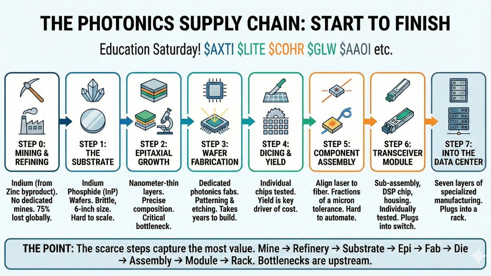

# Signals from Upstream — Epitaxy and Deposition Read-Through

Crux's argument: most photonics coverage sits at the finished-product layer (modules, transceivers, testing, assembly). One layer upstream — **epitaxy and deposition tools** that grow the semiconductor structures inside lasers — is where production lines actually get built and tools get qualified. That layer is where cycles strengthen *before* downstream revenue confirms it. Three vendor data points point the same direction.

## The three signals

### [[Aixtron (AIXA.DE)]] — InP MOCVD

Last earnings call: optoelectronics is becoming the growth engine in 2026, tied directly to AI and 800G / 1.6T optical interconnect demand. Management quote: *"The global indium phosphide laser market has entered a new phase of growth."* AIXTRON serves "the top suppliers in that market." On the day of this Crux post, **AIXTRON raised guidance** because optoelectronics came in stronger than expected. Prior call already framed AI as 2026's key revenue driver, with optoelectronics expected to **more than double YoY**.

### [[Veeco Instruments (VECO)]] — Lumina InP MOCVD + Spector facet coatings

Q3 FY2025 call announced orders tied directly to datacenter optical comms: *"Additional recent announcements in this market include an order for multiple Lumina indium phosphide MOCVD tools for data center optical communication solutions."* The detail that matters: the Lumina platform became the customer's **production tool of record for InP epitaxy**, while Veeco's **Spector systems deposit optical coatings on laser-diode facets** — multiple steps in the same production flow. Not one isolated tool sale; participation in a broader manufacturing flow.

### [[Riber (ALRIB.PA)]] — MBE for quantum-dot

Riber operates in **molecular beam epitaxy (MBE)** — a different growth process used for very precise semiconductor structures. January release: **MBE 6000 order from QD Laser** to scale quantum-dot laser production for datacom, and noted it was the **third MBE 6000 project in a single month tied to quantum-dot epiwafer production for datacom**. Quantum-dot is a *different technical path* than indium phosphide — Riber's data point adds **breadth** rather than restating the same message.

## Why upstream signals carry more weight than downstream commentary

Customers don't qualify production tools speculatively. They commit line space, engineering resources, and capital only when they believe the demand is durable. Photonics raises that bar further — yield, repeatability, and process stability are unusually load-bearing.

AIXTRON management framed it directly: **the laser business is among the stickiest and hardest to re-qualify**, and modern laser structures move through the tool multiple times, raising the importance of precision and repeatability. Once tools are qualified and embedded into production, they shape capacity plans for a long time.

That's the signal asymmetry: upstream tool orders are denser evidence than downstream backlog comments because they require more conviction to place.

## What the breadth says

Three vendors, three distinct processes, all pointing the same direction:

| Vendor | Process | Architecture |
|---|---|---|
| AIXTRON | MOCVD | InP lasers |
| Veeco | MOCVD + facet coatings | InP lasers + module-level optics |
| Riber | MBE | Quantum-dot lasers |

That mix says **the market hasn't narrowed to one photonic path** — multiple architectures attract capital, multiple processes participate. A single-bottleneck cycle wouldn't show this pattern. The cycle has industrial substance behind it, not just demand commentary.

This layer doesn't pick winners — it doesn't tell you which transceiver vendor wins a specific socket, which module supplier captures near-term share, or which laser maker scales fastest into [[Lumentum (LITE)]]-style multiples. What it does answer: **is the optical buildout still deepening?** The equipment-side read is constructive.

## What to watch next

- **Repeat orders** — single wins can be staging; repeat orders signal sustained ramps.
- **Sustained utilization** — evidence datacom is moving from initial line buildout to ongoing production loads.
- **Multi-year capacity planning** — customer commentary about capacity beyond near-term demand reactions.

## Images

## Original Content

### The layer beneath the headlines

There are so many layers to the optical supercycle.

A good amount of my content in the past has been closer to the finished product.

Testing, lasers, assembly, modules.

Further upstream sits another layer that we are going to talk about today.

The equipment used to manufacture the photonic devices going into this buildout.

Epitaxy and deposition (step 2 in the image above).

The processes where the semiconductor structures inside lasers and other photonic devices are grown and refined before they ever become finished products. This is where production lines get built, tools get qualified, and manufacturing capacity starts to expand. It is also where you can often see a cycle gaining real strength before it fully shows up in downstream revenue.

For those of you that are newer to this part of the stack, a good mental model is this: if the transceiver is the finished product and the laser is one of the critical components inside it, epitaxy is the process used to grow the semiconductor layers that make that laser work.

These steps shape performance, yield, repeatability, and ultimately scale. So when equipment vendors in this layer start reporting datacom orders, production-tool wins, and rising optical demand, that is a different kind of read-through than a module vendor talking about backlog.

---

#### **What the equipment vendors are saying**

Three vendors have put out data points worth taking about.

**AIXTRON ($AIXA)** sells deposition tools used to make compound semiconductor devices, including the laser structures at the center of optical communications. On its last earnings call, management said optoelectronics was becoming the growth engine in 2026, driven by AI and optical interconnect demand.

> "The global indium phosphide laser market has entered a new phase of growth."

That comment goes beyond a generic demand statement in my opinion. Management tied the strength directly to AI data center build-out and to the move toward higher-bandwidth links such as 800G and 1.6T. It also said AIXTRON was serving the top suppliers in that market. Today the story gained more weight when AIXTRON raised guidance because optoelectronics demand came in stronger than expected. On the earlier call, management had already said AI would be the key revenue driver in 2026 and that optoelectronics was expected to more than double year over year. So getting this new signal is confirmation of the growth visibility.

**Then we have Vecco ($VECO)**

Veeco sells manufacturing tools across compound semiconductors and photonics. On its Q3 FY2025 call, management announced orders tied directly to data center optical communications.

> "Additional recent announcements in this market include an order for multiple Lumina indium phosphide MOCVD tools for data center optical communication solutions."

That is already useful on its own but the details make it even stronger. Veeco said the Lumina platform became the customer's production tool of record for indium phosphide epitaxy, while its Spector systems were being used to deposit optical coatings on laser diode facets. That means Veeco was participating in more than one manufacturing step around the same device. It was doing more than selling a single tool into an isolated process. It was part of a broader production flow.

**Then we have a French company Riber ($ALRIB)**

You can read some more of my thoughts on them here: [One to Watch - Small French Supply Chain](https://cruxcapitalgroup.substack.com/p/one-to-watch-small-french-supply) — Gaetano · Apr 9.

Riber operates in molecular beam epitaxy (MBE), a different process used for very precise semiconductor growth. Its January release announced an MBE 6000 order from QD Laser to scale quantum-dot laser production for datacom and noted that it was the third MBE 6000 project in a single month tied to quantum-dot epiwafer production for the datacom market. That is interesting because quantum-dot structures are a different technical path than indium phosphide. The Riber data point therefore adds breadth instead of just repeating the same message.

Three vendors. Three different processes. All pointing in the same direction at the same time.

---

*The rest of this post is for paid subscribers. What follows covers why these upstream commitments carry more analytical weight than downstream demand commentary, what the breadth of this cycle says about the durability of the optical buildout, and what to watch next to track whether the manufacturing base is still expanding.*

---

**Why these signals carry weight**

Customers do not qualify production tools on a whim. They do not build process flows around them on speculation alone. They do not commit line space, engineering resources, and capital just because a market sounds exciting for a quarter or two. That is especially true in photonics, where yield, repeatability, and process stability matter enormously.

AIXTRON itself made that point on the earnings call when management said the laser business is among the stickiest and hardest to re-qualify, and explained that modern laser structures often move through the tool multiple times, which raises the importance of precision and repeatability. That is exactly why these upstream signals tend to matter more than they first appear. Once tools are qualified and embedded into production, they can influence capacity plans for a long time.

That does not mean every order instantly becomes a straight-line revenue wave for every optics name. But it does mean the signal coming from this layer usually has more industrial substance behind it than a broad demand comment further downstream.

---

**What this says about the broader optics trade**

This is where the read-through gets relevant for most of my readers, even if they don't invest in these specific companies.

When the upstream tool layer starts seeing stronger demand for indium phosphide laser production, production-tool wins, datacom-related epi capacity additions, and activity across more than one device architecture, that supports the idea that the optical buildout still has real industrial momentum behind it.

It does not tell you which transceiver vendor wins a specific socket and it does not tell you which module supplier captures the most near-term share. But it does tell you the manufacturing base behind the sector is still being funded.

That's important as a pulse check. A healthy optics trade needs more than strong commentary from downstream vendors. It needs the laser layer to scale. It needs the manufacturing chain to expand. It needs customers to keep spending on the process tools that turn demand forecasts into real production capacity.

This is also where the breadth of the current cycle stands out. AIXTRON and Veeco point toward indium phosphide laser-related scaling. Riber points toward quantum-dot datacom structures. Veeco's facet coating exposure adds another piece of the chain. That mix suggests the market has not narrowed to one single photonic path. More than one architecture is still attracting capital. More than one manufacturing process is still participating. That supports a broader and more durable buildout than a cycle resting on one narrow bottleneck.

This layer is less useful for picking the exact winner and more useful for answering the bigger question behind the trade. Is the optical buildout still deepening? Right now, the answer coming from the equipment side looks constructive.

---

**What to watch next**

The next thing to watch is whether these signals broaden and repeat.

More repeat orders would be high signal. More evidence that datacom demand is moving beyond initial line buildout and into sustained utilization would matter. More commentary showing that customers are planning capacity across multiple years, rather than just reacting to near-term demand, would be high signal.

---

*The information provided is for informational purposes only and does not constitute investment advice, a recommendation, or an offer to buy or sell any securities. The author may hold a position in the securities mentioned. Readers should conduct their own due diligence and consult with a financial advisor before making investment decisions.*
