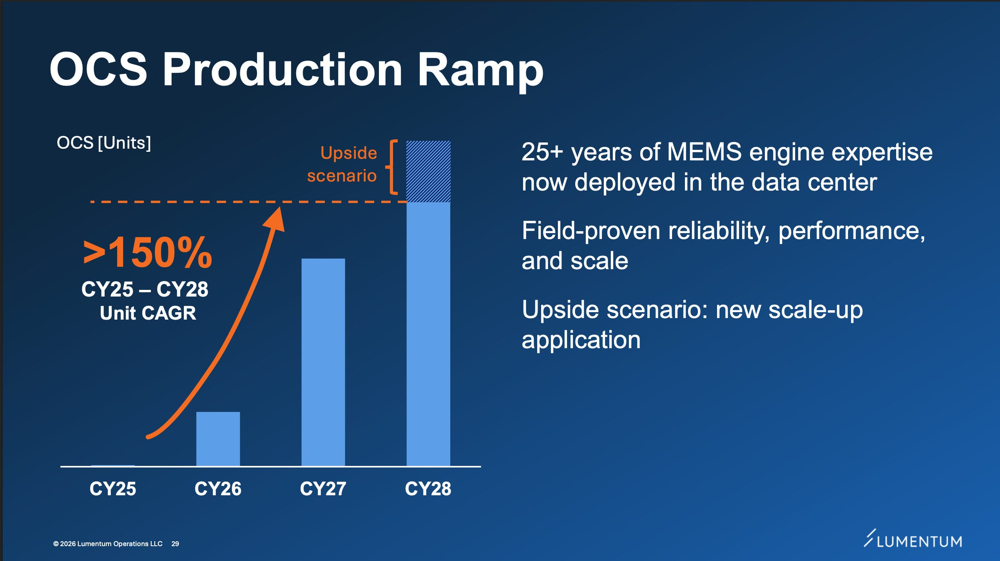
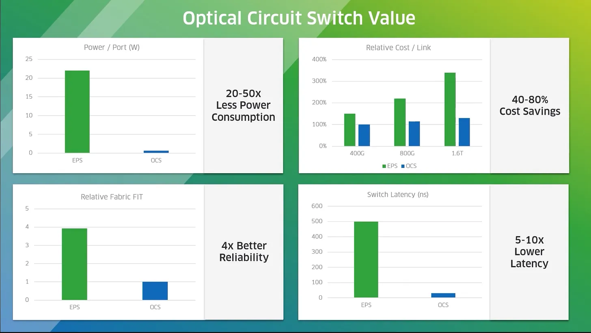
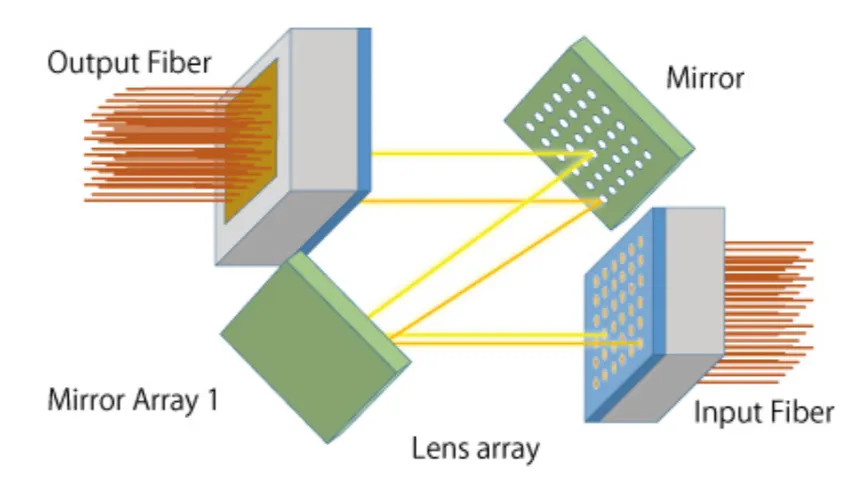
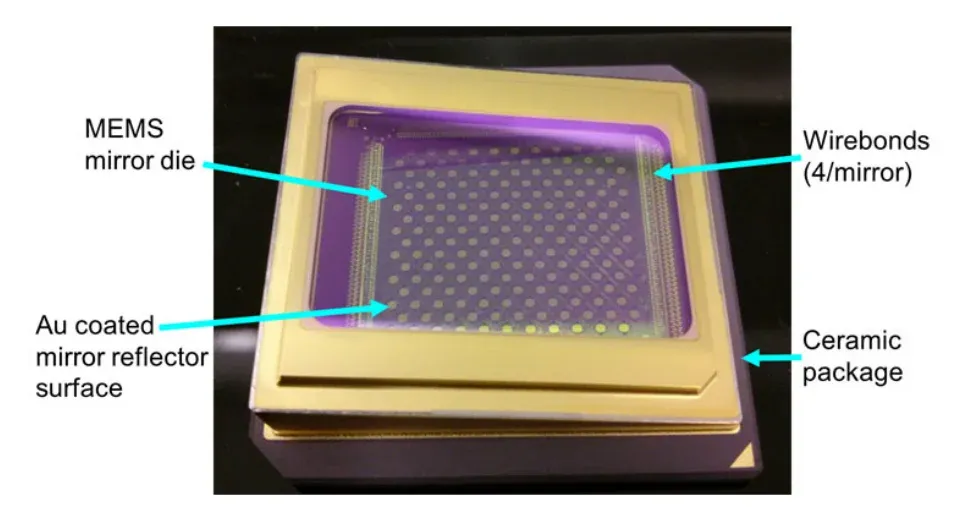
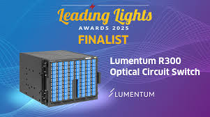
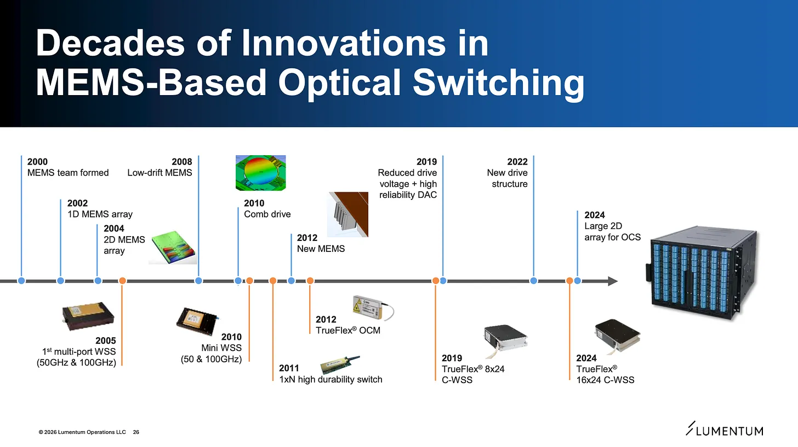
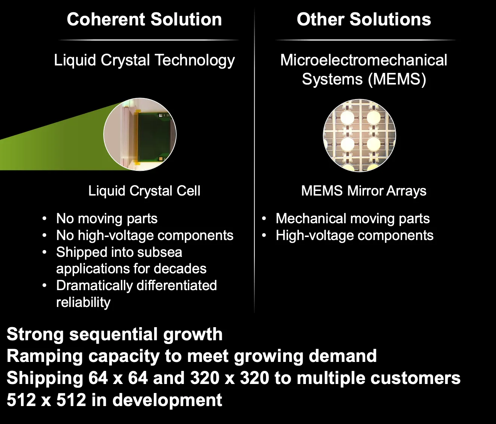
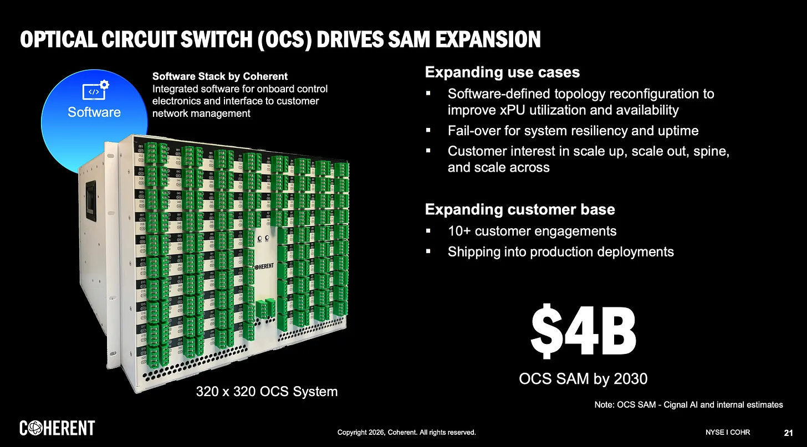

# Crux Capital 2026-05-10 - 12 Ways to Play OCS

A definitive Crux thematic mapping the optical circuit switching (OCS) supply chain to 12 public names across 5 layers, anchored in three simultaneous demand signals from incumbent switch vendors:

- **[[Lumentum (LITE)]]** — OCS backlog past **$400M**, multi-year **multi-billion-dollar** purchase agreement, ~$400M shipments planned H2 calendar 2026 stepping higher into 2027, CEO Michael Hurlston assigned senior exec Wajid Ali to the OCS supply chain. Hurlston: "in the next year it is hard to imagine anyone else being able to ship one of these very innovative solutions."
- **[[Coherent (COHR)]]** — OCS TAM doubled to **>$4B**, internal component bottleneck resolved, ramping across two facilities, sequential growth. CEO Jim Anderson: "breakthrough over the last couple of months removing a bottleneck."
- **[[Huber+Suhner (HUBN.SW)]] / Polatis** — hyperscaler multi-year cooperation order (Jul-2025); 2025 communication-segment order intake +21.9% to CHF 418.3M, total order intake crossed CHF 1B for the first time, book-to-bill 1.19x, backlog CHF 432M; existing Krzeszowice OCS plant at full capacity before Pisary (3,000 sqm, June 2025) broke ground targeting **5x capacity over 2 years**.

Anchored in Google's 2022 Jupiter paper rebuilding data-center network with OCS + SDN: **5x speed, 30% lower capex, 41% lower power**. That power-savings number is the slow-burn fuse on AI infrastructure economics.

## The 5-layer OCS supply-chain map

### Layer 1 — Direct OCS system vendors
- **[[Lumentum (LITE)]]** — MEMS micromirror approach. R300 (300x300 ports), R64 (64x64, <150W, >100Tbps, 80% power reduction vs packet switches).
- **[[Coherent (COHR)]]** — Digital liquid-crystal: no moving parts, no high-voltage, decades of subsea reliability history. 2D collimator array (integrating 2D lens + 2D fiber array) introduced March 2025.
- **[[Huber+Suhner (HUBN.SW)]]** — Polatis DirectLight piezo beam-steering. 160-year-old Swiss mid-cap; Polatis acquired 2016; stock roughly tripled off 2025 lows. Discovery gap: market still classifies as telecom cables.
- **[[Eoptolink (300502.SZ)]]** — China direct play. NX200/NX300 (140/320 ports) launched OFC 2026 on self-developed MEMS. SONiC-compliant OS, OCP OCS workgroup member. Shown alongside 12.8T XPO + 1.6T transceivers.

### Layer 2 — Light-steering layer
- **[[Silex Microsystems (SILEX.SS)]]** — World's leading pure-play MEMS foundry, 200mm wafer fab Sweden. Listed Nasdaq Stockholm May 7 2026; debut surge to ~360 from ~148 (now ~281). FY25 rev SEK 1,385M, EBIT margin ~27%; Q1 FY26 SEK 375M, EBIT >34%; target SEK 2.5B by 2030. Beijing Silex completed MEMS-OCS small-scale trial. IPO proceeds earmarked partly for US East Coast IC fab conversion to MEMS.
- **[[Santec (6777.T)]]** — LCOS programmable optics (wavelength-selective switches). Liquid-crystal-on-silicon expertise overlaps with COHR's OCS approach. Mcap ~Y332B, TTM rev ~Y28B, OI ~Y8.8B. "Hold more loosely" — indirect OCS proxy.

### Layer 3 — Precision optical parts
- **[[Advanced Fiber Resources (300620.SZ)]]** — Fiber arrays, collimators, isolators, combiners. **Direct match** to COHR's 2D collimator-array language. Partnered with Calient.AI at OFC 2026. FY25 rev 1.47B CNY (+47.6%), Q1 FY26 426.5M CNY (+60.8% YoY), TTM 1.64B CNY. Mcap ~64.7B CNY (~$9B), ~39.6x sales — priced like the market already believes the story.
- **[[Furukawa Electric (FUWAY)]]** — Hakusan subsidiary is #2 global share in multi-fiber MT ferrules. 2026 Hakusan+SANWA+US Conec announcement on next-gen very-small-form-factor connectors and TMT ferrules referencing hyperscale + CPO + high-density optical I/O. Low-purity OCS angle.

### Layer 4 — Making OCS at scale
- **[[RoboTechnik (300757.SZ)]] / ficonTEC** — China-listed automation co with German photonics-automation asset (ficonTEC) inside. Active alignment machines at sub-micron/nanometer-scale. **~€7.7M contract for second fully-auto OCS optical-switch packaging line with a leading Swiss subsidiary** (consistent with HUBN/Polatis ramp). Optoelectronics & semi division: >1B CNY (~$141M) new orders in first 4 months of 2026; significant portion from unnamed Nasdaq-listed "Company F". Mcap ~85B CNY (~$11.9B) on TTM ~1B CNY rev — scarcity pricing.
- **[[Fabrinet (FN)]]** — Quality manufacturing platform, OCS "similar to optical products Fabrinet already builds". iPronics dedicated SiPh OCS packaging/assembly line at Fabrinet (March 2026). Mcap ~$22B, Q3 FY26 rev $1.214B. OCS adds to a larger manufacturing story.

### Layer 5 — Proving the system works
- **[[Viavi (VIAV)]]** — Optical hardware test. MAP-300 platform, DCX 700 high-density fiber certification, TestCenter D2 1.6T AI fabric validation. Explicitly called out 300x300 OCS test at OFC 2024. Mcap ~$11.9B, Q3 FY26 rev $406.8M (+42.8% YoY).
- **[[Keysight (KEYS)]]** — System-level validation. KAI Data Center Builder emulates AI workloads, validates traffic across architecture. March 2026 collaboration with Salience Labs for **first OCS testing environment**. Acquired Synopsys Optical Solutions Group (2025) for deeper photonics design. Mcap ~$60B, annual rev ~$5.7B.

## Crux's research priority order (and own positions)

**Research priority**:
1. **[[Huber+Suhner (HUBN.SW)]]** — clearest combination of direct OCS product, confirmed hyperscaler PA, dedicated capacity build, real discovery gap.
2. **[[Silex Microsystems (SILEX.SS)]]** — MEMS scarcity is genuine; question is whether growth justifies post-IPO price.
3. **[[Advanced Fiber Resources (300620.SZ)]]** — most precise supply-chain match to COHR's product language. Valuation premium demands model work.
4. **[[RoboTechnik (300757.SZ)]] / ficonTEC** — compelling production-automation case, watch corporate structure overhang.

**Crux owns**: [[Coherent (COHR)]], [[Lumentum (LITE)]], [[Huber+Suhner (HUBN.SW)]], [[Viavi (VIAV)]], [[Fabrinet (FN)]] (entering soon). Interested in **[[Silex Microsystems (SILEX.SS)]]** pending dust settling. Crux doesn't invest in Chinese companies (so AFR, Eoptolink, RoboTechnik are research-only). HUBN is owned **primarily for OCS exposure**; rest are owned on overall positioning with OCS as an incremental, under-priced driver.

## Why it matters

- The Google Jupiter 2022 paper (5x speed / 30% capex / 41% power) is the production-proof that turned OCS from experimental to commercial. Three years of qualification later, all three Tier-1 vendors are shipping or ramping.
- The HUBN discovery gap is a specific mispricing claim: market models it as "cables and connectors", actually a 22% communication-segment order-intake jump from Polatis OCS that hasn't fully hit revenue yet.
- Multi-layer map gives 4 supply-chain entry points (light-steering foundry, precision parts, production equipment, system test) that monetize *whichever* architecture wins (MEMS vs LCOS vs SiPh OCS vs piezo) — architecture-agnostic bets vs vendor-specific.
- The "Company F" reference at RoboTechnik (unnamed Nasdaq-listed) is the kind of disclosure footnote worth tracking for identity reveal as a trigger.
- Crux's stated portfolio (COHR/LITE/HUBN/VIAV + FN entering) is a useful sanity check vs the framework — research priority does not equal capital allocation here.

## Linked tickers

**Already covered in vault**: [[Lumentum (LITE)]], [[Coherent (COHR)]], [[Viavi (VIAV)]], [[Fabrinet (FN)]], [[Keysight (KEYS)]], [[Furukawa Electric (FUWAY)]]

**To be added** (Photonics sector, flagged for QuietCove batch): [[Huber+Suhner (HUBN.SW)]] (CH), [[Eoptolink (300502.SZ)]] (CN), [[Silex Microsystems (SILEX.SS)]] (SE), [[Santec (6777.T)]] (JP), [[Advanced Fiber Resources (300620.SZ)]] (CN), [[RoboTechnik (300757.SZ)]] (CN — contains ficonTEC).

## Original Content

I believe optical circuit switching (OCS) is going to become one of the major growth drivers in optical networking over the next few years.

We are talking about new revenue ramps, purchase agreements, production bottlenecks, capacity additions, and supply-chain tension.

Let me give you three signals that all landed in the past few months.

**Lumentum** has a multi-year, **multi-billion-dollar** OCS purchase agreement in hand.

On its Q3 2026 earnings call, CEO Michael Hurlston said the OCS backlog has surged well past $400 million, with management outlining roughly $400 million of OCS shipments planned for the back half of calendar 2026 and that number stepping higher into 2027. The company has assigned one of its most senior executives, Wajid Ali, personally to the OCS supply chain.

**Coherent** doubled its OCS market opportunity estimate to **over $4 billion.** The company resolved a bottleneck in internal component supply that had been constraining production and is now ramping across two facilities simultaneously. OCS revenue is growing sequentially. CEO Jim Anderson: "We had a breakthrough over the last couple of months removing a bottleneck in production capacity, which has allowed us to ramp production at a much faster rate."

**Huber+Suhner** received major orders for its Polatis OCS from a globally active hyperscale operator tied to a **multi-year cooperation** agreement. Communication segment order intake surged 21.9% to CHF 418.3 million in 2025, with the Data Center and Polatis ramp as the key driver. The company crossed CHF 1 billion in total order intake for the first time in its history. The existing OCS production facility in Poland was already at full capacity before the new Pisary site broke ground, which is why it was built.

Three different companies.

Three demand signals.

All pointing the same direction.

The supply chain cannot keep up with what customers want.

The proof behind all of this still comes from Google. In 2022, Google published a paper describing what happened when it rebuilt its Jupiter data-center network using optical circuit switches alongside software-defined networking and topology changes across a decade of production experience.

The combination delivered 5x higher speed and capacity, 30% lower capex, and 41% lower power.

A 41% power reduction in a data center, in an environment where power is becoming the primary constraint on AI growth, is not a marginal improvement. The reason this 2022 paper still matters today is that Google spent years proving this architecture at production scale, and the rest of the industry has spent the years since building commercial products around that proof.

Lumentum, Coherent, and Huber+Suhner are all shipping or ramping OCS. The architecture is proven and now the commercial supply chain is becoming real.

---

### What OCS Actually Does

OCS keeps more traffic in the optical domain.

In a traditional data-center network, light gets converted into an electrical signal inside the switch. The switch processes and routes the traffic, then converts it back into light. That round trip costs power, latency, space, and money. OCS changes the role of part of the network by creating a direct optical path instead. The signal stays as light. When one group of GPUs needs to send a massive amount of data to another, OCS reconfigures that path on demand.

Less conversion means lower power. More direct paths mean lower latency. More flexible paths mean clusters that are easier to reorganize as workloads shift.

Coherent's CTO described OCS as a new capability rather than a replacement for packet switching. So OCS adds a layer. The electrical packet-switching layer stays. Operators gain a new tool to send a software command and reconfigure how all fibers are connected within anything touching the switch.

Remember, AI clusters use three types of networking. Scale-up connects GPUs within the same tightly-coupled compute node, where latency has to be extremely low. Scale-out connects racks and clusters within the same facility. Scale-across connects separate facilities, campuses, or regional data centers. OCS is most immediately relevant to scale-out and scale-across, where the flexibility to reconfigure optical paths on demand creates real benefits in how AI workloads are routed across a cluster. But scale up is coming soon enough.

The investment opportunity follows directly from the fact that OCS is a physical machine. It needs light-steering technology. Precision fiber arrays and tiny lenses. Specialized manufacturing equipment. Test systems that can validate hundreds of ports working reliably under real data-center conditions. That physical chain is what this report is about.

---

### Lumentum

Lumentum's OCS is built on MEMS: microscopic mechanical structures made with semiconductor-style manufacturing.

Picture a grid of tiny mirrors, each smaller than a grain of sand, that physically tilt to redirect a beam of light from one fiber path to another. That is what steers the signal inside a Lumentum OCS. The R300 is a 300x300-port switch, meaning it can manage up to 300 simultaneous input fiber connections and route each one to any of 300 output connections.

Larger AI clusters need more simultaneous optical paths, and higher port counts let the switch serve more of the cluster at once. The R64 is the smaller 64x64-port version, consuming less than 150W while carrying more than 100Tbps of optical traffic, which the company says represents an 80% power reduction versus packet-based switches.

What makes the current Lumentum setup so interesting is the combination of massive demand visibility and real supply constraint. The backlog has surpassed $400 million. A multi-year, multi-billion-dollar purchase agreement is signed. Management has outlined roughly $400 million to ship in the back half of calendar 2026, with the number stepping up further into 2027. And customers are asking for a major step-up in output beyond what the supply chain can currently support.

Hurlston: "We've gone in many instances really from zero to a significant number very, very quickly... but we are definitely on a tightrope on this product line. It's probably our biggest ramp."

Then he said something I thought was more revealing than the backlog number itself. When asked about competition, he said that in the next year it is hard to imagine anyone else being able to ship "one of these very innovative solutions." That is a CEO telling investors the competitive window is open and the constraint is internal execution, not external competition. He has assigned one of the company's most important people to fix it. Which is interesting when you contrast that with the confidence of Coherent's CEO that their application is superior. I believe that arguments can be made for both, and just like lasers, there is plenty to go around for the foreseeable future. I don't think we need to compare these two at this time as we are still very early stages and need proof from customers first.

So we need to see whether the $400 million ships on schedule, whether new hyperscaler customers are qualifying alongside the known one, and whether the competition window Hurlston described actually holds through 2027.

---

### Coherent

Coherent's OCS uses digital liquid-crystal technology, which is a fundamentally different architecture from Lumentum's MEMS approach. Instead of tiny moving mirrors, it uses a programmable optical layer to control the path of light.

Coherent markets its digital liquid-crystal architecture as a highly reliable alternative to MEMS-based switching. Unlike MEMS, liquid crystal has no moving parts and requires no high-voltage components, which in practice means fewer mechanical failure modes over time and less sensitivity to vibration and temperature variation that data centers can produce. The company has also been shipping liquid-crystal components into subsea applications for decades, which gives the technology a much longer reliability track record than a new product would suggest. When customers think about deploying hundreds of thousands of ports inside production networks that run continuously, that track record matters.

The market opportunity upgrade from roughly $2 billion to over $4 billion reflects expanding use cases across data-center interconnect, scale-out networks, and scale-up architectures. OCS creates flexible optical paths across all three of these networking layers. The copper displacement story, where optics increasingly complements and over time replaces copper inside scale-up links, is specifically tied to co-packaged optics (CPO), which Coherent also develops but is a separate product category from OCS. The resolved production bottleneck was internal. The company worked through a constraint in component supply over the past couple of months, and output is now ramping across two sites in parallel. Anderson said OCS is expected to be a primary driver of accelerated revenue growth in the current quarter.

Coherent also gave the supply-chain map some really great insight. In March 2025, they introduced a 2D collimator array for OCS that integrates a 2D lens array and a 2D fiber array, which the company describes as core to matrix optical signal switching inside OCS systems. That product detail points directly at the component layer underneath the switch vendor, which is where the rest of this report lives.

---

### The Setup

Lumentum and Coherent are the obvious names. But there is an entire physical supply chain underneath them, and that supply chain is starting to show its own demand signals.

If you literally opened up an OCS system you would see hundreds of fibers bringing light into the box, each held in exact positions by precision fiber arrays. Tiny lenses shaping the beams. A steering mechanism sending each beam to the right output path. The whole thing has to hold alignment, minimize optical loss, survive real data-center conditions, and prove reliable performance across hundreds of ports, again and again at scale.

That physical journey is where the supply chain lives.

*Below the paywall, I am going through the full public OCS map across five layers: direct OCS system vendors, the light-steering layer, precision optical parts, manufacturing at scale, and test and validation. Twelve public names. I will also share which one's I am actively positioned in, and which I am intersted in researching further.*

---

### Layer 1: Direct OCS System Vendors

Lumentum and Coherent are covered above. Two additional public names belong here.

**Huber+Suhner (HUBN SW) and the Polatis asset**

This is probably the most interesting company in the entire report for those of you who have not already found it.

I posted about it a bit ago: [Worth Tracking: A Company With OCS Exposure — Gaetano · Apr 20](https://cruxcapitalgroup.substack.com/p/worth-tracking-a-company-with-ocs)

Huber+Suhner has been making cables, connectors, and RF components for 160 years. For most of that history it was a dependable, unsexy Swiss mid-cap. Then Polatis happened, and the stock roughly tripled off its 2025 lows.

Polatis is an all-optical circuit switch business that Huber+Suhner acquired back in 2016. The technology uses patented DirectLight beam steering, built around compact piezoelectric actuators that align collimated beams of light between opposing input and output fiber arrays. So basically Polatis uses tiny piezo-driven movements to line up beams of light directly between fibers, keeping the signal in the optical domain throughout the switch. That gives HUBN a distinct architecture from Lumentum's MEMS-mirror approach and Coherent's liquid-crystal approach.

The demand signal arrived in July 2025 when the company announced major orders from a globally active hyperscale data-center operator tied to a multi-year cooperation agreement. Management said the contract was a milestone that allowed the company to unlock major capital investments behind OCS. Full-year 2025 communication segment order intake surged 21.9% to CHF 418.3 million, with the Data Center and Polatis ramp as the key driver. Total company order intake crossed CHF 1 billion for the first time ever. The book-to-bill entering 2026 was 1.19x with a backlog of CHF 432 million.

The hyperscaler customer has remained unnamed publicly, which leaves room for debate around customer identity. The more important point is that the order and capacity expansion are already confirmed in company disclosures.

The existing Krzeszowice OCS production facility was already at full capacity before Pisary broke ground. Pisary is a new 3,000 square meter facility opened in June 2025 with a target to increase capacity at least fivefold over two years. A portion of the company's CHF 55 million capex allocation went directly to the Poland OCS ramp. Management is guiding for at least 10% organic revenue growth in 2026 as the backlog converts.

The discovery gap is still real though. I believe the market still classifies Huber+Suhner as telecom cables and connectors. Analyst coverage is thin. The company is guiding conservatively and declining to endorse specific market size forecasts, which is exactly the kind of cautious management communication that can leave a stock undervalued relative to what the order book is actually saying.

One thing I keep coming back to is that Polatis OCS was the primary driver behind a 22% increase in communication-segment order intake last year. The revenue conversion still lags because the Poland capacity is being built. That lag between order intake and revenue recognition could be where mispricing lives.

---

**Eoptolink (300502.SZ)**

Eoptolink is the direct China OCS play.

The company launched NX200 and NX300 optical circuit switches at OFC 2026, supporting 140 and 320 ports respectively, using self-developed MEMS mirrors. The OCS operating system is SONiC-compliant, widely used in cloud networking, and Eoptolink has joined the Open Compute Project OCS workgroup. At OFC 2026, they showed OCS products alongside 12.8T XPO and 1.6T transceiver solutions, positioning this as part of a broader AI optical networking stack rather than a standalone product.

China's AI infrastructure buildout will favor domestic suppliers where possible. Eoptolink already has optical-module scale and established customer relationships. NX200 and NX300 move it up the stack. The question is how quickly these products move from OFC launch into qualification and customer deployment. That progression determines whether this is a direct OCS play or a company with OCS optionality on top of a transceiver business.

---

### Layer 2: The Light-Steering Layer

Once light enters the OCS box, something has to steer it. Lumentum and Eoptolink use MEMS mirrors. Coherent uses digital liquid crystal. Other architectures use silicon photonics. Two public companies sit in this layer.

**Silex Microsystems (SILEX SS)**

Silex listed on Nasdaq Stockholm on May 7, and the debut was extraordinary with the the stock surging massively. It hit a low of ~148 and a high of ~360 and is now sitting at ~281.

Let me explain what this company is before getting into the OCS angle. Silex is the world's leading pure-play MEMS foundry. It operates a single 200mm wafer fab in Sweden.

To put the 200mm figure in context, a wafer is the round silicon disc from which semiconductor devices are cut. Larger wafers mean more devices per production run, which means lower cost per unit and higher total output. Moving from smaller wafers to 200mm is a meaningful capacity and cost advantage in MEMS manufacturing. The company manufactures MEMS devices for customers across automotive, industrial, life sciences, and consumer electronics. The model is similar to TSMC where the customers design, Silex manufactures. Full-year 2025 revenue was SEK 1,385 million with an EBIT margin around 27%. Q1 2026 revenue was SEK 375 million with an EBIT margin above 34%. The company is targeting SEK 2.5 billion in organic net sales by 2030.

The OCS connection is through MEMS-based optical switching. Lumentum's OCS uses MEMS mirrors. Eoptolink's OCS uses MEMS mirrors. As the market moves toward higher port counts, the precision requirement on those mirrors goes up, and the manufacturing process becomes more difficult and more specialized. That is where a dedicated MEMS foundry becomes relevant. A translated Chinese disclosure from the broader Sai Micro and Silex ecosystem indicates that Beijing Silex completed small-scale trial production of MEMS-OCS products, which gives the OCS read-through more substance than the Swedish IPO materials alone suggest.

What I find genuinely interesting here is the scarcity angle. There are very few public pure-play MEMS foundries. X-FAB in Paris has MEMS expertise but is more diversified. The IPO proceeds are earmarked partly for a potential acquisition of a U.S. East Coast IC fab to convert into MEMS production, which directly addresses supply-chain concentration risk.

The massive first-day move tells you the market is already pricing scarcity into a fresh IPO. So now we need to see whether the underlying business growth is real enough to grow into the valuation the market has assigned. Based on the margin profile and the revenue trajectory, I think the business is real. Whether the current price is right is a different question that requires deeper digging on my part.

**Santec (6777.T)**

Santec is the liquid-crystal and optical-control proxy, and it is a a lower key name than Silex.

Coherent's OCS uses digital liquid-crystal technology. Santec builds LCOS-based programmable optical components, specifically wavelength-selective switches and related optical instruments. LCOS means liquid crystal on silicon, and the WSS is a system that routes and shapes optical signals by wavelength inside fiber networks. Different application than OCS, but the underlying optical-control expertise overlaps.

This is a real and profitable company. Market cap is roughly 332 billion yen with trailing revenue around 28 billion yen and operating income around 8.8 billion yen. So you are buying an existing optical components and instruments business, with the OCS angle as a potential upside layer if liquid-crystal optical control gets more attention from AI data-center architects.

I would hold Santec more loosely than the other names on this list. The connection to OCS is genuine but indirect. Worth tracking as a proxy, worth digging into only if you become convinced that liquid-crystal OCS adoption is accelerating, and it's a meaningful enough segment to move this busuiness.

---

### Layer 3: Precision Optical Parts

OCS is fundamentally an alignment problem. Light has to enter the switch, travel through the system, get steered, and exit through the correct fiber path with minimal loss. The higher the port count, the harder that becomes. The components that make alignment possible at scale are where real bottlenecks can form.

**Advanced Fiber Resources (300620.SZ)**

AFR is the name I would spend the most time researching further if I invested in Chinese companies.

The company makes precision passive optical components: fiber arrays, collimators, isolators, combiners. The key product for this thesis is the fiber array, a small precision structure that holds many optical fibers in exact positions. In an OCS system, those positions have to be perfect. Small misalignment means lost optical power. Lost optical power means the architecture becomes harder to deploy at scale.

Here is what made me pay close attention to AFR specifically. Coherent said its OCS collimator array integrates a 2D lens array and a 2D fiber array, and described that assembly as core to matrix optical signal switching inside its OCS systems. AFR's own OFC 2026 language listed ultra-high-precision, ultra-high-density 2D and MxN fiber array units for OCS and WSS applications. Those two descriptions map onto each other almost exactly.

AFR also partnered with Calient.AI at OFC 2026 to showcase OCS solutions, and described a broader OCS manufacturing platform spanning MEMS chip packaging and testing, optical coupling, circuit-board manufacturing, final assembly, and system testing. That sounds to me like a company positioning itself as a full OCS supply-chain enabler.

On the numbers, AFR is already being valued like an AI optical bottleneck. Full-year 2025 revenue was 1.47B CNY, up 47.6% from 2024. Q1 2026 revenue was 426.5M CNY, up 60.8% year over year, bringing TTM revenue to 1.64B CNY, up 48.1%. Using a rough 7.2 CNY/USD conversion, that is about $204M of 2025 revenue, $59M of Q1 revenue, and $228M of TTM revenue. The market cap is roughly 64.7B CNY, or about $9.0B, which puts the stock around 39.6x sales.

That is the tension. The growth is real, and the product language maps directly onto one of the most important OCS component bottlenecks. But AFR is already priced like the market believes the story. If OCS scales and AFR captures meaningful share of the precision fiber-array and collimator layer, the premium can make sense. If adoption takes longer or AFR's position proves less defensible than the product language suggests, the multiple has room to compress. This is one of the best names in the map, but it needs honest model work before sizing a position.

**Furukawa Electric (5801.T)**

Furukawa sits at the edge of the OCS map through its Hakusan subsidiary, which has the second-largest global share in multi-fiber MT ferrules. MT ferrules are the precision alignment pieces inside fiber connectors that keep fibers positioned correctly. As OCS and CPO push toward higher fiber density and tighter loss budgets, low-loss alignment hardware becomes more valuable.

The 2026 announcement from Hakusan, SANWA, and US Conec around next-generation very-small-form-factor connectors and TMT ferrule components specifically referenced hyperscale data-center architectures, CPO, and high-density optical I/O.

This is a much lower-purity OCS angle than AFR. Furukawa is a large industrial company. The OCS read-through runs through a recently acquired subsidiary that makes a specific precision component. Worth having in the map, worth treating as a physical-layer thematic name rather than a direct OCS bet.

---

### Layer 4: Making OCS at Scale

Building an OCS in a lab and shipping reliable OCS into hyperscale environments at volume are completely different problems. This layer is where the scale transition happens.

**RoboTechnik / ficonTEC (300757.SZ)**

The investable stock here is 300757.SZ. The OCS asset inside the company is ficonTEC, a German photonics automation specialist. So investors buying this angle are buying a China-listed automation company with a German OCS production-equipment asset inside it.

ficonTEC builds precision optical assembly machines. The core capability is active alignment, where the machine physically moves optical components while measuring the actual light signal, then locks them in place once the signal is optimized.

To understand why this matters, consider that a human hair is roughly 70,000 nanometers wide. ficonTEC's pitch is extreme motion precision at the level required for optical packaging, with company materials referencing sub-micron tolerances and nanometer-scale accuracy.

In optical systems, alignment errors far smaller than a human hair can cause enough light loss to make a product fail. The alternative is passive alignment, where parts are positioned using physical guides rather than live optical feedback. That can work for simpler optical assemblies, but high-port-count OCS systems need tighter control because every small optical loss compounds across the system.

The order evidence is unusually explicit. ficonTEC signed a roughly €7.7 million contract for a second fully automatic OCS optical-switch packaging line with a subsidiary of a leading Swiss company, which appears consistent with Huber+Suhner's Polatis ramp, though the customer has yet to be publicly disclosed.

At the broader RoboTechnik level, the optoelectronics and semiconductor division secured over 1 billion CNY, roughly $141 million, in new orders in the first four months of 2026. A significant portion came from a contract with an unnamed Nasdaq-listed company referred to as "Company F" in filings.

The bull case is that OCS creates a specialized production-equipment cycle that barely existed before this AI optical buildout.

If Lumentum, Coherent, Huber+Suhner, and Eoptolink all need to ramp OCS output, they need precision optical assembly lines. ficonTEC is one of the few companies with the active-alignment, laser-processing, photonics assembly, and test capabilities to build those lines.

The scarcity story here may be sharper than the MEMS foundry scarcity at Silex. Silex gives exposure to MEMS manufacturing. RoboTechnik / ficonTEC gives exposure to the production equipment that turns OCS designs into repeatable factory output.

The complexity is the wrapper though. This is a China-listed automation company, while the key OCS asset is German ficonTEC. So the underwriting work is twofold in the ficonTEC order cycle in OCS/CPO production equipment, and the broader RoboTechnik valuation.

The market cap sits around 85 billion CNY, roughly $11.9 billion, against trailing revenue of about 1 billion CNY. That is a dramatic premium that reflects scarcity pricing. The business momentum is strong, but the listed equity already trades like investors understand the bottleneck.

The question is whether OCS and CPO production-line orders can sustain the kind of growth that justifies it.

**Fabrinet (FN)**

Fabrinet is the lower-purity, higher-quality name in this layer.

The company already knows how to manufacture complex optical products at scale. On its recent earnings call, management described OCS as a "great opportunity" and said the technology is very similar to optical products Fabrinet already builds, which means it can potentially serve OCS customers without building entirely new manufacturing capabilities from scratch. The company is currently focused on one or two specific OCS opportunities, with more detail likely once those become concrete enough to announce.

The named public data point is iPronics' dedicated silicon-photonics OCS packaging and assembly line at Fabrinet, announced in March 2026, designed to support volume production from wafers to line cards.

Fabrinet has a market cap around $22 billion and Q3 FY2026 revenue of $1.214 billion. OCS is one product category among many. If it scales meaningfully, it adds to an already strong manufacturing platform story. So I think the framing should be: quality manufacturing business with real OCS read-through, not direct OCS bet.

---

### Layer 5: Proving the System Works

Before hyperscalers deploy OCS inside production networks at scale, someone has to prove it works. Insertion loss is the key metric, so how much light power is lost as the signal passes through each component in the system? Every fiber connection, every lens, every switching element introduces some loss. In a 300-port OCS, those losses compound. If the total loss is too high, the signal degrades and the system fails to perform as designed. That is what test equipment measures, and why it becomes more valuable as OCS moves from controlled lab environments into real production networks where hundreds of ports have to work reliably under continuous load.

**VIAVI Solutions (VIAV)**

VIAVI explicitly called out testing solutions for the emerging 300x300 optical circuit switch market at OFC 2024, tying the opportunity to its MAP-300 optical manufacturing test platform, DCX 700 high-density fiber certification tool, and TestCenter D2 1.6T for AI-scale Ethernet fabric validation.

On its latest earnings call, management said OCS and CPO are still in early sales but the ramp is expected to show up over the next two to three quarters. Network equipment manufacturers are already buying VIAVI lab equipment for optical switches and next-generation AI systems. The broader dynamic pulling VIAVI into this cycle is that as optics move closer to the chip and systems get more complex, testing has to happen earlier and more often. Components need to be tested before they are sealed inside larger modules.

VIAVI has a market cap around $11.9 billion. Q3 FY2026 revenue was $406.8 million, up 42.8% year over year. OCS is early within a broader AI optical test buildout.

**Keysight (KEYS)**

Keysight is the system-level validation angle.

VIAVI tests the optical hardware. Keysight helps prove whether an OCS-based network architecture actually works at AI-cluster scale.

A switch can look good in isolation. The harder question is whether the full network improves throughput, congestion, latency, and job completion time under real AI workloads.

In March 2026, Salience Labs and Keysight announced a collaboration to build the first OCS testing environment. Salience brings the silicon-photonics optical-switching platform. Keysight brings KAI Data Center Builder, which can emulate AI workloads and validate how traffic moves across the architecture.

So Keysight helps prove the cluster design before the cluster gets built. The company also moved deeper into optical design in 2025 by acquiring Synopsys' Optical Solutions Group. That expands Keysight's role earlier in the photonics workflow, alongside silicon photonics, CPO, and next-generation optical interconnect design.

Keysight has a market cap around $60B and annual revenue around $5.7B, so OCS is a lower-purity angle inside a much larger test-and-measurement business.

The bull case is that OCS, CPO, silicon photonics, 1.6T, and eventually 3.2T create a multi-year validation cycle. The more optical and complex AI networks become, the more customers need design tools, emulation platforms, and system-level test.

---

### Where I Would Focus

I personally don't invest in Chinese companies, but this is how I would go about spending my time on the full stack if I did.

Huber+Suhner is the one I would spend the most research time on. It has the clearest combination of direct OCS product ownership, confirmed hyperscale purchase agreement, dedicated production capacity being built, and a real discovery gap because most investors still screen it as telecom cables. The work is in sizing the Polatis revenue contribution as the Poland ramp converts orders into sales.

Silex is next. Fresh IPO, already up massively, real underlying business, and the MEMS scarcity angle is genuine. The current price reflects enthusiasm. The work is in determining whether the growth trajectory justifies it.

AFR is the third priority. The component-level overlap with Coherent's own product description is the most precise supply-chain match in this report. If you believe OCS scales and precision fiber arrays become a real bottleneck, AFR is the most direct public bet on that layer. The valuation premium is real and demands honest model work.

RoboTechnik / ficonTEC is the fourth, with eyes open on the corporate structure complexity. The business case for OCS production automation is compelling and the order evidence is unusually specific. But the acquisition overhang needs to be understood before sizing.

Lumentum and Coherent are the obvious ones for anyone who has not already looked at them.

---

### What I Own

Out of this batch I own:

Coherent

Lumentum

HUBN (Huber + Suhner)

VIAVI

FABRINET (soon, almost at my level)

And I am interested in SILEX but I need to really see where the dust settles and dig further into their financials.

HUBN is the one I own primarily for their OCS exposure. The rest of the companies I own because I like their overall positioning and see OCS as an incremental growth driver that isn't really being priced in yet.

---

*Informational research for educational purposes. This is commentary and research discussion. I may hold positions in securities mentioned. Readers should do their own research and consult a qualified financial advisor before making investment decisions.*
