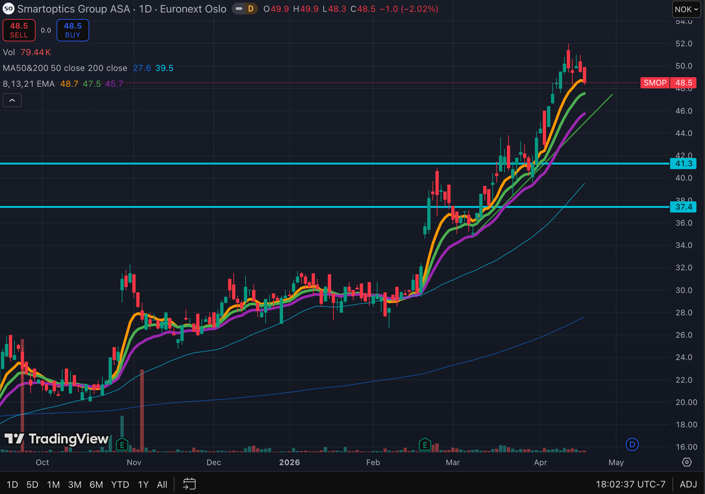
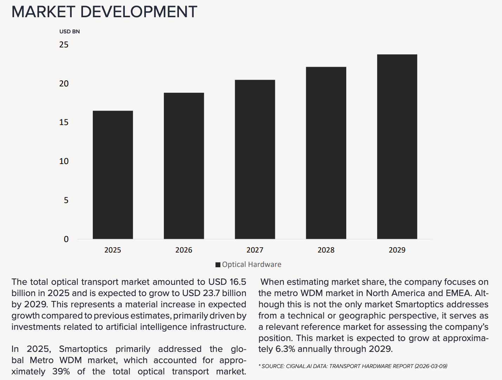
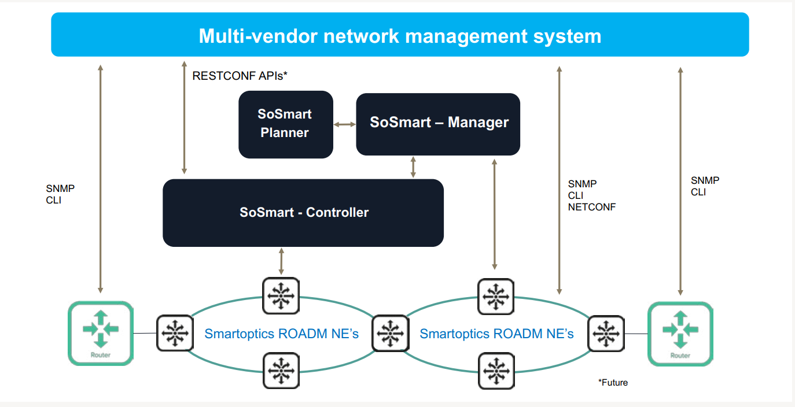
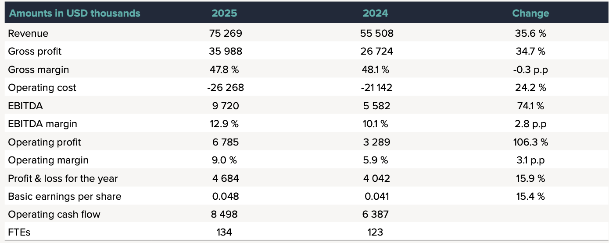
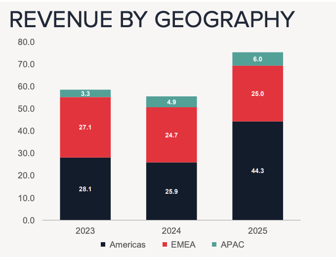

# Crux Capital new position 2026-04-22 — Smartoptics (SMOP) Norwegian open optical transport vendor with 35% revenue growth and 4-6 week lead times riding AI infrastructure

Crux Capital broke their normal "wait for a dip" rule and opened a **starter** position in [[Smartoptics (SMOP.OL)]] (Euornext Oslo) at ~NOK 48. Subject company sells open optical transport systems for metro/regional/DCI networks — Crux puts it in the same bucket as [[Ciena (CIEN)]] and [[Nokia (NOK)]] but at small-cap scale (~$520M market cap, NOK 4.85B).

**Why now**: while [[Lumentum (LITE)]], [[Coherent (COHR)]] and [[Applied Optoelectronics (AAOI)]] are essentially sold out to hyperscalers heading into 2026, mid-sized operators are looking for vendors who can deliver — SMOP is filling that gap with **4-6 week lead times** in an industry where larger vendors are stretching much longer.

**The business**:
- 2025 revenue $75.3M (+35.6% YoY); GM 47.8%; EBITDA $9.7M; EBIT $6.8M; OCF positive
- >50% of 2025 revenue from customers who were already customers in 2020 (compounding installed base)
- Communication service providers, internet content providers, internet exchanges all growing; Americas became largest geography
- 800G transponder just launched; building automated/robotic Optical Devices factory in Kista, Stockholm
- Cash $7.3M + undrawn $7.4M credit; minimal debt; proposed NOK 0.60/share dividend
- Management targets: 2-3x market share growth in relevant markets, 13-16% EBIT margin

**Optical transport TAM**: $16.5B in 2025 → $23.7B by 2029 (and management thinks assumptions are still moving higher). Two demand vectors: (1) day-one bandwidth needs of hundreds of terabits for new data centers, (2) enterprises building local GPU clusters for inference.

**Where the story is still early**: Europe pipeline (described as "where the Americas were two years ago" with 10+ developed operator opportunities), 800G product cycle just starting, software/services recurring layer growing on top of installed base.

**Sizing & entry**: starter position at ~NOK 48 on IBKR (OTC version too illiquid). Crux sees attractive averaging-down levels at ~44, ~40.5, ~35. Risk flags: competition from larger vendors, execution at smaller scale, broader AI-CAPEX cycle risk.

Tip-of-the-hat to John Galt for surfacing the name.

## Original Content

If you know me, you know I am very conservative with my entries.

I very rarely buy when stocks are at highs.

I almost always wait till some kind of dip to support or a trendline.

I broke that rule today.

When I dug in to this company, I knew I wanted to take a position.

I have been very conservative lately and this was a good opportunity to push that.

European photonics companies have been getting re-rated these last two weeks.

Many of these are more speculative and based solely on future potential.

This one we will talk about today is already executing.

Some quick bits:

* Revenue grew >35% last year. Gross margin held > 45%.
* Net income positive.
* Operating cash flow positive.
* Lead times running four to six weeks in an industry where larger vendors are coming in much longer.
* A developed operator pipeline building in a second geography that management says looks a lot like their strongest market did before it broke out.
* A market backdrop that keeps getting revised higher as AI infrastructure pushes more traffic through more parts of the network.

The deeper I went, the clearer it became that the business quality here is strong.

This is the kind of name that can get overlooked because it sits one layer away from the flashiest part of the buildout. But when you find a smaller company with real growth, real margins, real retention, and a practical advantage in getting product out the door, it is worth a good look.

So rather than putting this in my 'Worth Watching' section, it goes right to my 'New Position' section.

Let's unpack this a bit.

This will serve as an introduction post with a deep dive to follow when I can.

---

*Subscribers get the company name, the full thesis, why demand is building, why customers are choosing it, where growth still looks early, what my investment plan is and what I'm watching quarter by quarter from here. This is solely for educational purposes. This is not a recommendation to buy or sell a security. Do your own diligence. Consult with an investment professional.*

**Smartoptics (SMOP) (Euornext Oslo)**

Smartoptics sells systems, devices, and software used to move traffic across metro, regional, and data center interconnect networks. That is an important layer of the stack because rising demand for bandwidth has to show up somewhere practical. I like to put SMOP in a similar bucket as Ciena and Nokia. It shows up in operators adding capacity, interconnection points carrying more traffic, and data centers needing more links into the network and across regions.

Per the annual report, the optical transport market reached $16.5 billion in 2025 and is expected to reach $23.7 billion by 2029, driven largely by AI infrastructure investment. Management also made clear on the call that they think those industry growth assumptions are still moving higher, not lower.

That fits with how they described demand. The biggest projects they are seeing now involve day-one bandwidth requirements of hundreds of terabits just to connect a new facility to the internet. Then there is the regional traffic moving between data centers themselves.

> "The other thing with AI is, of course, the west-east traffic. The scale up, the scale out, the scale across — which is really connecting data centers in the region to optimize where you run your workloads. And that's a market that I believe is gonna continue to grow as these data centers continue to grow."

There is a second demand vector here too that stood out to me. Management thinks enterprises themselves will increasingly build local GPU clusters for inference and private workloads rather than relying entirely on outsourced capacity. That creates another layer of demand for the network links that sit around those clusters.

So the opportunity here is broader than one buyer type or one network configuration. More traffic has to move through more places, and Smartoptics sits in the layer that helps make that happen.

---

**Why the business is winning**

The lead-time advantage is the most obvious edge, but the more important point is why that advantage exists.

Management explained that some larger competitors are heavily focused on hyperscaler demand and are coming into 2026 essentially sold out. We talk alot about this with Lumentum, Coherent, Applied Opto etc. That leaves mid-sized operators and other customers looking for someone who can actually deliver. Smartoptics is filling that gap.

> "We are operating with 4-6-week lead times, typically, which is extraordinarily good in our industry right now."

That matters because this company sits in a part of optical networking where customers care about cost, timing, and flexibility.

Smartoptics has built around open optical transport and more disaggregated architectures that help customers expand capacity with better economics and less lock-in.

> "At Smartoptics, we leverage modern software design principles and expand network horizons by taking an open approach in everything we do. This empowers our customers to break free from unwanted vendor lock-in, remain flexible and minimize costs."

That positioning lands especially well when demand is rising and customers need capacity quickly.

The retention data is key too. More than 50% of 2025 revenue came from customers the company already had in 2020. That is meaningful. It says the business is compounding on top of an installed base rather than constantly rebuilding itself.

The underlying numbers support that picture. Revenue grew 35.6% in 2025 to $75.3 million. Gross margin held at 47.8%. EBITDA came in at $9.7 million. EBIT was $6.8 million. Operating cash flow was positive.

Communication service providers were the largest customer segment and grew sharply year over year. Internet content providers and internet exchanges also grew strongly. The Americas became the largest geography.

This is already a business with real operating quality.

---

**Where the story still feels early**

Europe is one good reason.

Management described the region as being roughly where the Americas were two years ago, before that market became the company's largest revenue contributor. They also said they are sitting on at least ten highly developed operator opportunities in Europe. If that geography starts to follow a similar path, the growth engine broadens meaningfully.

The product cycle is another reason the story still feels early. Management just launched the 800G transponder and expects it to become a meaningful product, with more advanced versions already in development.

> "We have just released our 800G transponder now, which I think will become a high runner. We will develop more of those and more advanced versions of our transponders, muxponders..."

Network upgrades are moving toward higher-capacity links, and Smartoptics is positioned to participate in that next step.

The software and services layer deserves attention too. As the installed base grows, the revenue mix should improve with it. This segment already represents a meaningful piece of revenue, and deferred revenue increased year over year as the base expanded.

> "The increasing number of customers signing up for Smartoptics' professional services is an important source of recurring revenue for the company."

Management's longer-term targets give a framework for what they think the business can become: market share growth of two to three times in relevant markets, with EBIT margins in the 13 to 16% range. Those are ambitious targets, but they tell you management sees a longer runway here than the market may be pricing in.

---

**Scaling and balance sheet**

One of the usual questions with a smaller company is whether it can actually keep up once demand turns.

Smartoptics is already preparing for that. Management said they are building a new manufacturing facility in Kista focused on automation and robotization for the Optical Devices business. This shows the company is investing in operational scale while the business is already profitable.

> "...we're building a brand-new manufacturing facility for business area Optical Devices in our brand-new facility in Kista, Stockholm... focus there, automation, robotization of that business. It is high-volume business. It's several hundred thousand devices that we're shipping every year."

The balance sheet helps too. Cash at year-end was $7.3 million, and the company had an undrawn $7.4 million credit facility alongside it. Debt is minimal. On top of that they proposed a NOK 0.60 per share dividend for the year.

That combination says something useful. This is a growth story with real financial discipline behind it.

---

**Where I can see this going**

This is where the story gets interesting for me. They are currently valued at **NOK 4.85B** or about **$520M USD**.

The company did $75.3 million of revenue in 2025. Management is talking about a market that reached $16.5 billion in 2025 and is expected to grow to $23.7 billion by 2029, while also saying they believe the growth assumptions are still moving higher. They are also targeting market share growth of two to three times in their relevant markets and EBIT margins in the 13 to 16% range over time.

That gives enough to build a rough framework.

My base case is that this business keeps growing well above the underlying transport market over the next few years because the company is still early in Europe, still early in the 800G cycle, and still building recurring revenue through software and services. In that setup, I can see revenue moving toward roughly $95 to $100 million over the next year, then into a $115 to $130 million range after that if Europe starts converting and customer wins keep compounding on the installed base.

A stronger outcome is also easy to sketch out. If the European pipeline starts landing, the 800G products ramp the way management hopes, and software and services continue to layer on top of the hardware base, I can see a path toward something more like $140 to $170 million of revenue over the next few years with margins moving higher alongside it.

That is where the operating leverage starts to matter much more. Gross margins are already healthy. If the company can keep revenue compounding while pushing EBIT margin toward management's 13 to 16% target range, the earnings power starts to look very different from what the market saw even a year ago.

The reason I like thinking about it this way is that the story does not need heroic assumptions to get interesting. A company growing from $75 million toward $100 million, then toward $125 million and beyond, while keeping gross margin in the high 40s and improving mix through software and services, can create a very different financial profile over a fairly short period of time.

That is the path I am watching for.

> "We maintain our ambition to grow our market share by 2-3 times in the relevant markets... and we're continuing to believe and to target the 13%-16% range..."

---

**Why the position is sized the way it is**

The stock has moved with significant strength, which means this is now an execution story rather than a discovery story for the most part.

The market is also at all time highs even though there is still significant geopolitical risk.

That is why the position is still sized as a starter.

Also to see the growth I hope for, Europe has to convert. The 800G cycle has to generate real volume. Software and services has to keep compounding on the installed base. Margins have to hold as the company scales.

Those are exactly the kinds of things that can take a business-quality story and turn it into a larger position over time.

I personally like to take a starter position and then size down into it.

I think that there is highly likely downside from my ~48 entry.

The levels I find really attractive are:

~44

~40.5

~35

I bought it on IBKR. There is an OTC version but it is so low volume with huge huge spreads. I am not touching the OTC version.

---

**Bottom line**

Smartoptics has strong margins, real profitability, a sticky installed base, a meaningful lead-time advantage, exposure to a transport market that is being revised upward because of AI infrastructure, a developed European pipeline, and a product cycle moving into the next bandwidth generation.

There are risks. First there is competitive risk. Larger vendors have more scale, deeper product portfolios, and stronger balance sheets, and if they lean harder into this part of the market or shorten lead times, some of the opening Smartoptics is benefiting from today could narrow.

Then there is execution risk around growth itself. This is still a smaller company, which means project timing, customer concentration, product ramps, and regional momentum can all have an outsized impact on results from quarter to quarter. If growth slows before the newer opportunities start contributing, the stock could feel that quickly.

Then there is the overall AI buildout. If something happens and CAPEX drys up or data centers stop being built etc. then all photonics names will re-rate lower.

If you invest in any companies in this sector, please understand the downside risk!

Also, shout out to John Galt for putting this on my radar!

---

*This content is for informational purposes only and reflects personal opinion. It serves as commentary and discussion, never investment advice or a solicitation to buy or sell any security. I may hold or consider positions in mentioned securities. Every investor should do their own diligence. Just because I own shares doesn't mean that you should. Do your research and make your own decisions.*
