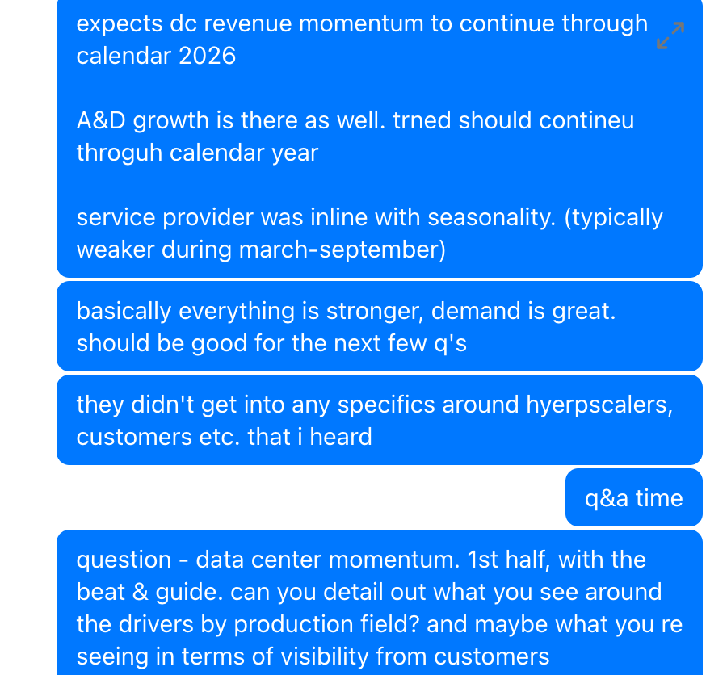

# Crux Capital VIAV FY26-Q3 earnings recap — 43% revenue growth, NSE drives AI infra re-rate, Spirent on track, CPO becomes new test insertion point

[[Viavi (VIAV)]] reported a meaningful beat-and-raise. Headline: revenue $406.8M (+42.8% YoY, beat $386-400M guide), non-GAAP op margin 21.0% (+430 bps), EPS $0.27 (beat $0.22-0.24 guide). Q4 guide $427-437M / EPS $0.29-0.31. Management said $500M quarterly revenue (~$2B annualized run-rate) is "entirely realistic" over the next upcycle.

**NSE (the AI engine)**: $321.5M (+54.4% YoY), GM 65.3%, op margin 17.2% (+680 bps). Incremental drop-through 40-45%. Demand strong across "scale up, scale out, scale across" — the architecture language that connects [[Viavi (VIAV)]] to the full AI network (inside clusters, across racks, between data centers). Hyperscalers largest bucket, then module makers, system makers, silicon vendors.

**Speed cycle**: 800G is volume; 1.6T "ramping in the lab"; **co-packaged optics (CPO) is the new layer** — VIAVI selling equipment into semi vendors developing integrated packaged optics. Management quote: "The package is now the system." New insertion points: optical component test, wafer-level packaging, heterogeneous integration, CPO workflows, silicon photonics characterization, custom rack-mounted systems. Early CPO sales, ramp potentially over next 2-3 quarters.

**Field instruments**: data-center share jumped from ~1/3 last quarter to **40-45% this quarter** and could approach 50%. Management: "I've never seen so much demand." This is the physical fiber network monitoring/SLA/wavelength layer that scale-across requires.

**Test intensity = durable alpha**: as speeds rise and CPO/near-packaged optics increase yield risk, test steps per system increase. Two growth vectors: more AI infra built, AND more test per system. The second is physics-driven, not capex-cycle-driven.

**Spirent**: $54.2M in Q3 in-line; full-year ~$200M run-rate; Q4 normalizes to just under $50M. First fully integrated VIAVI+Spirent product expected around 3.2T. Implies Q4 NSE growth coming from core VIAVI demand (data center, field instruments, CPO, aero/defense), not Spirent.

**Aerospace & Defense (second leg)**: Inertial Labs outperforming (large earnout payment tied to forecast beat). Resilient PNT, drones, autonomous systems, avionics, spectrum mgmt; winning/being considered by U.S. Tier 1 defense players. Wireless still down 40-45% but a recovery could add $20-30M quarterly.

**Watch item — cash flow**: OCF –$26.3M, FCF –$32.2M. Attributed to Inertial Labs contingent consideration, working capital timing, employee variable costs. Paid down $49M March 2026 convert (issued ~1.8M shares for premium), prepaid $150M of Term Loan B (now $450M outstanding). Q4 share count ~256.1M. Buybacks paused while prioritizing debt. Cash conversion has to catch up to operating leverage.

**Position framework (author's own)**: VIAV is ~5-6% of his optics portfolio; $50 area is a watch level for an add. YE-2027 scenarios:
- **Bear $35-40** — AI/DC momentum cools, CPO delayed, cash conversion uneven
- **Base $80-85** — NSE scales, field instruments stay strong, Spirent integrates, margins expand
- **Bull $95-100** — VIAVI proves path to larger run-rate; field/CPO/silicon photonics/integrated optics/aero+defense all contribute

Related peers mentioned across the call: [[Lumentum (LITE)]], [[Coherent (COHR)]], [[Applied Optoelectronics (AAOI)]] (referenced indirectly through the broader optics-test thesis).

## Original Content

VIAV is one of my preferred ways to have exposure to the testing layer for optics. Today it is demonstrating why!

If you haven't read my introduction piece on Viavi yet, please read it here:

[VIAVI - An Overlooked Layer](https://cruxcapitalgroup.substack.com/p/viavi-an-overlooked-layer) — Gaetano, Apr 16

Was taking live notes during the call today for subscribers, and the call was jam packed with alpha!

So now in this article I want to unpack things further, see just what went down, what is coming over the next few quarters, what signals it gives for the whole stack, my new financial model, and how I want to be positioned.

Subscribe to unlock!

---

### The Numbers First

Revenue came in at **$406.8 million**, up 42.8% year over year and above the prior guide of $386 million to $400 million. Non-GAAP operating margin reached 21.0%, up 430 basis points year over year. Non-GAAP EPS came in at **$0.27**, above the prior guide of $0.22 to $0.24.

For Q4, management guided revenue to **$427 million to $437 million** with EPS of **$0.29 to $0.31**. That is a real step up. NSE, the segment tied most directly to the AI infrastructure thesis, is expected to grow again to **$340 million to $348 million** with operating margin guided to 18.7%.

An analyst asked whether $500 million of quarterly revenue is a realistic target. Management said "entirely realistic," clarifying the target is over the next upcycle rather than an immediate guide. VIAVI just reported $406.8 million. A $500 million quarter implies roughly a $2 billion annualized revenue run-rate. Solid!

---

### NSE

VIAVI has two segments. This is important to know.

NSE, Network and Service Enablement, covers lab test, production test, field instruments, high-speed Ethernet, optical transport, data center, telecom, aerospace and defense, Spirent, and Inertial Labs.

OSP, Optical Security and Performance Products, covers anti-counterfeiting, 3D sensing, and optical products.

For this thesis, NSE is the engine.

NSE revenue was **$321.5 million**, up 54.4% year over year and above the high end of guidance. NSE gross margin improved to 65.3% and NSE operating margin reached 17.2%, up 680 basis points year over year. Management described NSE incremental drop-through around 40% to 45%, which means the model scales well as revenue grows.

> "We are seeing strong demand across all data center segments, scale up, scale out, and scale across."

That is the exact architecture language I wanted to hear because it connects VIAVI to the full AI network from inside clusters, across racks, and between data centers.

The customer base driving that growth looks healthy and diversified too. Which is nice because so many companies I talk about on this page have such strong customer concentration risk. But hyperscalers appear to be the largest bucket, buying for deployed data centers and internal R&D. Behind them, module makers, system makers, and silicon vendors.

OSP also beat and is guided higher in Q4, helped by 3D sensing and anti-counterfeiting, but NSE remains the segment driving the AI infrastructure re-rate.

---

### 800G Is Volume. 1.6T Is Ramping. CPO Is The New Layer.

The call gave a useful picture of where the industry sits right now, and this also has read through across our stack.

800G remains a high-volume driver. 1.6T is moving through lab validation and early production at module vendors. Management said "1.6T is ramping in the lab," which is exactly the setup I want in this part of the supply chain. VIAVI has exposure to what is shipping today and what the industry is building next.

The bigger incremental takeaway was co-packaged optics (CPO). Management called out momentum around CPO and described VIAVI selling equipment into semiconductor vendors developing integrated packaged optics. That moves VIAVI closer to the production and packaging flow in a way the old framing did not capture.

> "The package is now the system."

As optics move closer to the ASIC, testing becomes part of the manufacturing architecture rather than a downstream validation step. VIAVI is gaining new insertion points in optical component test, wafer-level packaging, heterogeneous integration, CPO workflows, silicon photonics characterization, and custom rack-mounted test systems.

This is how the thesis broadens and the TAM expands. VIAVI is becoming embedded in how the next optical network gets built.

Management also framed the current CPO-related revenue as early sales, with a ramp potentially starting over the next two to three quarters.

---

### Field Instruments

Last quarter, management said data center had moved to roughly one-third of field-instrument revenue. This quarter, that moved closer to 40% to 45%, with management suggesting it could approach 50%.

> "I've never seen so much demand."

Field instruments are tied to how hyperscalers monitor, measure, and optimize real fiber networks after deployment. This is where scale-across becomes tangible. AI infrastructure depends on data-center interconnect, dark fiber, wavelength monitoring, latency control, and SLA enforcement. VIAVI is increasingly sitting in that physical network assurance layer, and the shift from one-third to nearly half of field-instrument revenue in one quarter is a meaningful acceleration.

---

### Test Intensity Is The Real Alpha

As the industry moves to higher speeds, chip-to-chip interconnect, CPO, near-packaged optics, hollow-core fiber, and integrated optics, the amount of testing required per system increases. Components need to be tested before assembly, after placement, and again through the final system. Yield risk rises because failures become expensive once a full module is sealed. That creates more test steps per product!

VIAVI grows from two directions simultaneously. More AI infrastructure gets built. And each system requires more testing than the one before it. The second dynamic is the more durable one because it is driven by physics and manufacturing complexity rather than capex cycles alone.

Please understand how significant this is!

---

### Spirent Is Doing Its Job

Spirent contributed **$54.2 million** in Q3, in line with expectations. Management still expects roughly a **$200 million annualized run-rate**, with Q4 closer to just under $50 million after normalizing for timing.

Spirent gives VIAVI more high-speed Ethernet, traffic validation, software, and enterprise customer exposure. VIAVI brings stronger hardware and broader optical test reach. The first truly integrated VIAVI plus Spirent product is expected around 3.2T, which lines up directly with the next speed cycle.

The hidden positive is that Q4 NSE growth looks stronger on an organic basis. Spirent contributed $54.2 million in Q3, while management suggested Q4 Spirent normalizes closer to just under $50 million. Yet NSE is still guided higher to $340 million to $348 million. That implies the next leg of NSE growth is coming from core VIAVI demand, especially data center, field instruments, CPO, and aerospace and defense.

---

### Aerospace And Defense Is The Second Leg

Data center is the main story, but aerospace and defense also strengthened this quarter. In the call it felt like 'but wait, we have this other segment that is doing really good too!'.

Inertial Labs appears to be outperforming. The large earnout payment was tied to the business exceeding forecasts. The opportunity covers resilient PNT, drones, autonomous systems, avionics, spectrum management, and defense programs. Management said VIAVI is now winning or being considered by U.S. Tier 1 defense players. Big deal!

That gives the company a second growth engine outside the data-center cycle, which matters for the durability of the thesis across different macro environments.

Wireless remains weak, down roughly 40% to 45%, but a recovery could add $20 million to $30 million of quarterly revenue. Management mentioned AI-RAN and ground-to-satellite communication as future areas. This is secondary for now, but it represents additional upside if the wireless cycle turns. I want to do a future article on this, as you know I am super into AI-RAN. But I haven't discussed it from the testing angle yet.

---

### The Financial Watch Item

The operating story improved considerably. The balance sheet needs continued attention though.

Operating cash flow was negative $26.3 million and free cash flow was negative $32.2 million. Management attributed this to the Inertial Labs contingent consideration, working capital timing, and employee variable costs. The company also paid $49 million for the remaining principal on the March 2026 convert, issued about 1.8 million shares for the conversion premium, and prepaid $150 million of Term Loan B, which now sits at $450 million outstanding. Q4 share count is expected around 256.1 million.

The negative free cash flow is the main near-term watch item. Management's explanation is reasonable, but I want to see cash generation improve as revenue scales through Q4 and into the next fiscal year. Buybacks remain paused while the company prioritizes debt management, so the near-term shareholder-return story is operating leverage first, capital return later. The operating leverage is real. The cash conversion still has to catch up.

---

### Financial Modeling

I plan to continue maintaining my current VIAVI position, which is now roughly **5% to 6%** of my optics portfolio.

The **$50 area** is one level I am personally watching for a potential add, assuming the operating story remains intact. That is my own portfolio framework, rather than a recommendation.

For **year-end 2027**, my current scenario range is:

**Bear case: $35 to $40**
This assumes the current AI/data-center momentum cools, CPO adoption takes longer than expected, and cash conversion remains uneven.

**Base case: $80 to $85**
This assumes VIAVI continues scaling NSE, field-instrument demand remains strong, Spirent integrates cleanly, and operating margins move higher as revenue grows.

**Bull case: $95 to $100**
This assumes VIAVI proves the path toward a larger run-rate business, with field instruments, CPO, silicon photonics, integrated optics, and aerospace/defense all contributing to higher earnings power.

*These are scenario ranges I use to frame risk/reward, valuation, and position sizing. They are based on my own assumptions and may change as new information comes in. This is for informational purposes only and should not be treated as financial advice or a recommendation to buy, sell, or hold any security. Readers should do their own research and consult a financial advisor before making investment decisions.*

---

### Bottom Line

This quarter confirmed the thesis and expanded it.

VIAVI beat, guided higher, expanded margins, and showed stronger demand across data center, aerospace and defense, field instruments, CPO, silicon photonics, and high-speed Ethernet. The field instrument upgrade and the CPO insertion point were the two details that changed how I think about the surface area of this story.
