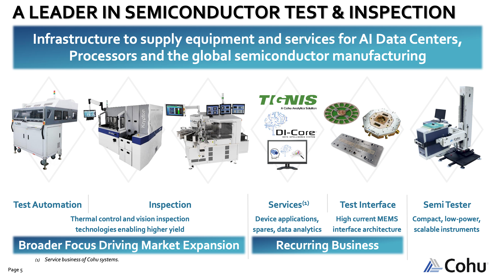
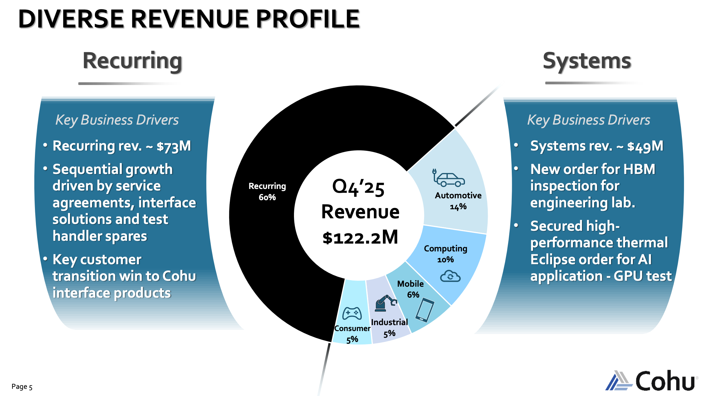
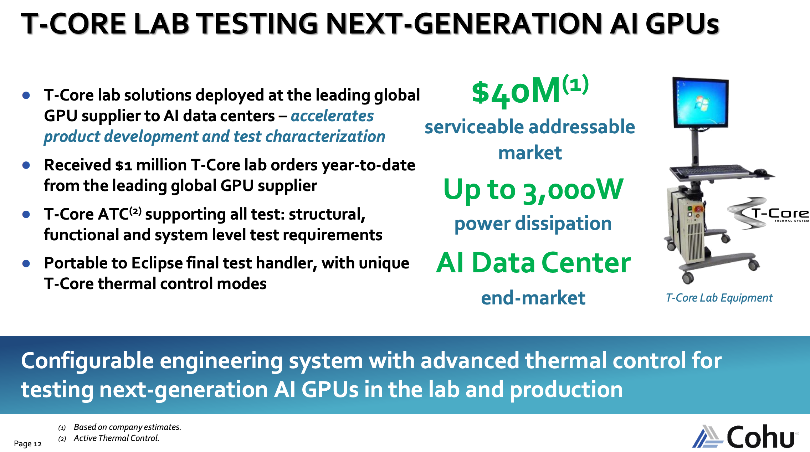
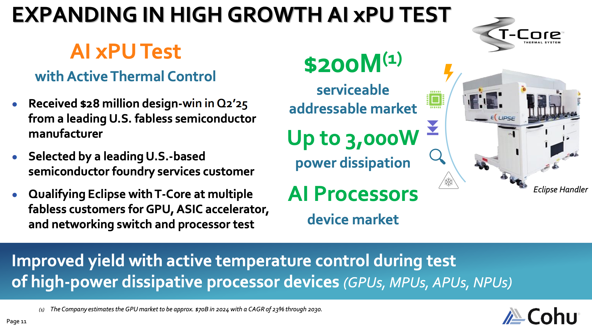
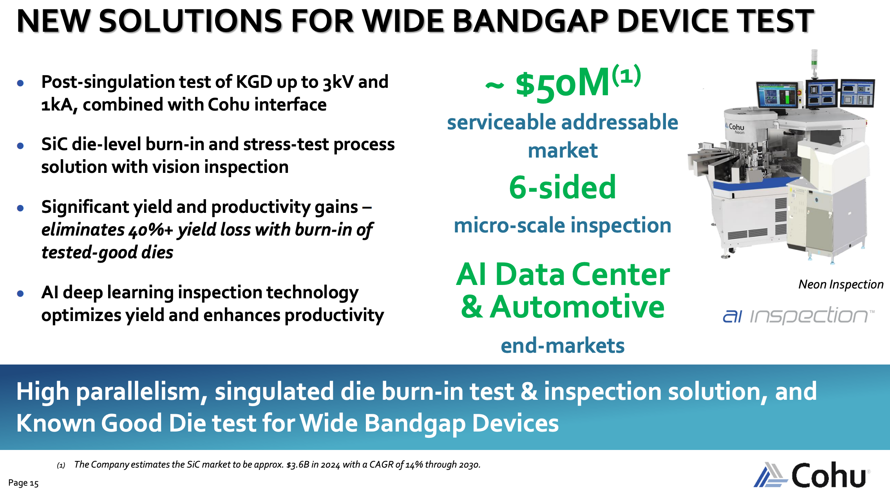
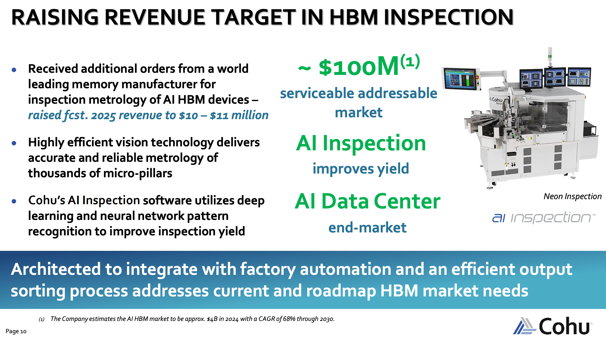
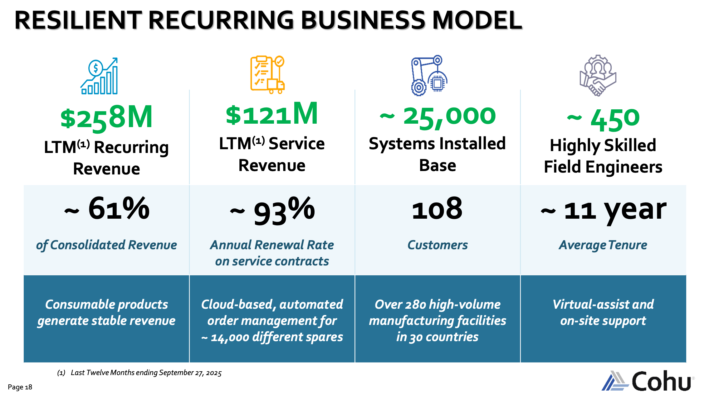
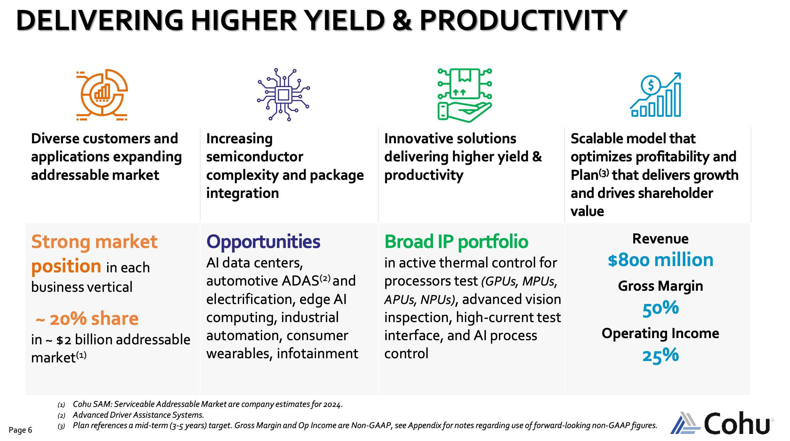
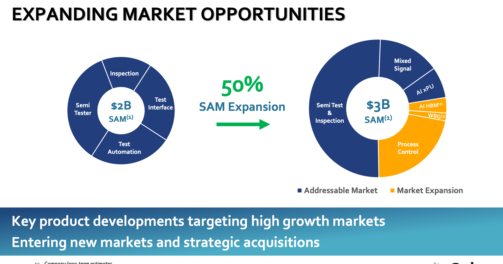

# COHU — The Chip Torturer

Every semiconductor that ends up inside an AI datacenter has been **tortured** first: physically picked up, pressed against electrical contacts, held at precisely controlled temperature ([[Cohu (COHU)]] handlers operate −55°C to +175°C), electrically interrogated across thousands of parameters, released, then optically inspected for defects invisible to the naked eye. The industry's clinical name for the problem this solves: **infant mortality** — chips that pass ordinary quality checks but fail within hours of real-world operation. In a consumer device, it's annoying. In an EV battery management system or autonomous driving processor, it's a recall, a fire, or worse.

Cohu is a 79-year-old San Diego back-end semi-test equipment company. Crux's thesis: as AI chip power densities push test complexity past what commodity handlers can manage, Cohu's decade-long bet on **thermal control during test** becomes a durable moat.

## What Cohu Actually Does

**Back-end** = what happens after wafer fab: singulation, packaging, handling, inspection, test before shipment. Front-end (litho, deposition, etch) gets all the attention. Back-end is where chips actually get verified to work.

Cohu = leading supplier of semi test **handlers and contactors**. Handler = the robotic system that picks devices, makes electrical contact with the tester, manages temperature, releases, and bins. Contactors = consumable electrical interface between handler and chip. Plus inspection/metrology (Neon, Krypton), mixed-signal tester (Diamondx), and software (PAICe, DI-Core).

**Structural feature: ~60% recurring revenue.** Installed base of ~25,000 systems across 280+ facilities in 30 countries. **Service contract renewal: ~93% annually.** Average customer tenure: ~11 years. That's what kept Cohu alive through the brutal 2023–2024 equipment downcycle.

Competitive frame: Cohu is **not** [[Teradyne (TER)]] or [[Advantest (6857.T)]]. Those two dominate automated test equipment (the testers themselves). Cohu sits in the **physical and thermal layer surrounding the tester** — handler, thermal control, contactor, inspection. In handlers specifically, multiple market research reports place Cohu among top global suppliers by installed base. **What's changing**: the handler, historically treated as commodity automation, has become one of the most technically demanding parts of the test cell.

## The Physics Problem (Why Thermal Matters)

IEEE Spectrum: power densities in leading-edge 3D chips are stretching the boundaries of thermal engineering.

You cannot drop a high-power AI chip into a test socket and apply test signals — the chip immediately generates enough heat to damage itself and distort its electrical characteristics. But you cannot just cool it either — a chip tested at the wrong temperature reports parameters that don't match its real operating behavior, producing **false passes that ship defective parts**. Test must happen at precisely controlled temperature while simultaneously dissipating enormous heat from a device smaller than your palm.

That's what **Cohu's T-Core Active Thermal Control** does, integrated into the **Eclipse handler** (originally launched in 2015 for mobile, progressively upgraded). Current configuration manages **up to 3,000W of power dissipation** with the thermal precision required for production test of GPUs, CPUs, custom AI accelerators, ASICs, and network processors.

Crux frames the flow: Teradyne and Advantest send the electrical signals. Cohu's Eclipse manages the thermal environment in which those signals are applied. As each [[Nvidia (NVDA)]] / [[Advanced Micro Devices (AMD)]] / hyperscaler-custom GPU generation draws more power, T-Core's decade of development becomes more valuable. The harder the problem, the more defensible the solution.

## The Design Wins (Order Flow)

- **Q2 2025**: $28M Eclipse order (originally mobile/automotive), shipments through Q4.
- **Q4 2025**: First **high-power thermal Eclipse order tied to a customer's AI roadmap**.
- **Late January 2026**: First production unit shipped; qualification work with multiple fabless customers for GPU, ASIC accelerator, networking processor test.
- **March 2026**: Second customer (US-based semi manufacturer + foundry services) places **multi-unit Eclipse order for next-gen HPC and AI datacenter processors**.
- **March 2026 (days later)**: Another **$30M follow-on production orders from two customers**. One customer **subscribed to PAICe** — early proof the software layer rides along with hardware.

Management response: **2026 HPC revenue outlook lifted to $65–80M**. Additional customers still in qualification.

CEO Luis Müller (March 2026 PR): *"These orders underscore the increasing importance of scalable, thermally precise test architectures as AI and HPC processors continue to push the limits of power density and performance."*

## Burn-In: Silicon Carbide

A second major growth leg. SiC is the key power-semi material for EVs, industrial systems, high-voltage applications — handles temperatures, voltages, switching conditions ordinary silicon struggles with. Reliability matters acutely: a die that passes standard electrical test can still fail early under real stress.

Cohu entered SiC burn-in late 2024 — European customer selected **Neon platform** for SiC burn-in. Proprietary carrier supports **2,500V burn-in at 150 devices per carrier**. Cohu's investor pitch: can eliminate **>40% of yield loss** in the production flow.

Same pattern as Eclipse: as devices move into harsher operating conditions and more demanding end markets, test/qualification becomes more valuable.

## The HBM Connection

High Bandwidth Memory (HBM) is one of the AI buildout's bottlenecks. Every leading AI accelerator depends on stacked memory close enough to feed the GPU at extreme speed.

HBM stacks = multiple DRAM dies vertically bonded. The **interconnect structure has to be inspected at very fine tolerances before bonding** — once stacks are assembled, defects become much more expensive to fix.

**Neon platform** does exactly that job. Deep learning / neural-network pattern recognition measures the **micro-pillars forming HBM interconnects** and supports **100% inspection at a world-leading memory customer** (likely [[Micron (MU)]] / [[Samsung Electronics (005930.KS)]] / [[SK Hynix (000660.KS)]] tier — Crux doesn't name). That same customer recently placed additional orders tied to **next-gen HBM development in an engineering lab** — Cohu moving with the roadmap, not just current node.

Each HBM generation brings more interconnect density, tighter tolerances, more inspection intensity → more inspection time, more equipment per unit of output. Cohu exited 2025 at **~$11M HBM inspection revenue**, guiding **$15–20M for 2026**. Small in absolute terms, but real foothold in one of AI memory's most important manufacturing steps.

## Recurring Revenue Engine

The legitimate concern: cyclicality. Revenue fell from **$813M (2022) → $402M (2024)** in the last downcycle.

What made Cohu more durable than a pure-systems story: service contracts + spares + consumable contactors + interface products kept printing even as new equipment demand collapsed. Customers must keep installed test capacity running.

Now an early-recovery signal: **recurring revenue grew sequentially for 4 straight quarters through Q4 2025**, while **test cell utilization climbed from ~72% early 2025 to 76% by year-end**. Computing exited at 78% utilization, automotive at 75%. When customers run installed test gear harder, demand for spares + service + interface products rises first; new capacity orders lag.

## Competitive Positioning — Why Not Just A Bigger Player?

Three reinforcing answers to "what stops Teradyne or Advantest from building a competing high-power thermal handler?":

1. **Installed base** — 25,000 systems already deployed; years of validation, operator familiarity, process recipes, service relationships embedded. 93% renewal proves stickiness.
2. **Thermal know-how** — T-Core didn't appear because AI got hot; it was developed through years across mobile, automotive, AI processor test. 3,000W dissipation at production-test precision is not a trivial extension.
3. **Integration breadth** — Eclipse + Cohu contactors + Neon inspection + PAICe analytics = broader test-cell stack. Harder to displace in pieces.

Not untouchable — but more durable than it looks at first glance.

## The Honest Bear Case

- **Customer concentration**: Eclipse ramp is concentrated in a small number of AI chip customers. Any major program delay/redirect would materially hit revenue.
- **Balance sheet**: $305M total debt, primarily a $287.5M convertible at 1.5% coupon due ~2029–2030. Interest manageable; refinancing risk real.
- **Chinese competition moving upmarket** in mature semi test, undercutting on price. Cohu's response (focus on AI thermal complexity layer where Chinese tools can't yet follow) is correct, but capability gaps can close over a decade.

None disqualifying — but worth holding alongside the bull case.

## Valuation — Crux's Levels

Easy money in the story is probably gone — stock has already moved, investors are paying for execution, not a hidden setup.

For the bull case from here:
- Eclipse converts design wins → real production revenue.
- HBM inspection keeps scaling with the roadmap.
- Margin profile improves as higher-value product mix grows.

**Crux's stated positioning:**
- No current position.
- Interested at **~$41.5** for an aggressive small initial sized position.
- Size in at **$38** and **$33.5**.
- Built to ~3% of overall optics portfolio (on the lower side).
- **YE2027 base case: ~$52–55**
- **YE2027 bull case: ~$65–70**

## Images

## Original Content

Every semiconductor that ends up inside an AI data center has been tortured first.

Alright, that's a little dramatic. But bear with me.

The chip is physically picked up, pressed against electrical contacts, held at a precisely controlled temperature (Cohu's own handlers operate across a range from −55°C to +175°C) electrically interrogated across thousands of parameters, released, and then optically inspected for defects invisible to the naked eye. This happens not once but at multiple points in the manufacturing process. For the most safety-critical chips, like the silicon carbide power devices going into electric vehicle powertrains, it happens to every single unit at temperatures and voltages that would destroy ordinary test equipment.

The industry has a clinical name for the problem this process solves: infant mortality. Yikes. Chips that pass ordinary quality checks but fail within hours of real-world operation. The defects might not be obvious. They're latent, buried in microscopic crystal flaws or imperceptible variations in the underlying material. Under normal conditions they're dormant. Under stress like heat, voltage, sustained current, they surface catastrophically. In a consumer device, infant mortality is annoying. But in an EV battery management system or an autonomous driving processor, it's a recall, a fire, or worse.

One of the only reliable ways to catch many of these failures before they show up in the field is to deliberately stress chips before they ship. That process, and the broader ecosystem of equipment surrounding it, is what a 79-year-old San Diego company called Cohu has built a business around.

You may have never heard of them. But they're worth knowing about.

---

### What Cohu Actually Does

Cohu is a back-end semiconductor equipment company. "Back-end" in semiconductor parlance refers to what happens after a chip has been fabricated on a wafer: singulation, packaging, handling, inspection, and test before shipment. The front-end (lithography, deposition, etching) gets a lot of the attention. The back-end is where chips actually get verified to work.

Cohu describes itself as the leading supplier of semiconductor test handlers and contactors. The handler is the robotic system that physically picks semiconductor devices, moves them into electrical contact with a tester, manages temperature during the test, releases them, and sorts them into pass and fail bins. Cohu also makes the contactors (the consumable electrical interface between handler and chip that wears out and must be replaced) along with inspection and metrology systems, a mixed-signal semiconductor tester called Diamondx, and software meant to improve yield and process control across production.

One structural feature of the business is that roughly 60% of revenue is recurring.

When Cohu installs a handler at a semiconductor manufacturer, that relationship generates ongoing revenue from spares, service contracts, and consumable contactors. Their installed base of roughly 25,000 systems across more than 280 manufacturing facilities in 30 countries gives the business a real revenue floor even when new equipment orders slow down. Service contracts renew at roughly 93% annually. Average customer tenure is about eleven years. That is what allowed Cohu to survive, and keep the recurring side of the business growing, through the brutal 2023–2024 semiconductor equipment downcycle.

Cohu's interface and contactor business is a real operating layer inside the test cell, and management specifically called out service agreements, interface solutions, handler spares, and a key customer transition win to Cohu interface products as drivers of recurring growth.

But wait, there's more! Alongside handlers, it sells inspection and metrology tools through platforms like Neon and Krypton, mixed-signal test capability through Diamondx, and software through PAICe and DI-Core aimed at improving yield, uptime, predictive maintenance, and process control across the installed base. So Cohu is trying to sell the interface layer, the inspection layer, and the software layer around it.

Where does that leave them competitively? Cohu is not Teradyne or Advantest. Those two companies dominate the automated test equipment market and are deeply embedded in the world's largest chipmakers. Cohu does not attack that directly. Instead, it sits in the physical and thermal layer surrounding the tester: the handler, the thermal control system, the contactor, and the inspection platform. In the handler market specifically, multiple independent market research reports I found place Cohu among the top global suppliers by installed base. What is changing now is that the handler, long treated like a commodity piece of automation equipment, has become one of the most technically demanding parts of the entire test cell.

That shift is the core of the Cohu story.

---

### The Physics Problem

IEEE Spectrum has reported that power densities in leading-edge 3D chips are reaching levels that stretch the boundaries of thermal engineering.

This creates a test problem that is genuinely really hard. You cannot put a high-power AI chip into a test socket and simply apply test signals. The chip immediately generates enough heat to damage itself and distort its electrical characteristics. But you also cannot simply cool it as a chip tested at the wrong temperature will report parameters that don't match its real operating behavior, producing false passes that ship defective parts. The test must happen at precisely controlled temperature while simultaneously dissipating enormous heat loads from a device smaller than your palm.

This is exactly what Cohu's T-Core Active Thermal Control system does.

T-Core is integrated into their Eclipse handler platform, and together they form the product driving Cohu's most exciting growth story. The Eclipse, originally launched in 2015 for mobile processor test, has been progressively upgraded to handle today's AI chip requirements. The current configuration manages up to 3,000 watts of power dissipation while maintaining the thermal precision required for production test of GPUs, CPUs, custom AI accelerators, ASICs, and network processors.

So if you wanted some kind of flow, Teradyne and Advantest send the electrical signals. Cohu's Eclipse manages the thermal environment in which those signals are applied. As each GPU generation draws more power, Cohu's decade of T-Core development becomes more valuable. The harder the problem gets, the more defensible the solution.

---

### The Design Wins

The clearest proof that Cohu's thermal bet is working is the order flow.

In Q2 2025, Cohu landed a $28 million Eclipse handler order that was originally described as supporting mobile and automotive applications, with shipments running through Q4. By the fourth quarter, the story had already moved forward. Cohu booked its first high-power thermal Eclipse order tied to a customer's AI device roadmap, shipped the first production unit in late January 2026, and was already highlighting qualification work with multiple fabless customers for GPU, ASIC accelerator, and networking processor test.

Then in March 2026, things picked up again. A second customer (described as a leading U.S.-based semiconductor manufacturer and foundry services company) placed a multi-unit Eclipse order for next-generation HPC and AI datacenter processors. Days later, Cohu announced another $30 million of follow-on production orders from two customers. One of those customers also subscribed to PAICe, giving Cohu an early real-world proof point that the software layer can start riding along with the hardware.

That sequence is important as it is one thing to talk about thermal complexity in AI test. It is another thing to see a product move from a large initial order, to production shipment, to a second major customer, to follow-on orders, all within a relatively short window. Management responded by lifting its 2026 HPC revenue outlook to $65–80 million. Additional customers are still in qualification, and that is relevant because semiconductor test equipment is sticky. Once a handler platform is qualified inside a production flow, switching it out is expensive, disruptive, and slow.

As CEO Luis Müller said in the March 2026 press release announcing the second customer win, "These orders underscore the increasing importance of scalable, thermally precise test architectures as AI and HPC processors continue to push the limits of power density and performance."

Eclipse is getting the attention. It should. It is the clearest proof that Cohu can win in one of the hardest parts of semiconductor production. But it is not the whole story. Cohu also has meaningful exposure to wide-bandgap device qualification, HBM inspection, mixed-signal and power-control test, and software layered on top of the installed base. That is the bigger point. Cohu is showing up in more parts of semiconductor manufacturing where complexity is rising, not falling.

---

*The rest of this post is for paid subscribers. What follows gets into the broader opportunity beyond Eclipse, including wide-bandgap burn-in, HBM inspection, the recurring revenue engine, the competitive positioning, and what the stock still needs to prove from here. I will also include my own strategy and price targets. None of this is financial advice, this is solely educatioanl.*

---

### Burn-In

This is one of Cohu's major growth legs. Burn-in testing for silicon carbide devices.

Silicon carbide (SiC) is a key power-semiconductor material for electric vehicles, industrial systems, and other high-voltage applications because it can handle temperatures, voltages, and switching conditions that ordinary silicon struggles with. That is exactly why reliability matters so much. A die that passes standard electrical test can still fail early in the field if latent defects only show up under real stress. In automotiv that is a major qualification problem.

Cohu entered this market in late 2024 when a European customer selected its Neon platform for silicon carbide burn-in. The system uses a proprietary carrier design that supports high-power burn-in and stress testing at up to 2,500 volts with 150 devices per carrier. In the investor presentation, Cohu says the solution can eliminate more than 40% of yield loss in the production flow.

This fits the same pattern as the Eclipse opportunity. As devices move into harsher operating conditions and more demanding end markets, test and qualification become more valuable. That is what makes burn-in worth paying attention to. It is another example of Cohu showing up where semiconductor complexity is rising and failure gets more expensive.

---

### The HBM Connection

High Bandwidth Memory is one of the bottlenecks behind the entire AI buildout. Every leading AI accelerator depends on stacked memory sitting close enough to the processor to feed it at extreme speed. Without HBM, the GPU is not nearly as useful.

That creates a manufacturing problem. HBM stacks are built by vertically bonding multiple DRAM dies, and the interconnect structure has to be inspected at very fine tolerances before bonding. Once those stacks are assembled, defects become much more expensive to fix. That is why the inspection step matters.

Cohu's Neon platform is built for exactly that job. Using deep learning and neural-network-based pattern recognition, Neon measures the micro-pillars that form HBM interconnects and supports 100% inspection at a world-leading memory customer. That same customer recently placed additional orders tied to next-generation HBM development in an engineering lab, which is an important signal that Cohu is still moving with the roadmap rather than just participating in the current node.

The bigger point is that HBM should get more valuable for Cohu as the technology gets harder. Each new generation brings more interconnect density, tighter tolerances, and more inspection intensity. On the Q4 2025 earnings call, management said that dynamic should translate into more inspection time and more equipment per unit of output. Cohu exited 2025 at roughly $11 million of HBM inspection revenue and is guiding to $15–20 million for 2026. That is still small in absolute terms, but it shows the company has already established a real foothold in one of the most important manufacturing steps in AI memory.

---

### The Recurring Revenue Engine

A legitimate concern with any semiconductor equipment company is cyclicality. The industry is famous for sharp upcycles and equally sharp downturns, and Cohu lived through that the hard way. Revenue fell from roughly $813 million in 2022 to $402 million in 2024.

What made the business more durable than a typical pure-systems story was the recurring model. Service contracts, spares, consumable contactors, and interface products kept generating revenue even while new equipment demand was weak. That matters because customers still have to keep installed test capacity running, even in a downturn.

The more important point now is that the recurring business is also one of the earliest signs that conditions are improving. Recurring revenue grew sequentially for four straight quarters through Q4 2025, while test cell utilization climbed from roughly 72% in early 2025 to 76% by year-end. Management said computing exited at 78% utilization and automotive at 75%. When customers are running installed test equipment harder, demand for spares, service, and interface products rises first. New capacity orders tend to come later.

---

### The Competitive Positioning

The obvious question for any smaller equipment company is simple: what stops a larger player from building a competing high-power thermal handler and taking the opportunity?

The first answer is installed base. Like I mentioned, Cohu has roughly 25,000 systems already deployed across customer production lines. That means years of validation work, operator familiarity, process recipes, and service relationships are already embedded in real manufacturing flows. Once a handler platform is qualified in production, switching it out is not easy. The 93% service-contract renewal rate is one sign of how sticky that installed base really is.

The second answer is thermal know-how. Cohu has been building toward this problem for a long time. T-Core did not appear overnight because AI chips got hot (get it??). It was developed through years of work across mobile, automotive, and now AI processor test. Managing up to 3,000 watts of power dissipation with the precision required for production test is not a trivial extension of ordinary handling. It is a specialized capability, and that matters more as chip power keeps rising.

The third answer is integration breadth. Cohu is increasingly selling more than a handler. It has contactors, interface products, inspection and metrology tools, mixed-signal test, and software that can sit on top of the installed base. A customer using Eclipse alongside Cohu contactors, Neon inspection, and PAICe analytics is buying into a broader test-cell stack. That makes the relationship harder to displace over time.

None of that makes the company untouchable. But it does help explain why this opportunity may be more durable than it looks at first glance. Cohu is doing more than trying to drop a new product into the market. It is building on an installed base, a recurring business, and a set of technical capabilities that become more valuable as semiconductor test gets harder.

---

### The Honest Bear Case

A piece that doesn't engage with the risks is incomplete.

The most significant concern is customer concentration. The Eclipse ramp is currently concentrated in a small number of AI chip customers. If any major program is delayed, paused, or redirected to a competing platform, the revenue impact would be material. The story is compelling precisely because it's early, and early-stage ramps can surprise in both directions.

The second is the balance sheet. Cohu now carries $305 million in total debt, primarily the $287.5 million convertible note due in five years. At a 1.5% coupon, the interest is manageable. But the refinancing obligation in 2029–2030 is real, and management needs the mid-term financial model to materialize before those notes come due.

The third is the competitive horizon. Chinese equipment competitors have been moving upmarket in semiconductor test, undercutting global players on price in mature applications. Cohu's response (focusing aggressively on the AI thermal complexity layer where Chinese competitors cannot yet follow) is the right instinct. But over a decade, capability gaps have a way of closing.

None of these concerns is disqualifying. But they're worth holding alongside the bull case.

---

### The Valuation Question

The easy money in this story is probably gone. The stock has already moved a lot, which means investors are no longer paying for a hidden setup. They are paying for execution.

That is the key question from here. For the bull case to keep working, Eclipse has to keep converting from design wins into real production revenue, HBM inspection has to keep scaling with the roadmap, and the margin profile has to improve as higher-value products become a bigger part of the mix. In other words, the story now has to show up more clearly in the financials.

Cohu still has a credible path to becoming a meaningfully larger business if it keeps gaining exposure to the parts of semiconductor manufacturing where test complexity is rising fastest. The longer-term case rests on three durable themes: hotter AI processors that need tighter thermal control, more advanced HBM stacks that require more inspection intensity, and a broader push into wide-bandgap devices where qualification and reliability matter more.

So the stock is no longer early IMO, but it is not fully played out either. The opportunity from here depends less on discovering the story and more on management proving that these product wins can turn into sustained revenue growth, better margins, and a broader, more durable business over time.

I do not own a position currently.

I would be interested at the ~41.5 level for an aggressive, small initial sized position. Then I would size in around $38 and $33.5. This of course would be impacted by global war risk, macro pressure etc. But today, those are my levels. COHU would be built to around a 3% position in my overall optics port which is on the lower side.

My YE2027 base case is ~$52-$55

My YE2027 bull case is ~$65-$70

---

*This article is for informational purposes only and does not constitute investment advice. I am not a financial advisor. Do your own research and consult a qualified financial professional before making investment decisions.*
